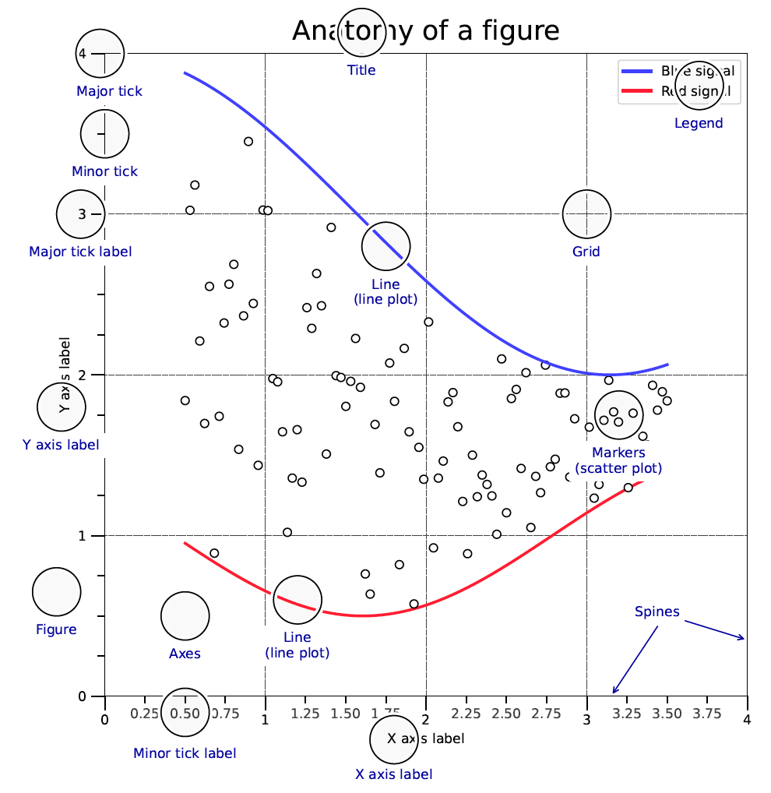
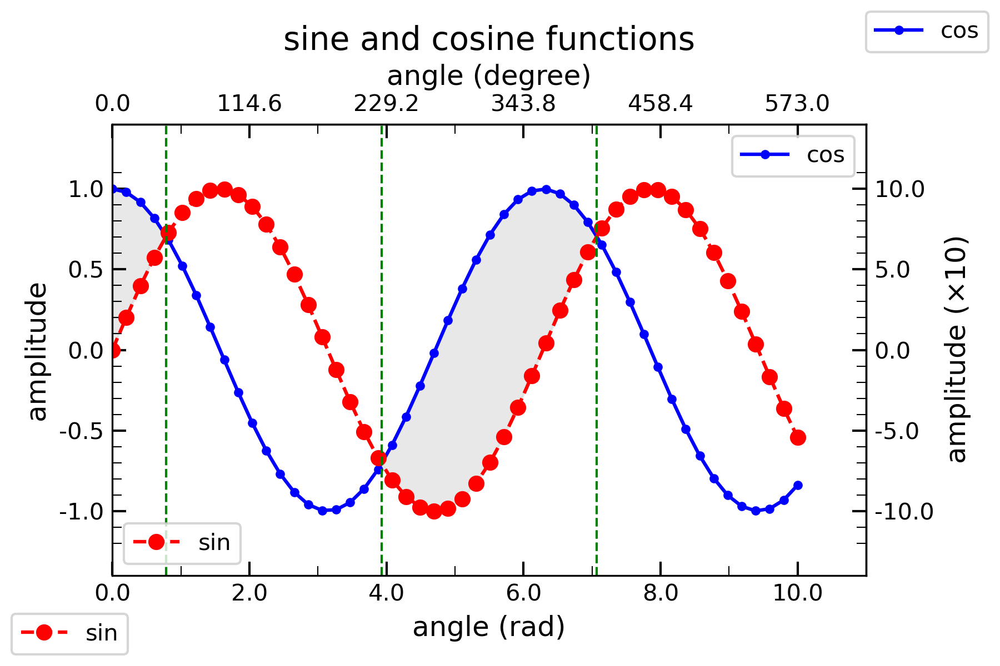
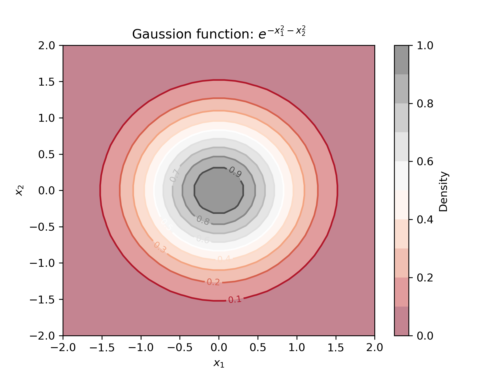
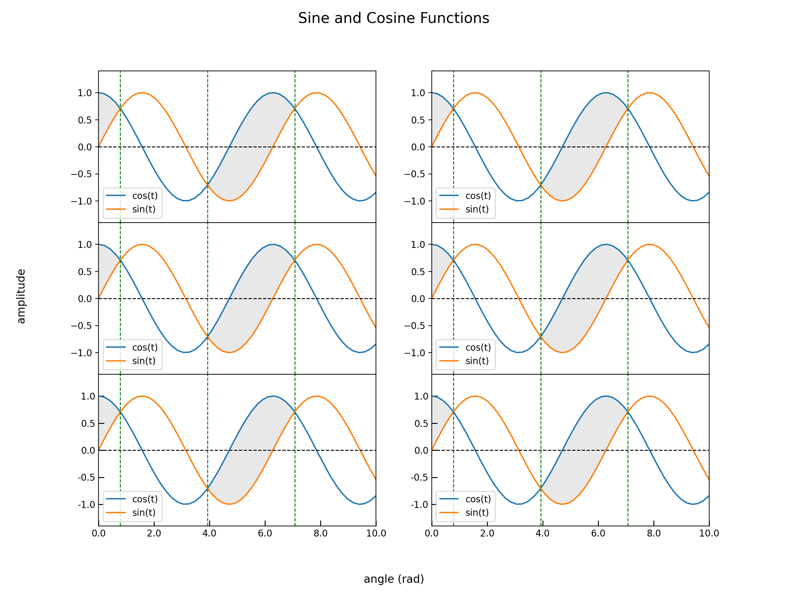
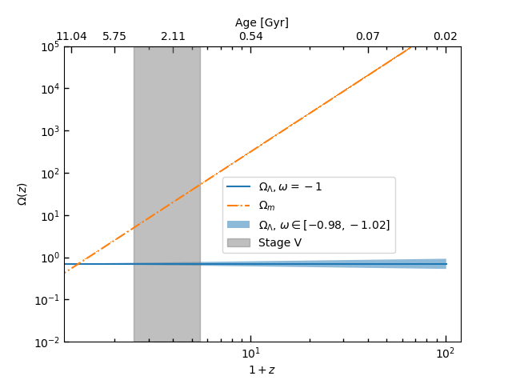
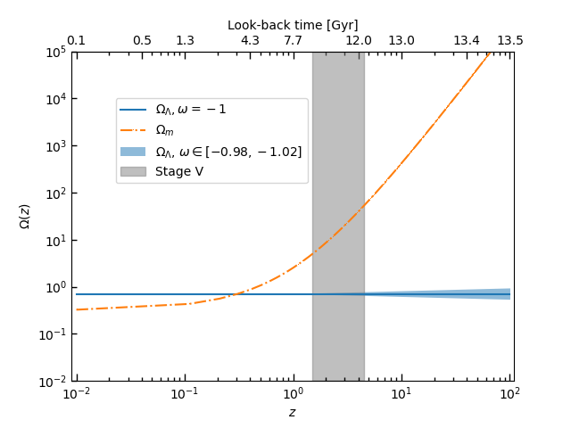
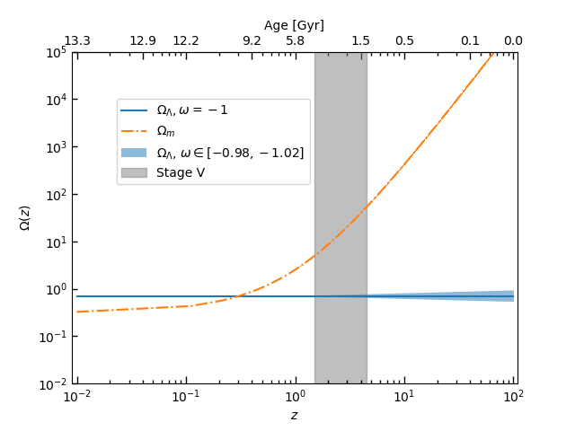

# Matplotlib tips

## 1. A single 2D line plot

The example provided can be used to achieve the following goals:

- Make secondary axes
- Modify the tick labels and location
- Modify line styles, markers, and colors
- Multiple legends but different locations on the same axes
- Multiple legends of a figure
- Modify the x/y label
- Add text to the figure
- Add a vertical/horizontal line
- Fill a certain region


## 1.1 Why "fig, ax = plt.subplots()"?

### The anatomy of a figure

From [Matplotlib Cheatsheet](https://matplotlib.org/cheatsheets/):



Many people just use `plt.plot(x, y)`, which will create a figure and axes automatically. However, it is better to use `fig, ax = plt.subplots()` to create a figure and axes explicitly. This is because it is easier to understand and control the figures and axes. For example, you can add second axes to the figure by using `fig.add_axes()` or `fig.add_subplot()`. You can also add a color bar to the figure by using `fig.colorbar()`.

```python
# -*- coding: utf-8 -*-
"""
@Author: Guan-Fu Liu
Created on Dec. 26, 2023
Last modified on Feb. 20, 2024

An good example of using matplotlib to plot the data
"""
import numpy as np
import matplotlib.pyplot as plt
from matplotlib.gridspec import GridSpec
# %matplotlib inline
# %matplotlib notebook
%matplotlib ipympl
# %matplotlib widget


x = np.linspace(0, 10, 50)
y1 = np.cos(x)
y2 = np.sin(x)

def deg2rad(x):
    return x * np.pi / 180

def rad2deg(x):
    return x * 180 / np.pi


fig, ax = plt.subplots(nrows=1, ncols=1, figsize=(6, 4))
line1, = ax.plot(x, y1, linestyle='-', color='blue', marker='.')
line2, =ax.plot(x, y2, linestyle='--', color='red', marker='o')

# Set the x major ticks and tick labels
major_xticks = np.arange(0, 11, 2)
ax.set_xticks(major_xticks, minor=False)
ax.set_xticklabels(['%0.1f'%i for i in major_xticks], fontsize=10, minor=False)
ax.tick_params(axis='x', direction='in',which='major', length=6, width=1.0)
# Set the x minor ticks and tick labels
minor_xticks = np.arange(1, 11, 2)
ax.set_xticks(minor_xticks, minor=True)
ax.set_xticklabels([' ']*len(minor_xticks), fontsize=8, minor=True)
ax.tick_params(axis='x', direction='in',which='minor', length=4, width=0.5)
# Secondary x-axis
secax1 = ax.secondary_xaxis('top', functions=(rad2deg, deg2rad))
# Set secondary x axis ticks and labels
secax1_major_xticks = rad2deg(major_xticks)
secax1.set_xticks(secax1_major_xticks, minor=False)
secax1.set_xticklabels(['%0.1f'%i for i in secax1_major_xticks], minor=False)
secax1.tick_params(axis='x', direction='in',which='major', length=6, width=1.0)
# Set secondary x axis minor ticks and labels
secax1_minor_xticks = rad2deg(minor_xticks)
secax1.set_xticks(secax1_minor_xticks, minor=True)
secax1.set_xticklabels([' ']*len(secax1_minor_xticks), minor=True)
secax1.tick_params(axis='x', direction='in',which='minor', length=4, width=0.5)

# Set the y major ticks and tick labels
major_yticks = np.arange(-1, 1.1, 0.5)
ax.set_yticks(major_yticks, minor=False)
ax.set_yticklabels(['%0.1f'%i for i in major_yticks], fontsize=10, minor=False)
ax.tick_params(axis='y', direction='in',which='major', length=6, width=1.0)
# Set the y minor ticks and tick labels
minor_yticks = np.arange(-1.2, 1.2, 0.1)
ax.set_yticks(minor_yticks, minor=True)
ax.set_yticklabels([' ']*len(minor_yticks), fontsize=8, minor=True)
ax.tick_params(axis='y', direction='in',which='minor', length=4, width=0.5)
# Set secondary y-axis
secax2 = ax.secondary_yaxis('right', functions=(lambda x: 10*x, lambda x: x/10))
# Set secondary y axis ticks and labels
secax2_major_yticks = 10*major_yticks
secax2.set_yticks(secax2_major_yticks, minor=False)
secax2.set_yticklabels(['%0.1f'%i for i in secax2_major_yticks], minor=False)
secax2.tick_params(axis='y', direction='in',which='major', length=6, width=1.0)
# Set secondary y axis minor ticks and labels
secax2_minor_yticks = 10*minor_yticks
secax2.set_yticks(secax2_minor_yticks, minor=True)
secax2.set_yticklabels([' ']*len(secax2_minor_yticks), minor=True)
secax2.tick_params(axis='y', direction='in',which='minor', length=4, width=0.5)

# Fill the region where cos(x) > sin(x)
ax.fill_between(x, y1, y2, where=(y1 > y2), interpolate=True, color='lightgray', alpha=0.5)

# Add two vertical line to indicate sin(x)=cos(x)
ax.axvline(np.pi/4, color='green', linestyle='--', linewidth=1.0)
ax.axvline(np.pi/4+np.pi, color='green', linestyle='--', linewidth=1.0)
ax.axvline(np.pi/4+2*np.pi, color='green', linestyle='--', linewidth=1.0)

# Set x/y limits
ax.set_xlim(0, 11)
ax.set_ylim(-1.4, 1.4)
# Set x/y labels
ax.set_xlabel('angle (rad)', fontsize=12)
secax1.set_xlabel('angle (degree)', fontsize=12)
ax.set_ylabel('amplitude', fontsize=12)
secax2.set_ylabel(r'amplitude ($\times 10$)', fontsize=12)
# Set title
ax.set_title('sine and cosine functions', fontsize=14)

# Add two legends of two lines at different locations
# is non-trivial, but can be done by adding the second legend as an artist
legend1 = ax.legend([line2], ["sin"], loc="lower left")
ax.add_artist(legend1)
ax.legend([line1], ["cos"], loc="upper right")
# Legend can also be put outside the axes
fig.legend([line1], ["cos"], loc="upper right")
fig.legend([line2], ["sin"], loc="lower left")
fig.tight_layout()
plt.show()
```
The output is shown below:


## 2. A single contour plot

```python
# -*- coding: utf-8 -*-
"""
@Author: Guan-Fu Liu
Created on Dec. 26, 2023
Last modified on Feb. 20, 2024

An good example of using matplotlib to plot the data
"""
import numpy as np
import matplotlib.pyplot as plt
from matplotlib.gridspec import GridSpec
# %matplotlib inline
# %matplotlib notebook
%matplotlib ipympl
# %matplotlib widget


x1 = np.linspace(-2, 2, 30)
x2 = np.linspace(-2, 2, 30)
X1, X2 = np.meshgrid(x1, x2)
Y = np.exp(-X1**2 - X2**2)

fig, ax = plt.subplots()
contour = ax.contour(X1, X2, Y, 10, cmap='RdGy')
contourf = ax.contourf(X1, X2, Y, 10, cmap='RdGy', alpha=0.5)
ax.clabel(contour, inline=True, fontsize=8)
colorbar = fig.colorbar(contourf)
colorbar.set_label(r'Density')
ax.set_xlabel(r'$x_{1}$')
ax.set_ylabel(r'$x_{2}$')
ax.set_title(r'Gaussion function: $e^{-x_1^2-x_2^2}$')
fig.savefig('gaussion.png', dpi=300)
plt.show()
```
The output is shown below:


## 3. Multiple 2D line plots
Use [GridSpec](https://matplotlib.org/stable/api/gridspec_api.html) to create a grid of subplots.

```python
# -*- coding: utf-8 -*-
"""
@Author: Guan-Fu Liu
Created on Dec. 26, 2023
Last modified on Feb. 20, 2024

An good example of using matplotlib to plot the data
"""
import numpy as np
import matplotlib.pyplot as plt
from matplotlib.gridspec import GridSpec
# %matplotlib inline
# %matplotlib notebook
%matplotlib ipympl
# %matplotlib widget
x = np.linspace(0, 10, 50)
y1 = np.cos(x)
y2 = np.sin(x)
major_xticks = np.arange(0, 11, 2)
minor_xticks = np.arange(1, 11, 2)
major_yticks = np.arange(-1, 1.1, 0.5)


fig = plt.figure(figsize=(12, 9))
gs = GridSpec(3, 2, width_ratios=[1, 1], height_ratios=[1, 1, 1], wspace=0.2, hspace=0)
axes = { }
axes['1'] = fig.add_subplot(gs[0])
axes['2'] = fig.add_subplot(gs[1])
axes['3'] = fig.add_subplot(gs[2])
axes['4'] = fig.add_subplot(gs[3])
axes['5'] = fig.add_subplot(gs[4])
axes['6'] = fig.add_subplot(gs[5])

for i in range(1, 7, 1):
    axes[str(i)].plot(x, y1, label='cos(t)')
    axes[str(i)].plot(x, y2, label='sin(t)')
    axes[str(i)].legend()
    axes[str(i)].set_xlim(0, 10)
    axes[str(i)].set_ylim(-1.4, 1.4)
    if i < 5:
        axes[str(i)].set_xticks([ ], minor=False)
    else:
        axes[str(i)].set_xticks(major_xticks, minor=False)
        axes[str(i)].set_xticklabels(['%0.1f'%i for i in major_xticks], fontsize=10, minor=False)
        axes[str(i)].tick_params(axis='x', direction='in',which='major', length=6, width=1.0)
        axes[str(i)].set_yticks(major_yticks, minor=False)
        axes[str(i)].set_yticklabels(['%0.1f'%i for i in major_yticks], fontsize=10, minor=False)
        axes[str(i)].tick_params(axis='y', direction='in',which='major', length=6, width=1.0)

    axes[str(i)].fill_between(x, y1, y2, where=(y1 > y2), interpolate=True, color='lightgray', alpha=0.5)
    axes[str(i)].axvline(np.pi/4, color='green', linestyle='--', linewidth=1.0)
    axes[str(i)].axvline(np.pi/4+np.pi, color='green', linestyle='--', linewidth=1.0)
    axes[str(i)].axvline(np.pi/4+2*np.pi, color='green', linestyle='--', linewidth=1.0)
    axes[str(i)].axhline(0, color='black', linestyle='--', linewidth=1.0)

fig.suptitle('Sine and Cosine Functions', fontsize=16)
fig.supxlabel('angle (rad)', fontsize=12)
fig.supylabel('amplitude', fontsize=12)
fig.tight_layout()
plt.show()
```
The output is shown below:


## 4. 3D surface plot

```python
import numpy as np
import matplotlib.pyplot as plt
from matplotlib import cm
from mpl_toolkits.mplot3d import Axes3D

# Generate the data
x = np.linspace(-1.0, 1.0, 50)
y = np.linspace(-1.0, 1.0, 50)
z = np.zeros(len(x))
x,y = np.meshgrid(x,y)
z = 1 - y/x
z[z >= 5.0] = 5.0            # Clips top of surface
z[z <= -5.0] = -5.0          # Clips bottom of surface

# place NaNs at the discontinuity
pos = np.where(np.abs(np.diff(z)) >= 5.0)
z[pos] = np.nan

# Create the plot
fig, ax = plt.subplots(subplot_kw={"projection": "3d"})
surf = ax.plot_surface(x,y,z, rstride=1, cstride=1, cmap=cm.coolwarm, linewidth=0,
                           vmin=np.nanmin(z), vmax=np.nanmax(z), antialiased=False)
plt.title("1 - y/x")
ax.set_xlim(-1.0, 1.0)
ax.set_ylim(-1.0, 1.0)
ax.set_zlim(-5.0, 5.0)
ax.set_xlabel("x")
ax.set_ylabel("y")
ax.set_zlabel("z")
plt.show()
```

## 5. Redshift and age (look-back time) axes

It is common that we need to plot a figure with the major x-axis representing redshift while the secondary one is the look-back time or age.

```python
# -*- coding: utf-8 -*-
"""
@Author: Guan-Fu Liu
Created on Oct. 14, 2023
Last modified on Oct. 14, 2023

A simple example to show how to plot redshift in the bottom x-axis and time in the top x-axis.
"""
import numpy as np
import matplotlib.pyplot as plt
from astropy.cosmology import FlatLambdaCDM
from astropy import units as u
from astropy.cosmology import z_at_value
%matplotlib widget

cosmo = FlatLambdaCDM(H0=70*u.km/u.s/u.Mpc, Om0=0.3)
```
```python
def evolve(z, w, Omega0):
    """
    Return the evolution of radiation, matter, and dark energy densities

    Parameters
    ----------
    z : array
        Redshift
    w : float
        w = -1 for cosmological constant, w = 0 for matter, w = 1/3 for radiation.
    Omega0 : float
        Present-day value of the density parameter
    """
    y = Omega0*(1+z)**(3*(1+w))
    return y


def zp1_to_age(zp1):
    """
    Return to the age of the universe at redshift+1

    Parameters
    ----------
    z : float
        Redshift+1
    """
    y = np.array(zp1, float)
    mask = zp1 < 1  # Mask the negative redshift
    y[mask] = np.inf
    if mask.sum() == len(y):
        return y
    else:
        y[~mask] = cosmo.age(zp1[~mask]-1).value
    return y


def age_to_zp1(age):
    """
    Return to the redshift+1 at age of the universe

    Parameters
    ----------
    age : float
        Age of the universe
    """
    y = np.array(age, float)
    mask_max = age > 13.4
    y[mask_max] = 0
    mask_min = age < 1e-4
    # z_at_value cannot handle age > 13.4 Gyr and age < 1e-4 Gyr.
    # It depends on how you set the zmin and zmax.
    y[mask_min] = np.inf
    mask = mask_max | mask_min
    if mask.sum() == len(y):
        return y
    else:
        y[~mask] = z_at_value(cosmo.age, age[~mask]*u.Gyr, zmin=1e-9, zmax=2000)+1
    return y


def z_to_back(z):
    """
    Return to the look-back time of the universe at redshift

    Parameters
    ----------
    z : float
        Redshift
    """
    y = np.array(z, float)
    mask = z < 0  # Mask the negative redshift
    y[mask] = 0
    if mask.sum() == len(y):
        return y
    else:
        y[~mask] = cosmo.age(0).value-cosmo.age(z[~mask]).value
    return y


def back_to_z(back):
    """
    Return to the redshift at look-back time of the universe

    Parameters
    ----------
    back : float
        Look back time of the universe
    """
    y = np.array(back, float)
    mask_min = back < cosmo.age(0).value-13.4
    y[mask_min] = 0
    mask_max = back > cosmo.age(0).value-1e-4
    # z_at_value cannot handle age > 13.4 Gyr and age < 1e-4 Gyr.
    # It depends on how you set the zmin and zmax.
    y[mask_max] = np.inf
    mask = mask_max | mask_min
    if mask.sum() == len(y):
        return y
    else:
        y[~mask] = z_at_value(cosmo.age, (cosmo.age(0).value-back[~mask])*u.Gyr, zmin=1e-9, zmax=2000)
    return y


def z_to_age(z):
    """
    Return to the age of the universe at redshift z.

    Parameters
    ----------
    z : float
        Redshift
    """
    y = np.array(z, float)
    mask = z < 0  # Mask the negative redshift
    y[mask] = np.inf
    if mask.sum() == len(y):
        return y
    else:
        y[~mask] = cosmo.age(z[~mask]).value
    return y


def age_to_z(age):
    """
    Return to the redshift at age of the universe

    Parameters
    ----------
    age : float
        Age of the universe
    """
    y = np.array(age, float)
    mask_max = age > 13.4
    y[mask_max] = 0
    mask_min = age < 1e-4
    # z_at_value cannot handle age > 13.4 Gyr and age < 1e-4 Gyr.
    # It depends on how you set the zmin and zmax.
    y[mask_min] = np.inf
    mask = mask_max | mask_min
    if mask.sum() == len(y):
        return y
    else:
        y[~mask] = z_at_value(cosmo.age, age[~mask]*u.Gyr, zmin=1e-9, zmax=2000)
    return y
```
```python
z = np.linspace(0.01, 100, 1000)
OmegaDE = evolve(z, -1, 0.7)  # Planck 2018
OmegaM = evolve(z, 0, 0.3158)  # Planck 2018
OmeagaR = evolve(z, 1/3, 9.29e-5)  # Planck 2013
OmegaDE1 = evolve(z, -1+0.02, 0.7)
OmegaDE2 = evolve(z, -1-0.02, 0.7)
```
```python
fig, ax = plt.subplots()
ax.plot(1+z, OmegaDE, '-', label=r'$\Omega_{\Lambda},\omega=-1$')
ax.plot(1+z, OmegaM, '-.,', label=r'$\Omega_{m}$')
# ax.plot(1+z, OmeagaR, '--',label=r'$\Omega_{r}$')
ax.loglog()
ax.fill_between(1+z, OmegaDE1, OmegaDE2, alpha=0.5, label=r'$\Omega_{\Lambda}$, $\omega\in [-0.98, -1.02]$')
ax.fill_betweenx(np.logspace(-2, 6, 100), 1.5+1, 4.5+1, alpha=0.5, color='grey', label='Stage V')

major_xticks = np.array([1, 10, 100, 1000])
ax.set_xticks(major_xticks, minor=False)
minor_xticks = np.array([2, 3, 4, 5, 6, 7, 8, 9, 20, 30, 40, 50, 60, 70, 80, 90])
ax.set_xticks(minor_xticks, minor=True)
ax.set_xticklabels([' ']*len(minor_xticks), minor=True)
minor_yticks = np.logspace(-4, 2, 2)
ax.set_yticks(minor_yticks, minor=True)
ax.set_yticklabels([' ']*len(minor_yticks), minor=True)
ax.tick_params(axis='x', which='major', direction='in', length=6.0, width=1.0)
ax.tick_params(axis='x', which='minor', direction='in', length=3.0, width=1.0)
ax.tick_params(axis='y', which='major', direction='in', length=4.0, width=1.0)
ax.tick_params(axis='y', which='minor', direction='in', length=2.0, width=1.0)

secax = ax.secondary_xaxis('top', functions=(zp1_to_age, age_to_zp1))
major_xticks1 = zp1_to_age(np.array([1.2, 2, 4, 10, 40, 100]))
secax.set_xticks(major_xticks1, minor=False)
secax.set_xticklabels(['%.2f'%i for i in major_xticks1], minor=False)
minor_xticks1 = zp1_to_age(minor_xticks)
secax.set_xticks(minor_xticks1, minor=True)
secax.set_xticklabels([' ']*len(minor_xticks1), minor=True)
secax.set_xlabel('Age [Gyr]')
secax.tick_params(axis='x', which='major', direction='in', length=6.0, width=1.0)
secax.tick_params(axis='x', which='minor', direction='in', length=3.0, width=1.0)

ax.set_xlim(1.1, 1.2e2)
ax.set_ylim(1e-2, 1e5)
ax.set_xlabel('$1+z$')
ax.set_ylabel(r'$\Omega(z)$')
ax.legend(loc=(0.4, 0.3))
fig.savefig('Omega.png')
plt.show()
```
The output figure is:


```python
fig, ax = plt.subplots()
ax.plot(z, OmegaDE, '-', label=r'$\Omega_{\Lambda},\omega=-1$')
ax.plot(z, OmegaM, '-.,', label=r'$\Omega_{m}$')
ax.loglog()
ax.fill_between(1+z, OmegaDE1, OmegaDE2, alpha=0.5, label=r'$\Omega_{\Lambda}$, $\omega\in [-0.98, -1.02]$')

ax.fill_betweenx(np.logspace(-2, 6, 100), 1.5, 4.5, alpha=0.5, color='grey', label='Stage V')

major_xticks = np.array([0.01, 0.1, 1, 10, 100])
ax.set_xticks(major_xticks, minor=False)
minor_xticks = np.array([0.02, 0.03, 0.04, 0.05, 0.06, 0.07, 0.08, 0.09,
                         0.2, 0.3, 0.4, 0.5, 0.6, 0.7, 0.8, 0.9,
                         2, 3, 4, 5, 6, 7, 8, 9, 
                         20, 30, 40, 50, 60, 70, 80, 90])
ax.set_xticks(minor_xticks, minor=True)
ax.set_xticklabels([' ']*len(minor_xticks), minor=True)
minor_yticks = np.logspace(-4, 2, 2)
ax.set_yticks(minor_yticks, minor=True)
ax.set_yticklabels([' ']*len(minor_yticks), minor=True)
ax.tick_params(axis='x', which='major', direction='in', length=6.0, width=1.0)
ax.tick_params(axis='x', which='minor', direction='in', length=3.0, width=1.0)
ax.tick_params(axis='y', which='major', direction='in', length=4.0, width=1.0)
ax.tick_params(axis='y', which='minor', direction='in', length=2.0, width=1.0)

secax = ax.secondary_xaxis('top', functions=(z_to_back, back_to_z))
major_xticks1 = z_to_back(np.array([0.01, 0.04,
                                   0.1, 0.4, 
                                   1, 4, 
                                   10, 40, 100]))
secax.set_xticks(major_xticks1, minor=False)
secax.set_xticklabels(['%.1f'%i for i in major_xticks1], minor=False)
minor_xticks1 = z_to_back(minor_xticks)
secax.set_xticks(minor_xticks1, minor=True)
secax.set_xticklabels([' ']*len(minor_xticks1), minor=True)
secax.set_xlabel('Look-back time [Gyr]')
secax.tick_params(axis='x', which='major', direction='in', length=6.0, width=1.0)
secax.tick_params(axis='x', which='minor', direction='in', length=3.0, width=1.0)

ax.set_xlim(0.009, 109)
ax.set_ylim(1e-2, 1e5)
ax.set_xlabel('$z$')
ax.set_ylabel(r'$\Omega(z)$')
ax.legend(loc=(0.1, 0.6))
fig.savefig('Omega-z.png')
plt.show()
```
The output figure is:


```python
fig, ax = plt.subplots()
ax.plot(z, OmegaDE, '-', label=r'$\Omega_{\Lambda},\omega=-1$')
ax.plot(z, OmegaM, '-.,', label=r'$\Omega_{m}$')
ax.loglog()
ax.fill_between(1+z, OmegaDE1, OmegaDE2, alpha=0.5, label=r'$\Omega_{\Lambda}$, $\omega\in [-0.98, -1.02]$')

ax.fill_betweenx(np.logspace(-2, 6, 100), 1.5, 4.5, alpha=0.5, color='grey', label='Stage V')

major_xticks = np.array([0.01, 0.1, 1, 10, 100])
ax.set_xticks(major_xticks, minor=False)
minor_xticks = np.array([0.02, 0.03, 0.04, 0.05, 0.06, 0.07, 0.08, 0.09,
                         0.2, 0.3, 0.4, 0.5, 0.6, 0.7, 0.8, 0.9,
                         2, 3, 4, 5, 6, 7, 8, 9, 
                         20, 30, 40, 50, 60, 70, 80, 90])
ax.set_xticks(minor_xticks, minor=True)
ax.set_xticklabels([' ']*len(minor_xticks), minor=True)
minor_yticks = np.logspace(-4, 2, 2)
ax.set_yticks(minor_yticks, minor=True)
ax.set_yticklabels([' ']*len(minor_yticks), minor=True)
ax.tick_params(axis='x', which='major', direction='in', length=6.0, width=1.0)
ax.tick_params(axis='x', which='minor', direction='in', length=3.0, width=1.0)
ax.tick_params(axis='y', which='major', direction='in', length=4.0, width=1.0)
ax.tick_params(axis='y', which='minor', direction='in', length=2.0, width=1.0)

secax = ax.secondary_xaxis('top', functions=(z_to_age, age_to_z))
major_xticks1 = z_to_age(np.array([0.01, 0.04,
                                   0.1, 0.4, 
                                   1, 4, 
                                   10, 40, 100]))
secax.set_xticks(major_xticks1, minor=False)
secax.set_xticklabels(['%.1f'%i for i in major_xticks1], minor=False)
minor_xticks1 = z_to_age(minor_xticks)
secax.set_xticks(minor_xticks1, minor=True)
secax.set_xticklabels([' ']*len(minor_xticks1), minor=True)
secax.set_xlabel('Age [Gyr]')
secax.tick_params(axis='x', which='major', direction='in', length=6.0, width=1.0)
secax.tick_params(axis='x', which='minor', direction='in', length=3.0, width=1.0)

ax.set_xlim(0.009, 109)
ax.set_ylim(1e-2, 1e5)
ax.set_xlabel('$z$')
ax.set_ylabel(r'$\Omega(z)$')
ax.legend(loc=(0.1, 0.6))
fig.savefig('Omega-t.png')
plt.show()
```
The output figure is



## 6. More information

```python
%matplotlib ipympl
```
This line is used to enable the interactive mode in Jupyter notebook embedded in VSCode. If you are using Jupyter notebook, you can use `%matplotlib notebook` or `%matplotlib widget` to enable the interactive mode.

More details about the backend of matplotlib can be found in the website [backends](https://matplotlib.org/stable/users/explain/figure/backends.html).
If you are a beginner of matplotlib, you can find more information [here](https://matplotlib.org/stable/tutorials/introductory/usage.html).

There is also a well-structured and open-source book for scientific visualization, that is 
[Scientific Visualization: Python + Matplotlib](https://github.com/rougier/scientific-visualization-book)

