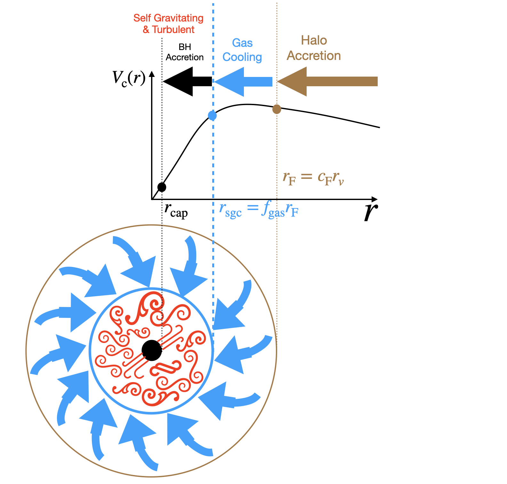

# Two-phase formation

## Speaker: Houjun Mo

## What is two-phase formation

- Phase I: Fast assembly, mass increases rapidly, the gravitational potential change greatly. The entropy of gas increases.
- Phase II: Slow assembly, stilling adding mass but almost no change on the potential.

### What does the changes of potential mean?

If the gravitational potential increases, the energy of particles will change rapidly. 
Only part of gas can settle.

### How to separate this two phases

Relative to Hubble expansion rate: $\gamma$

- $\frac{\dot{M}}{M} > \gamma$: phase I

- $\frac{\dot{M}}{M} < \gamma$: phase II

## The gas component

### Critical halo mass

<!--  -->

<figure style="text-align: center;">
  
  <figcaption>  
  
  $10^{12}~ M_{\odot}$ is a critical mass for halos

  </figcaption>
</figure>

<!-- If you want to use markdown expression in HTML, you should use blank lines to surround them. More details see https://spec.commonmark.org/0.30/ -->

### Collapse to form self-gravitating clouds (sgc)

The extent of gas should be a factor $f_{\text{gas}}$ smaller than that of dark matter. 
Gas becomes first self-gravitating and then rotation supported.

### Turblence is common

### Sub-clouds

Note that there are two kinds of  "clouds":
sgs clouds: large, proto-galaxy, $\sim 10$kpc.
sub-clouds: much small, about $\sim 0.1 ~$kpc, star-forming. 
Collisions of sub-clouds are rare and the drag is negligible.  

### How to feed the SMBH

The self-gravitating gas can be turbulent, whose angular momentum obeys the normal distribution. 
The gas with small angular momentum ($\lesssim j_{\text{cap}}$) can feed the SMBH (phase I). 
After complex mixing, the gas become rotation supported, whose angular momentum peaks at the average given by halo spin (phase II).
No feeding from rotation-supported gas

## Basic picture

## Star-formation

Stars formation in giant molecular cloud-> SNe -> enrichment -> new cooling, cooling rapidly, turbulent, some of gas will have much low angular momentum, and feed the BH -> new star formation.

## Disk formation

A simple deduction:
At higher redshift, disk is predicted to be more rare by the two-phase scenario, which is supported by the current JWST observation.

## Co-evolution in sgc

The term inside the  parentheses:
$$
\left(1-\beta \frac{M_{\mathrm{bh}} c^2}{M_{\mathrm{sgc}} V_{\mathrm{sgc}}^2}\right)
$$
if it is $0$: the main sequence, gives a scaling relation,
if it is positive: $M_{\text{bh}}$ is small, but BH mass will increase,
if it is positive: $M_{\text{bh}}$ is large, but BH mass will decrease.
Namely, the BH mass will relax to where the term inside the parentheses is zero.

**Correlation of BH mass and halo mass is not simply proportional but regulation.**

Below z~1: It seems to underestimate the growth of BH. It is because that the model only takes the former phase into consideration, which means that the major growth of BH is in the former phase.
There are also can be some local growth channel for BHs.

## Size-mass relation

Massive end: size increases but stellar mass not changes, because radiative cooling is ineffective in cluster.

## Four quadrant diagram of galaxy formation

