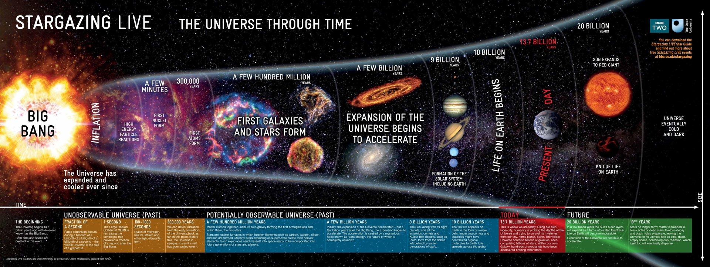
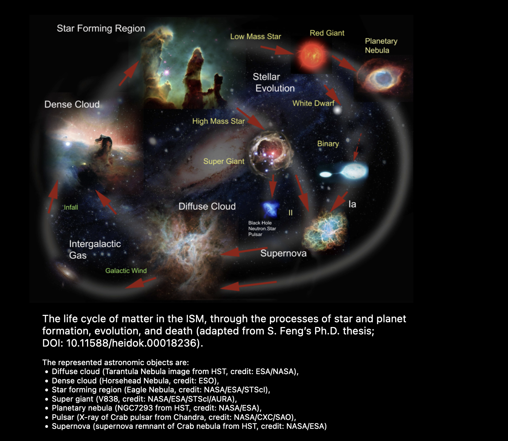
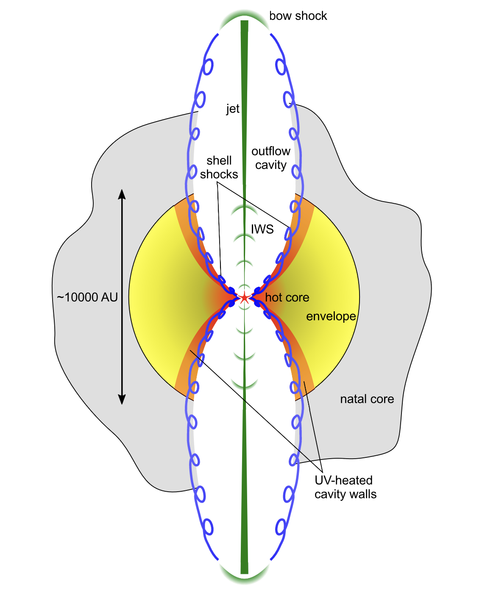

# Astrochemistry of ISM

## Speaker: Siyi Feng

[Siyi Feng](https://siyifeng.github.io/resume.html)

## A big picture

## The life cycle of the ISM

<!--  -->

<figure style="text-align: center;">
  
  <figcaption> This figure is from <a href="https://siyifeng.github.io/teaching.html"> Siyi Feng's teaching </a>.
  </figcaption>
</figure>

<!-- This figure can be found on [Siyi Feng's teaching](https://siyifeng.github.io/teaching.html). -->

## Molecular in ISM

## How to choose the tracer

- H$_{2}$ has no dippolement moment, so it is not easy to detect.
However, it is the most abundant molecule in the universe. Therefore, we need some proxy like CO, i.e., CO is the tracer of H${_2}$.
- SiO gas is a tracer of shock. Because SiO is solid when the temperature is not very high. 
If we detect SiO (the spectrum comes from the gas), it means that there is a shock. 
Or there will be no SiO in the gas phase.

## How to fit the spectrum in radio band

### Models

- LTE model
- Non-LTE model: Large Velocity Gradian (LVG) approximation

### From continuum

To get density, temperature.
Use black-body radiation or grey body raditation to fit the continuum.

### Substract the continuum

1. Extract the emission line regime
2. Fit the continuum
3. Substract the continuum

### Identify the emission line

- By eye, still not automatic
- Infer the molecular emission line datebase

## The $\textit{MIAO}$ project

## Proto-stellar shocks

From [Kristensen et al.(2012)](https://ui.adsabs.harvard.edu/abs/2012A%26A...542A...8K/abstract)
