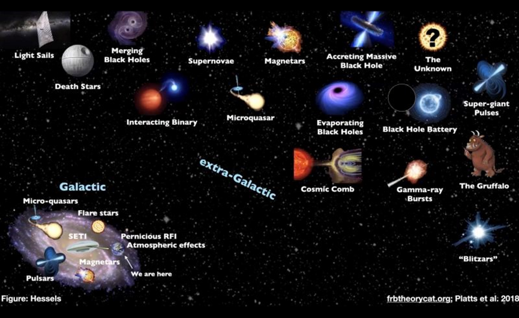
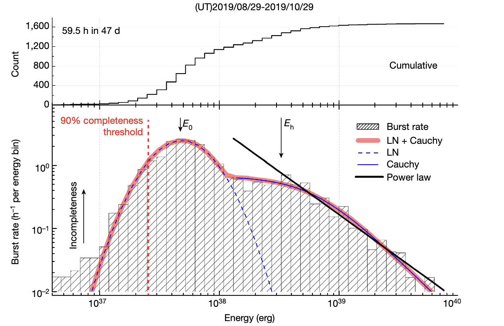
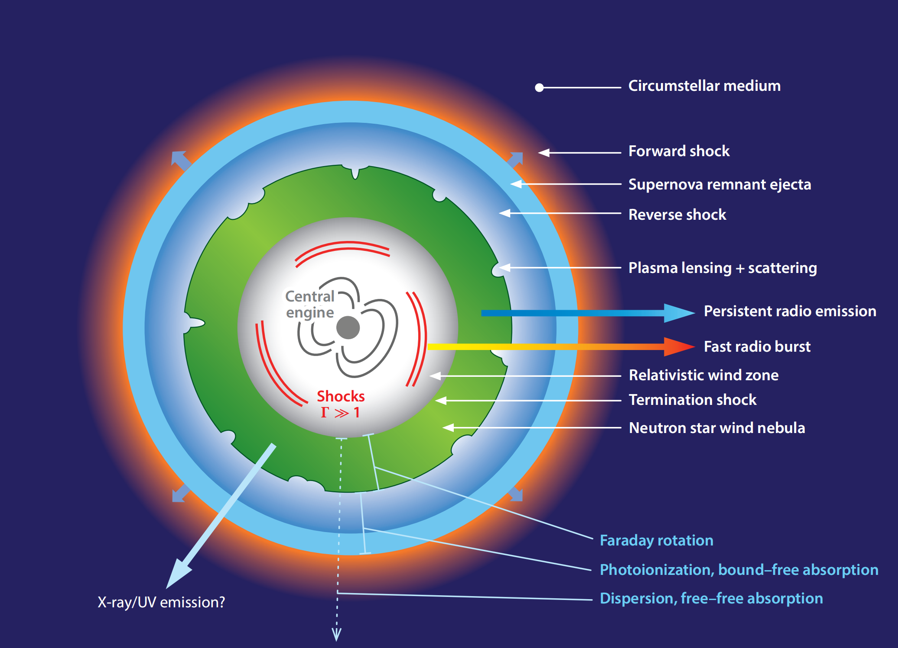
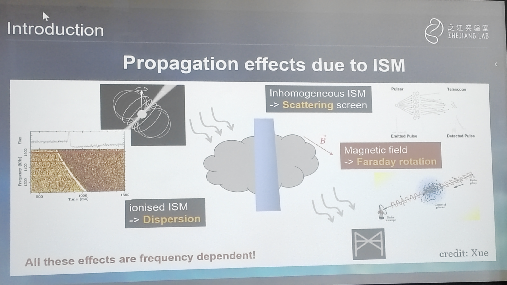
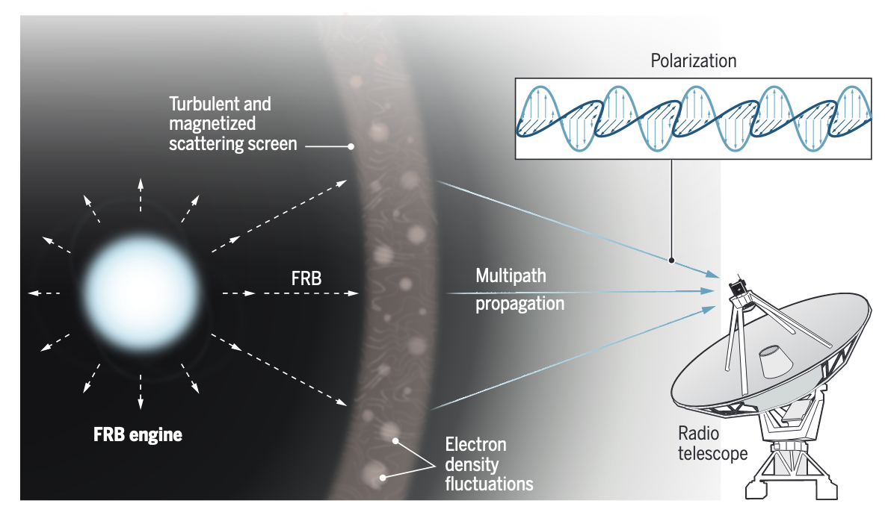
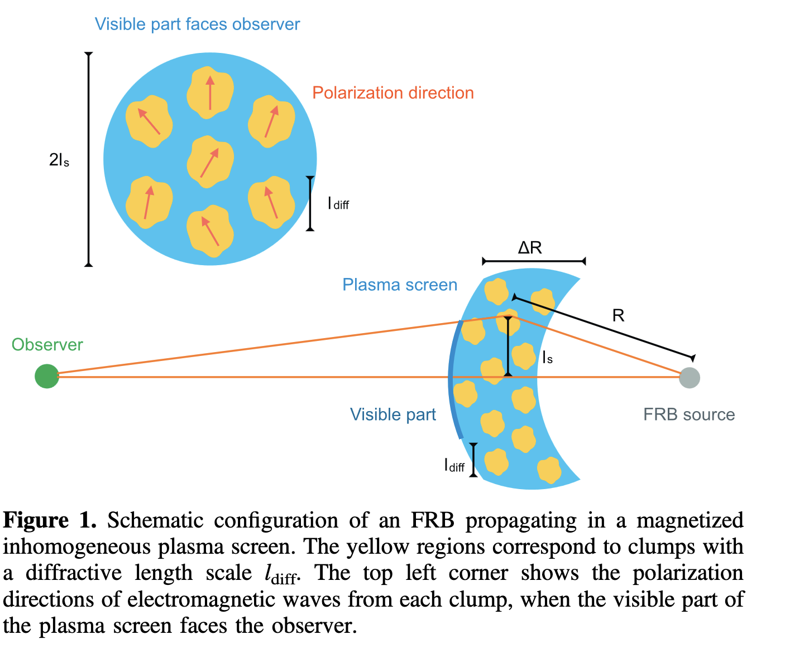
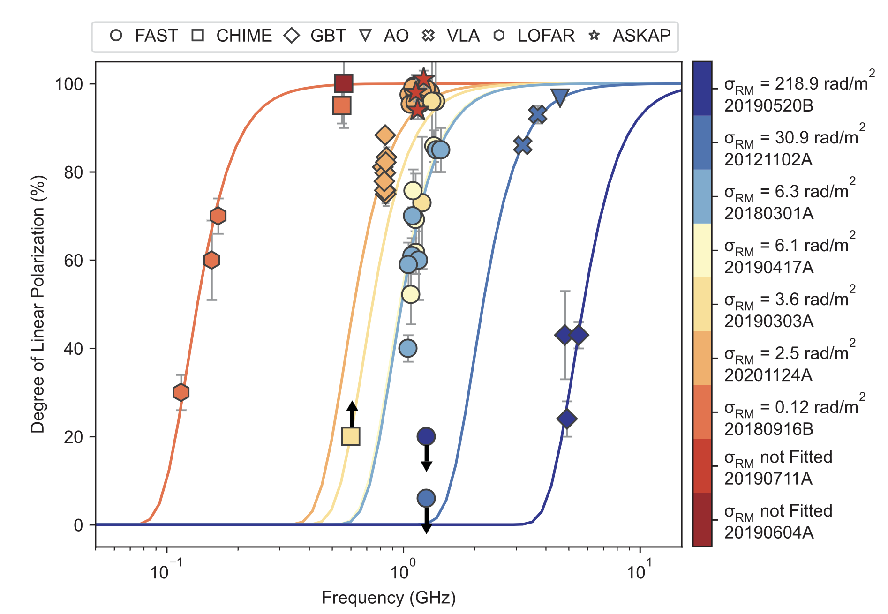
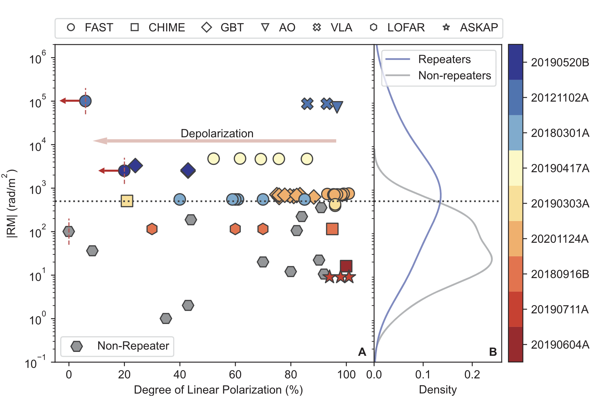

# Title

Exploring the blinking universe with FAST

## Speaker: Yi Feng

<!-- ## Abstract

Fast radio bursts (FRBs) are the brightest millisecond-duration-astronomical transients in radio bands with yet unknown origin. I will briefly review the development process of the field of fast radio bursts and introduce how we use FAST to study fast radio bursts. We reveal systematic frequency evolution of repeating FRBs, namely depolarization toward lower frequencies, which can be well described by multi-path scatter, with only one single adjustable parameter σRM. Such a unified description of repeating FRBs indicates a complex environment near and/or around the bursting sources. Finally, I will introduce some polarization measurements of repeating FRBs.

## Biography

I earned my bachelor's degree in physics from Tsinghua University in 2013, followed by a doctoral degree in astrophysics from the University of the Chinese Academy of Sciences in 2021. My research interests include: fast radio bursts, detecting gravitational waves using pulsar timing arrays, and computational astronomy. I have published more than 50 papers in top astronomy journals. I won the 2022’s Outstanding Science and Technology Achievement Prize of the Chinese Academy of Sciences, TR35, and First Prize of Beijing Natural Science Award. -->

## Lorimer Burst

Lorimer et al. (2007)

Lorimer burst was renamed to Fast Radio Burst (FRB) soon.

Flux: $\sim 10 ~ \mathrm{mJy}$  to $100~\mathrm{Jy}$.
Width: $\sim 0.1~\mathrm{ms}$ to $10~\mathrm{ms}$.

## Origin

All are out of the Milky Way? (Only one inside the Milky Way)

<figure style="text-align: center;">
  
  <figcaption> 

The conjecture on the origin of FRBs  Source: Jason Hessels

  </figcaption>
</figure>

<figure style="text-align: center;">
  
  <figcaption>
Figure 2 of <a href="https://www.nature.com/articles/s41586-021-03878-5">Li et al. (2021)</a>.
A bimodal burst energy distribution: diffferent origin?
  </figcaption>
</figure>

Repeating FRBs may be pulsar or magnetar in supernova remnant.

<figure style="text-align: center;">
  
  <figcaption>
From <a href="https://www.annualreviews.org/doi/10.1146/annurev-astro-091918-104501">Cordes & Chatterjeeet (2019)</a>.
Schematic diagram of an FRB source engine involving a young, highly magnetized neutron star.
  </figcaption>
</figure>

## Propagation effects of ISM

<figure style="text-align: center;">
  
  <figcaption>

  </figcaption>
</figure>

## Depolarization occurs at low frequency

<figure style="text-align: left;">
  
  <figcaption>

  > Radiation from repeating fast radio burst (FRB) sources appears to rotate as they pass through magnetically active areas in the universe. Variation in this rotation is a result of the different ray paths taken by each burst. A larger variation can mean the FRB source is relatively young and resides in a more turbulent magnetized environment.

From <a href="https://www.science.org/doi/10.1126/science.abo2353">Manisha Caleb (2022)</a>

  </figcaption>
</figure>

<figure style="text-align: center;">
  
  <figcaption>
From <a href="https://iopscience.iop.org/article/10.3847/2041-8213/ac5f46">Yang et al. (2022)</a>
  </figcaption>
</figure>

<figure style="text-align: center;">
  
  <figcaption>
 Figure 2 from <a href="https://www.science.org/doi/10.1126/science.abl7759">Feng et al. (2022)</a>
  </figcaption>
</figure>

RM: Rotation Measure
$$
\mathrm{RM}=\frac{e^3}{2 \pi m^2 c^4} \int_0^d n_e(s) B_{\|}(s) \mathrm{d} s
$$
Magnetic field can be extremely high: $10^{9-11}~\mathrm{T}$.

interstellar Faraday rotation ($\beta$) has a simple dependence on the wavelength of light ($\lambda$):

$$
\beta = \mathrm{RM} \lambda^2
$$

Lower frequency, higher $\lambda$, higher $\beta$, and more rotation.
If the dispersion of rotation measure $\sigma_{\mathrm{RM}}$ is very small or even zero, the radiation from the source will just be rotated by $\beta$ but the polarization fraction will not be affected.
If $\sigma_{\mathrm{RM}}$ is large, radiation from different path will be rotated by different $\beta$ and
the radiation from the source will be depolarized.

## Repeating or non-repeating FRBs

63 repeating FRBs and 672 non-repeating FRBs [BlinkVerse](https://blinkverse.alkaidos.cn/)

Confirm a repeating FRB: 3 arcmin, dispersion measure.

<figure style="text-align: center;">
  
  <figcaption>
 Figure 3 from <a href="https://www.science.org/doi/10.1126/science.abl7759">Feng et al. (2022)</a>
  </figcaption>
</figure>

FRBs with $\mathrm{RM}>500~\mathrm{rad}~\mathrm{m}^{-2}$ are more likely to be repeating FRBs.
FRBs with $\mathrm{RM}<500~\mathrm{rad}~\mathrm{m}^{-2}$ are more likely to be non-repeating FRBs.

