# On the Cosmic Baryon Cycle: Insights Learned from the CUBS

the Cosmic Ultraviolet Baryon Survey (CUBS)

## Speaker: Hsiao-Wen Chen

## Abstract

The circumgalactic medium (CGM) contains the fuel for future star formation and the record of past feedback, making it uniquely sensitive to the physics of baryonic flows.
Characterizing the tenuous multiphase CGM across cosmic time holds a key to unveiling the drivers of galaxy growth.
The Cosmic Ultraviolet Baryon Survey (CUBS) is designed to map intergalactic and circumgalactic gas at intermediate redshifts, bridging the gap between previous efforts at z < 0.4 and at z ~ 2.
The program utilizes high-quality quasar absorption spectra and matching deep galaxy survey data.
It exploits the synergy between space-based UV spectroscopy and ground-based wide-field surveys to advance our understanding of the cosmic evolution of baryonic structures.
In this talk, I will highlight a few examples that illustrate how combined space-based UV and ground-based optical echelle absorption spectroscopy of distant QSOs provides a powerful tool for resolving distinct ionization and thermodynamic states, as well as chemical enrichment histories, within the blended multiphase medium over a broad range of gas densities.
The accompanying deep and wide galaxy survey data further provide a sensitive record of the environment on both large and small scales, revealing a diverse range of galaxy properties.
I will present empirical evidence showing that diffuse CGM is turbulent. For the first time, a clear distinction is found in the significance of turbulent energy between passive and star-forming haloes.
I will also review other key findings from the CUBS program and briefly discuss the future outlook for CGM studies.

## Biography

HSIAO-WEN CHEN is a professor of astronomy and astrophysics at the University of Chicago. Her research interests include the formation and evolution of galaxies across cosmic time, chemical enrichment in the circumgalactic and intergalactic gas, and transient phenomena.
She uses absorption-line spectroscopy of distant light sources (quasars/gamma-ray burst afterglows) to probe diffuse gas around galaxies, and combines absorption-line observations with galaxy survey data to understand the recycling of baryonic matter between star-forming regions and dark intergalactic medium.
Prior to joining the University of Chicago, she held a postdoctoral position at Carnegie Observatories and a Hubble Fellowship at Massachusetts Institute of Technology.  She was named a fellow of American Astronomical Society in 2022.

## 1. Cycle of galactic gas flows

<figure style="text-align: center;">
  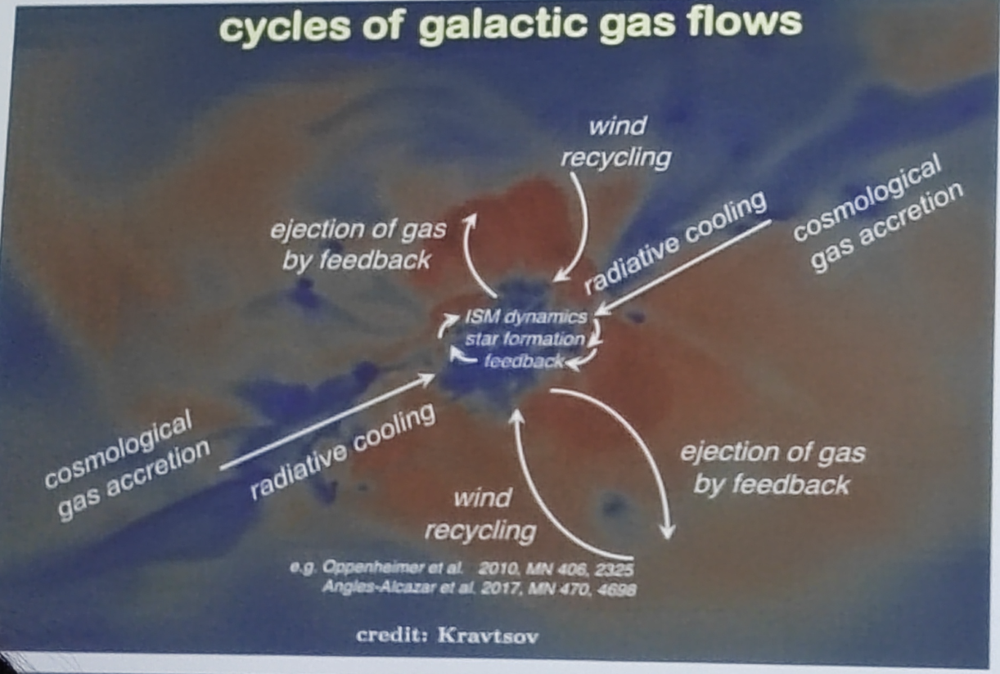
  <figcaption>

> “Probing the heart of the galactic feedbackprocess requires detecting and measuring thetenuous gases at the boundaries of galariesand their intergalactic surroundings, thecircumgalactic medium (CGM). where theaccretion and recycling of gas and metals fromfeedback processes take place.”
> -- Astro 2020 Decadal Survey

  </figcaption>
</figure>

<figure style="text-align: center;">
  
  <figcaption>
 Figure 2 from <a href="https://ned.ipac.caltech.edu/level5/Sept17/Chen/paper.pdf">Chen (2016)</a>

  </figcaption>
</figure>

## 2. Probing the multiphase CGS via absorption spectra

### 2.1. Ionization and thermodynamic states

<figure style="text-align: center;">
  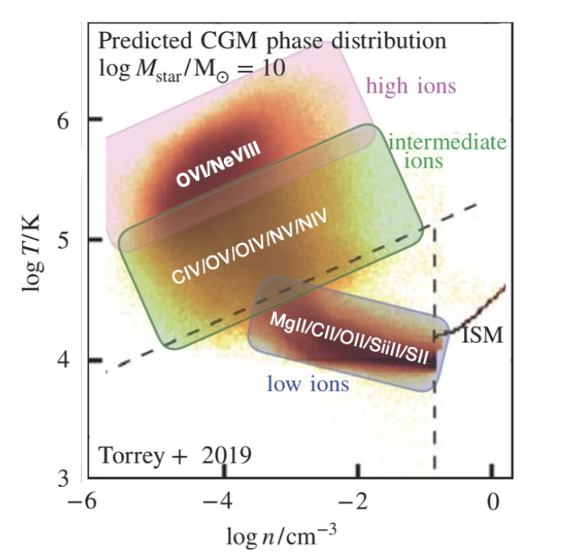
  <figcaption>

  Different ions occupy different phases of the CGM and reside in different areas of the $T-n$ diagram.

  </figcaption>
</figure>

### 2.2. The detection scheme

<figure style="text-align: center;">
  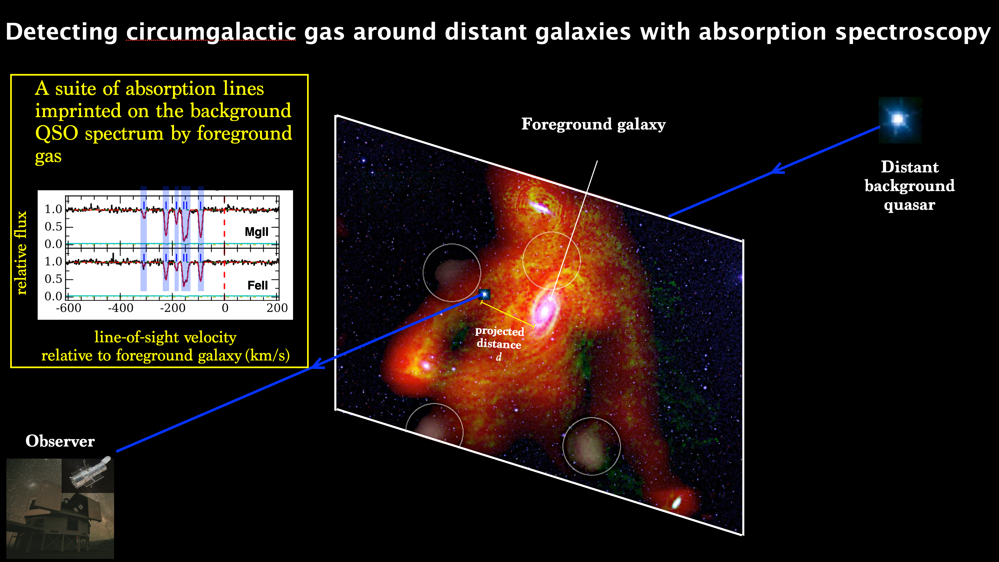
  <figcaption>
 
 From <a href="https://obs.carnegiescience.edu/postdoc-spotlight-fakhri-zahedy">Postdoc Spotlight: Fakhri Zahedy </a>
> Illustration showing how astronomers detect diffuse circumgalactic gas around distant galaxies using quasar absorption spectroscopy technique.

  </figcaption>
</figure>

### 2.3. The CGM are multi-phased

<figure style="text-align: center;">
  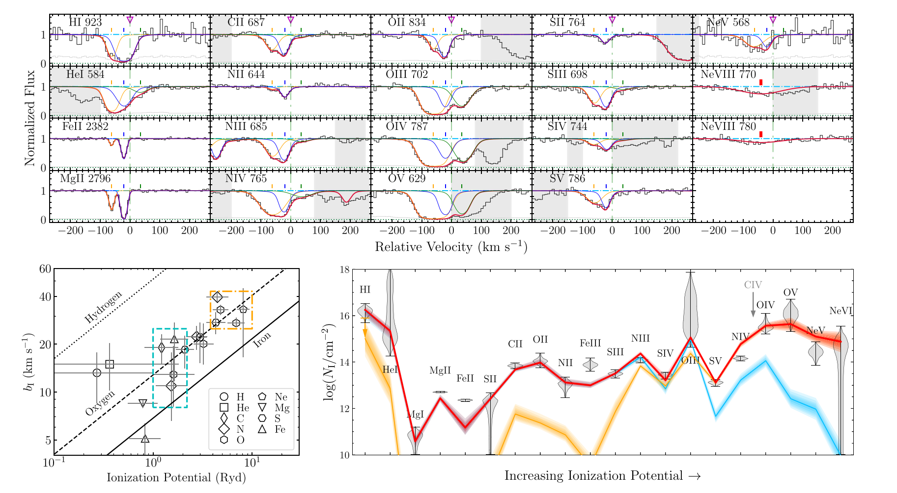
  <figcaption>
 
 From <a href="https://academic.oup.com/mnras/article/516/4/4882/6695098?login=false">Qu et al. (2022) </a>

  </figcaption>
</figure>

<figure style="text-align: center;">
  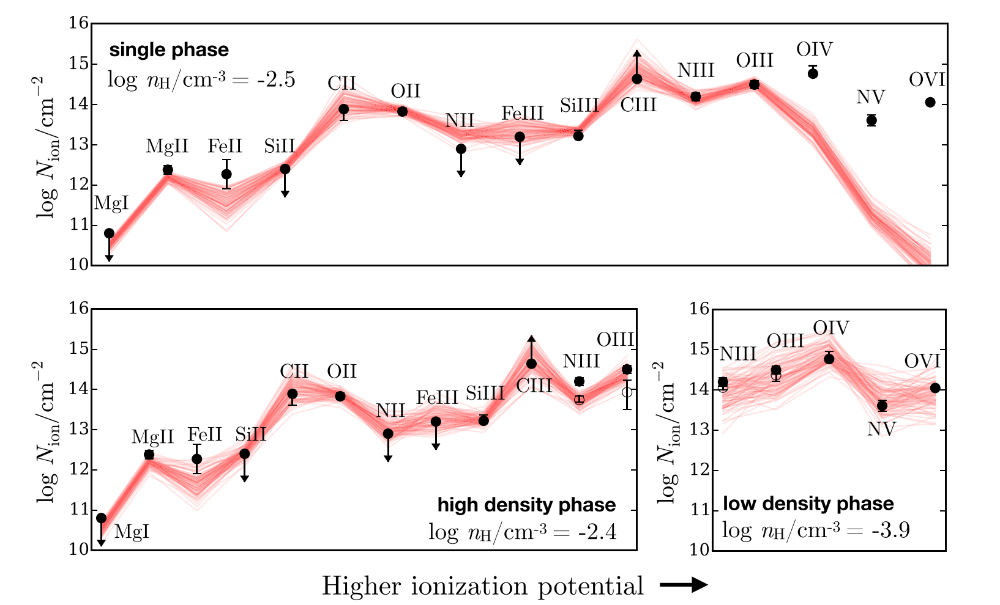
  <figcaption>
 From <a href="https://academic.oup.com/mnras/article/506/1/877/6307532">Zahedy et al. (2021) </a>
  </figcaption>
</figure>

Single phase CGM model cannot explain why there are both prominent O II and O VI absorption lines, **multi-phase** model is needed.

### 2.4. Line profile to thermaldynamic properties

$$
b_I^2=\frac{2 k_B T}{m_I}+b_{\text {non-thermal, turbulent}}^2

$$

<figure style="text-align: center;">
  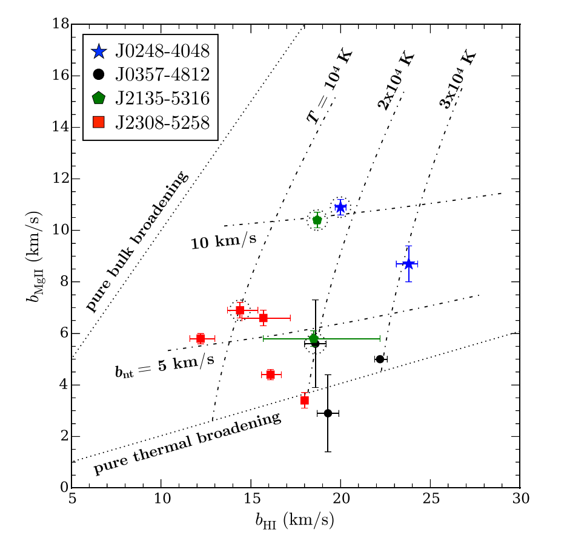
  <figcaption>
 From <a href="https://academic.oup.com/mnras/article/506/1/877/6307532">Zahedy et al. (2021) </a>
  </figcaption>
</figure>

## 3. Selected key results to CUBS

### 3.1. Cool CGM is clumpy

<figure style="text-align: center;">
  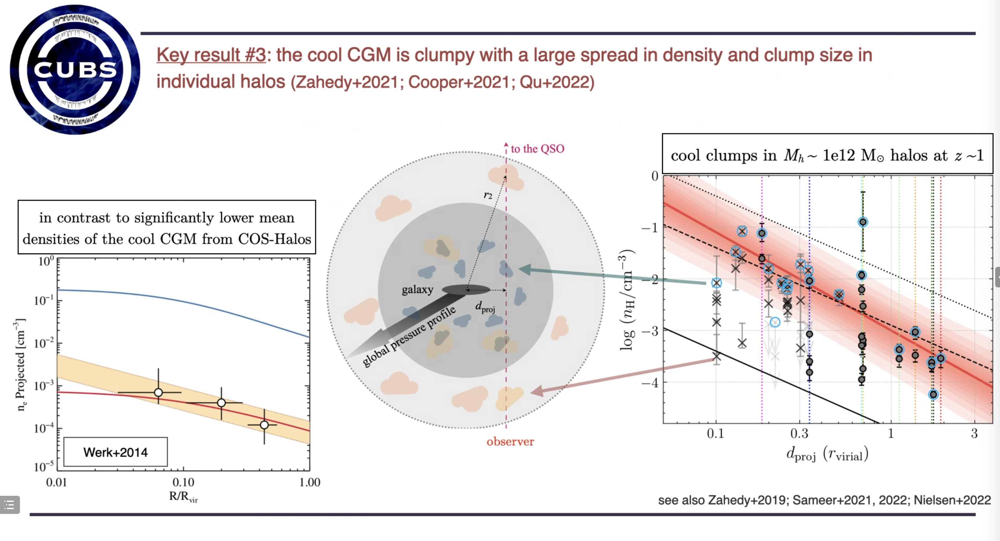
  <figcaption>
    A slide in the talk
  </figcaption>
</figure>

<figure style="text-align: center;">
  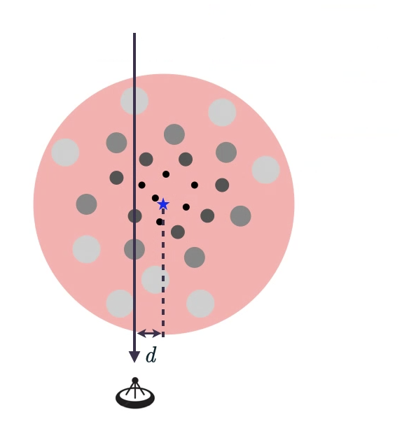
  <figcaption>
    A schematic diagram of the observation of the cool and clumpy CGM.
  </figcaption>
</figure>

The origin of the clumps:
It is still an open question. There should be some perturbations to generate clumps.

### 3.2. Non-uniform chemical enrichment

<figure style="text-align: center;">
  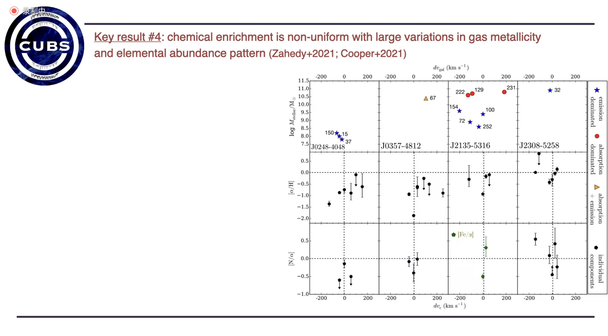
  <figcaption>
    A slide in the talk
  </figcaption>
</figure>

### 3.3. CGM and star formation histroy

<figure style="text-align: center;">
  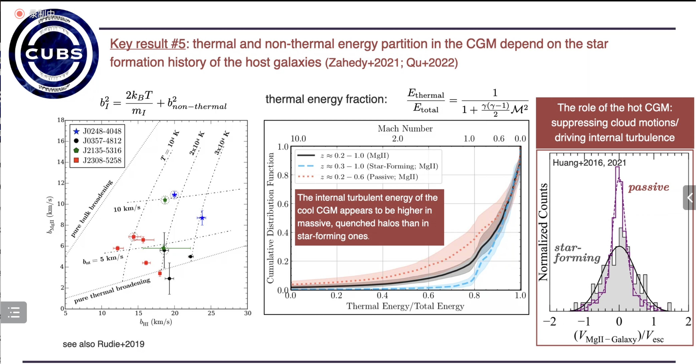
  <figcaption>
A slide in the talk
  </figcaption>
</figure>

### 3.4. Constrain the clump size

<figure style="text-align: center;">
  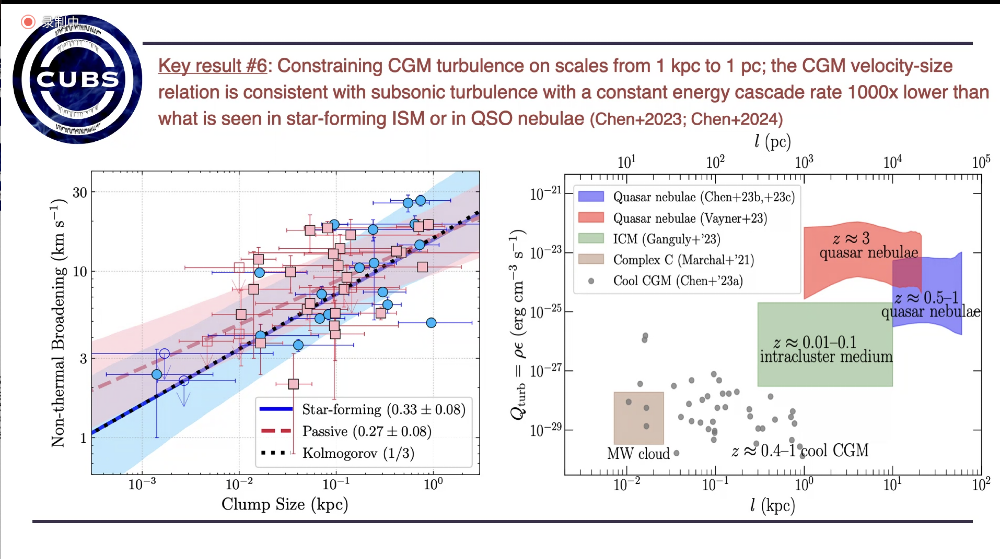
  <figcaption>
A slide in the talk
  </figcaption>
</figure>

### 3.5. The WHIM

<figure style="text-align: center;">
  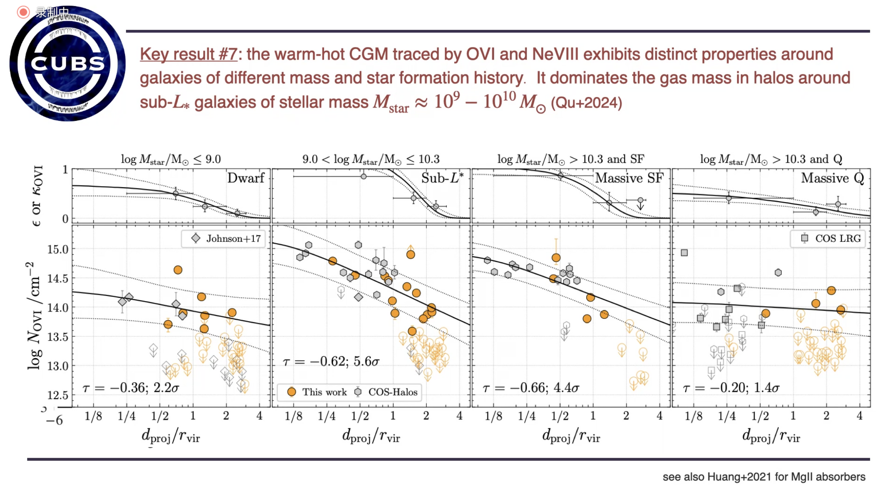
  <figcaption>
A slide in the talk
  </figcaption>
</figure>

## 4. Summary

<figure style="text-align: center;">
  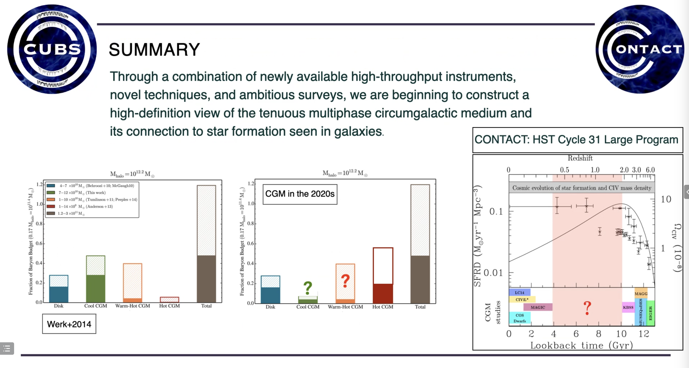
  <figcaption>
A slide in the talk
  </figcaption>
</figure>

