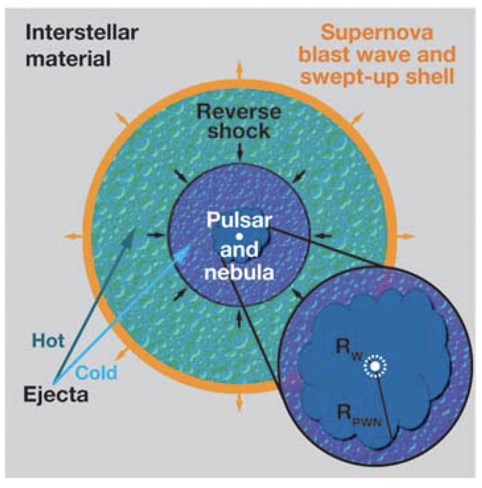

---
prev:
    text: "CUBS by Hsiao-Wen Chen"
    link: "/Colloquium/2023/2023-12-06-CUBS-by-Hsiao-Wen-Chen"
next: 
    text: "The Outskirts of Abell 133 and Abell 1795: Probing Gas Clumping in the Intracluster Medium by Zhenlin Zhu"
    link: "/Colloquium/2023/2023-12-20-The-Outskirts-of-Abell-133-and-Abell-1795-by-Zhenlin-Zhu"
---

# Studying Particle Transport in the Magnetic Turbulence with Pulsar Wind Nebulae/Pulsar Halos with Multiwavelength Observations

## Speaker: Ruoyu Liu

## Abstract

Pulsar wind nebulae and pulsar halos are extended sources of nonthermal radiation powered by pulsars. Morphologies of these sources reflect the spatial distribution of electrons/positrons therein, which is related to the particle transport mechanism and the turbulent nature of the background medium.
Therefore, multiwavelength observations of pulsar wind nebula and pulsar halos provide a good opportunity to study these issues and may help to unravel the century-puzzle of cosmic-ray origin. 
In this talk, I will introduce the recent progress in this direction with some bias towards works of our group, and discuss the key role of modern instruments of our country, such as LHAASO and EP, may play in these issues.

## Biography

Ruoyu Liu obtained his doctoral degree from the University of Heidelberg in 2015.
After that, he worked as a postdoctoral researcher in Max-Planck-Institute for Nuclear Physics (MPIK) and Deutsches Electron-Synchrotron researcher center (DESY) respectively for two years.
He returned back to China and joined Nanjing University as a research professor in 2019. His research interest mainly focuses on (but not limited to) the origin of high-energy cosmic rays and high-energy neutrinos, the radiation processes in dynamic astrophysical objects such blazars, gamma-ray bursts, pulsar wind nebulae, as well as their roles as the accelerators of cosmic rays.

## 1. Introduction

Rotational energy -> Electromagnetic energy -> Kinetic energy -> Nonthermal energy

n=3: dipole radiation

$$
L_{s} \equiv \frac{L_{s,0}}{(1+t / \tau_{0})^{(n+1)/(n-1)}}
$$

Difference between pulsar wind nebulae and supernova remnants

- Histroically, they are the same. This is because the pulsar formed after the supernova explosion.
- The difference is that pulsar wind nebulae are powered by the pulsar wind, while supernova remnants are powered by the supernova explosion.

The ejection of supernova is asymmetric, which results in the angular momentum of pulsar.

<figure style="text-align: center;">
  
  <figcaption>
    A schematic diagram of a composite SNR showing the swept-up interstellar medium shell,
hot and cold ejecta separated by the reverse shock, and the central pulsar and its nebula.
  </figcaption>
</figure>

<figure style="text-align: center;">
  
  <figcaption>
    Sketch of the main evolutionary stages of a PWN.
From <a href="https://api.semanticscholar.org/CorpusID:198968020">Giacinti et al. (2012)</a>
  </figcaption>
</figure>
