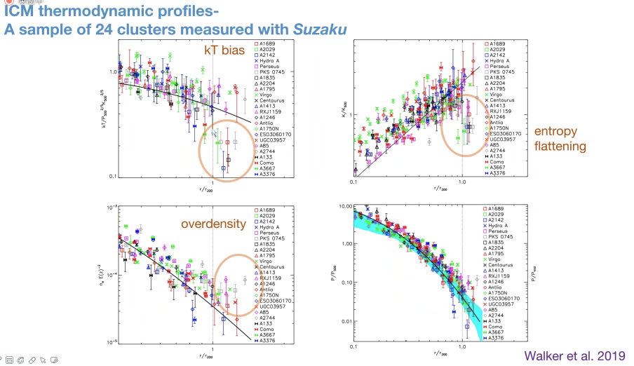
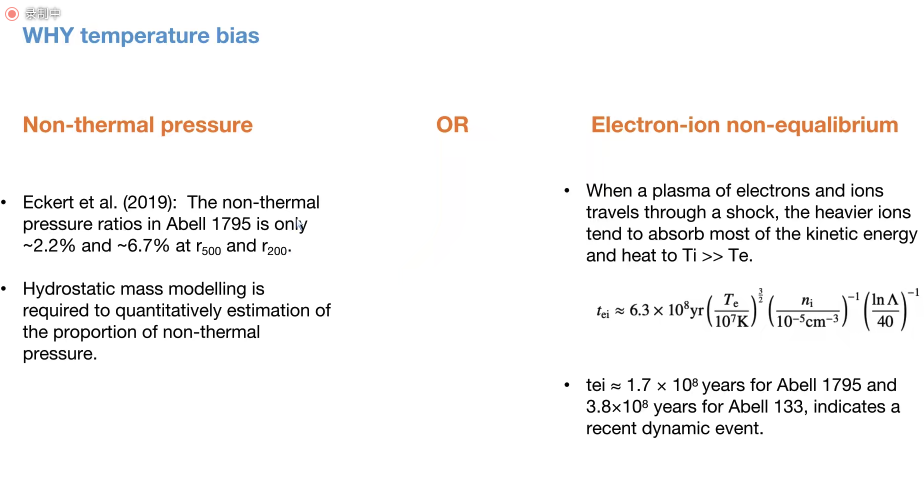
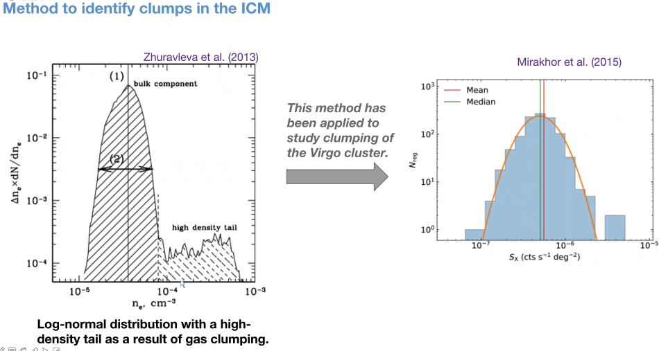
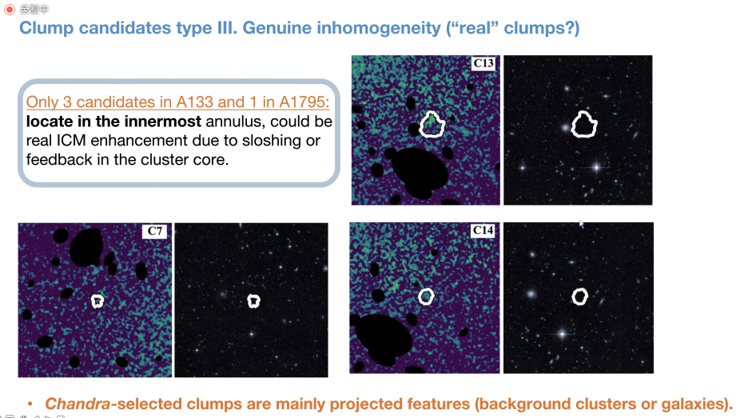

---
prev:
    text: 'Particle Transport with Multiwavelength Observations by Ruoyu Liu'
    link: '/Colloquium/2023/2023-12-14-Particle-Transport-Multiwavelength-Observations-Ruoyu-Liu'
next:
    text: "Probing Planet Formation with the Most Extreme Cases by Fei Dai"
    link: "/Colloquium/2023/2023-12-21-Probing-Planet-Formation-with-the-Most-Extreme-Cases-by-Fei-Dai"
---

# The Outskirts of Abell 133 and Abell 1795: Probing Gas Clumping in the Intracluster Medium

## Speaker: Zhenlin Zhu

## Abstract

Past observations and simulations have predicted an increasingly inhomogeneous gas distribution towards the outskirts of galaxy clusters. However, the exact properties of such gas clumping are not yet well known.
The outskirts of Abell 133 and Abell 1795 benefit from deep X-ray observations of Chandra and Suzaku pointings mapping out to large radius, making it a unique laboratory for studying the clumping of the intracluster medium.
Combining with information from the DESI Legacy Imaging Surveys cluster catalog as well as the CFHT r-band image, we selected clump candidates with at least 2 σ significance from Chandra images, most of which are identified as background clusters or galaxies – as opposed to intrinsic inhomogeneity.
We found that even after the correction of the resolved clumps, the entropy profile approaching the outskirts still flattens, deviating from the power law model expected from self-similar evolution, which implies that unresolved clumping and other complex physics contribute to the entropy flattening in the outskirts.

## ICM thermodynamic profiles

A sample of 24 clusters measured with *Suzaku*.

<figure style="text-align: center;">
  
  <figcaption>
 

  </figcaption>
</figure>

## Why temperature bias?

<figure style="text-align: center;">
  
  <figcaption>
 

  </figcaption>
</figure>

The logic of temperature bias is as follows,

1. temperature of electrons + equalibrium -> temperature of gas

2. if there is a shock, the temperature of ions increase rapidly, and hence the temperature of gas is higher, but the temperature of electrons still does not keep in pace, so the temperature of electrons is lower than the temperature of gas.

## How to identify clumps

<figure style="text-align: center;">
  
  <figcaption>
 

  </figcaption>figure-href
</figure>

If there are many clumps, the mean value of density/surface brightness will be higher than the median, since the mean value is sensitive to the outliers.

## Clump candidates

<figure style="text-align: center;">
  
  <figcaption>
  </figcaption>
</figure>

Among about 30 clumps, there are only about 3 clumps are real and resolved clumps, while the rest are associated with background objects.

