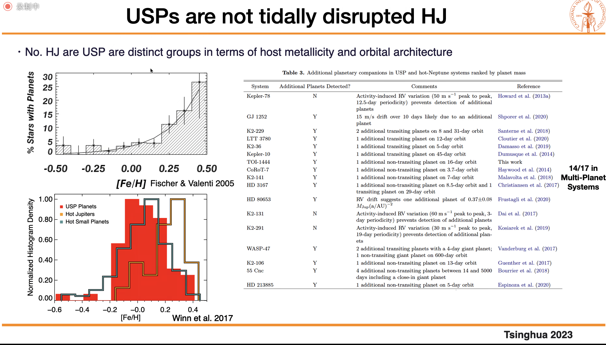
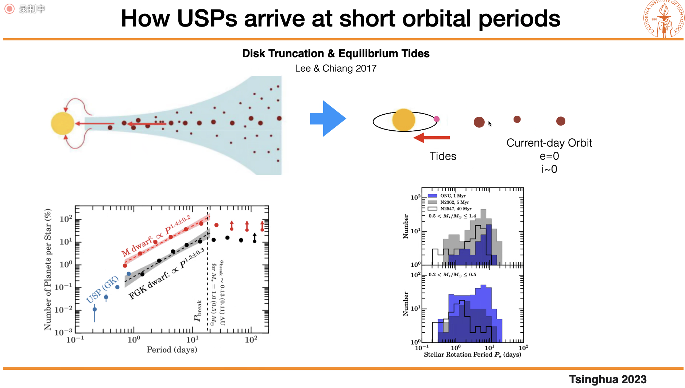
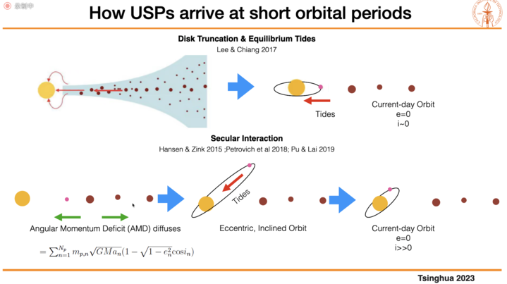
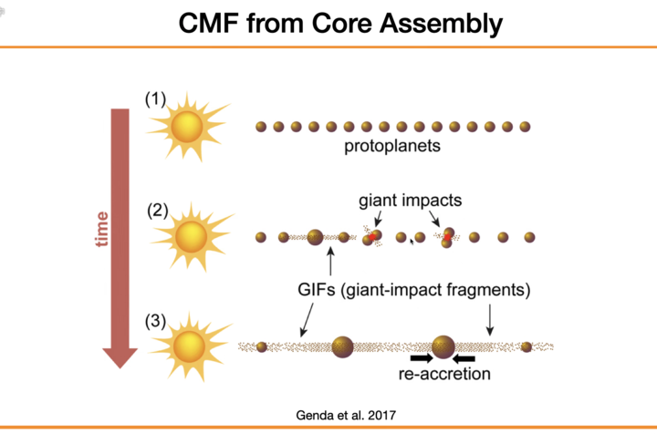
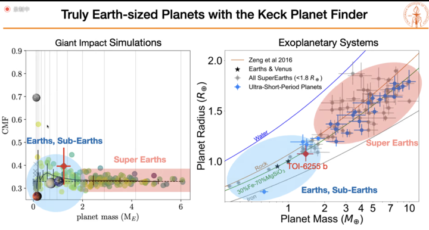
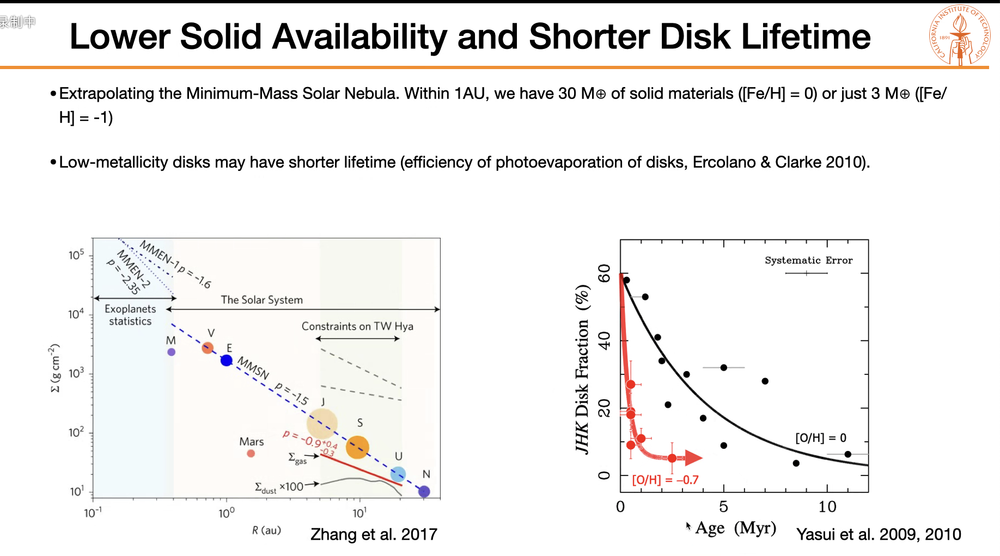
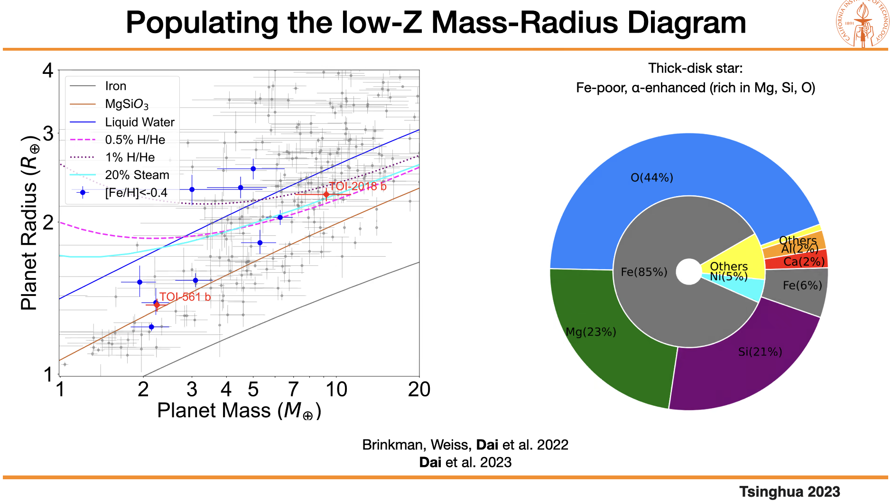
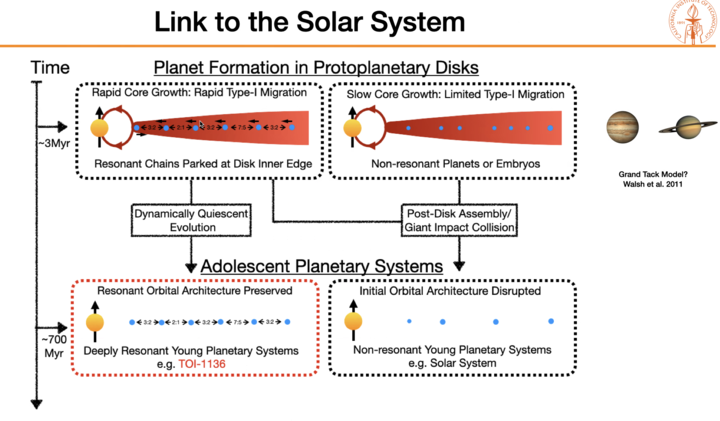

# Probing Planet Formation with the Most Extreme Cases

## Abstract

Thousands of exoplanets have been discovered in the past ~30 years.
However, there are still major gaps of knowledge in our understanding of planet formation.
The most extreme exoplanets are often ideal for identifying, isolating, and investigating critical aspects of plant formation. In this talk, I will highlight three extremes of planet formation: 1 the ultra-short-period planets ($<1~\mathrm{day}$, $<2~R_{\oplus}$) are the hottest possible planets. I will review our most recent phase curve observation with JWST that constrain the surface mineralogy on ultra-short peroid (USP) planets. I will also show case how a USP on 5.7-hour orbit is tidally distorted into a rugby. 2  I will showcase a multi-planet system that is deepest in resonance that we know of.
All of its six planets are in a chain of mean-motion resonances.
The orbital period ratios deviate from exact integer commensurability by merely a few parts in 10^-4.
This 700 Myr-old system is likely a fossil record of the orbital architecture produced by convergent disk migration before dynamical processes could disrupt the initial resonant configuration.
3 Could planet formation be starved out in extremely metal-poor environments?
With TESS’ full sky coverage and ground-based medium resolution surveys, we examined whether planet formation is suppressed for metal-poor host stars ([Fe/H]<-0.5).
Preliminary results suggest that sub-Neptune planet form readily in low-metallicity environments.
The result possibly hints at the early inward drift of solids in protoplanetary disks.

## USPs are not tidally disrupted hot Jupiters

<figure style="text-align: center;">
  
  <figcaption>

Hot Jupiters are more likely not to form in-situ, but migrate inwards.

  </figcaption>
</figure>

## How to achieve such a short period?

<figure style="text-align: center;">
  
  <figcaption>

 

  </figcaption>
</figure>

<figure style="text-align: center;">
  
  <figcaption>

 

  </figcaption>
</figure>

## CMF

<figure style="text-align: center;">
  
  <figcaption>

 

  </figcaption>
</figure>

<figure style="text-align: center;">
  
  <figcaption>

 

  </figcaption>
</figure>

## Connection between metallicity and disk

<figure style="text-align: center;">
  
  <figcaption>

 Lower metallicity -> shorter disk life time

  </figcaption>
</figure>

<figure style="text-align: center;">
  
  <figcaption>

 

  </figcaption>
</figure>

## Link to the solar system

<figure style="text-align: center;">
  
  <figcaption>

 

  </figcaption>
</figure>