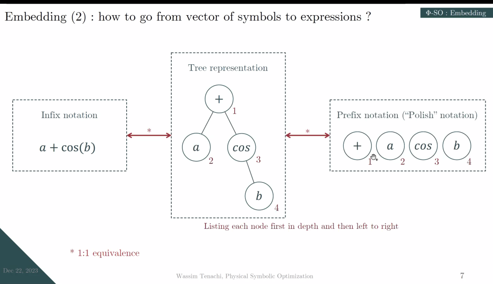
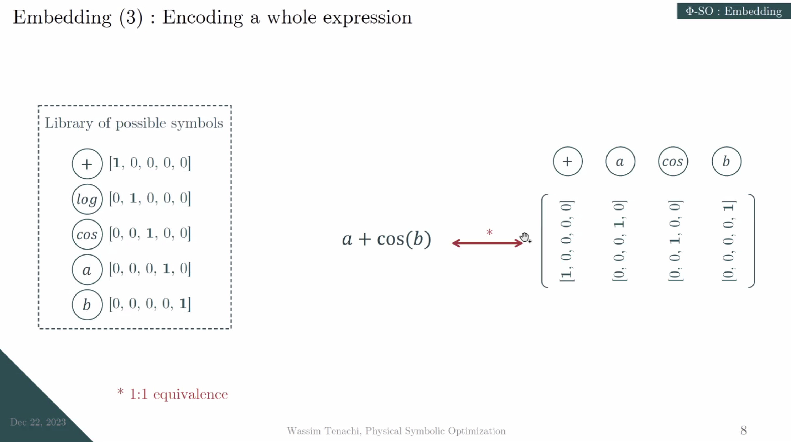
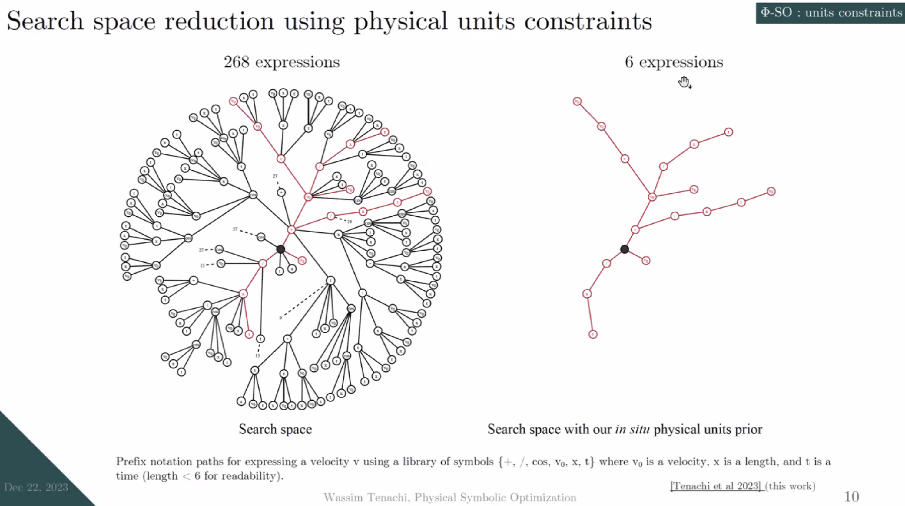
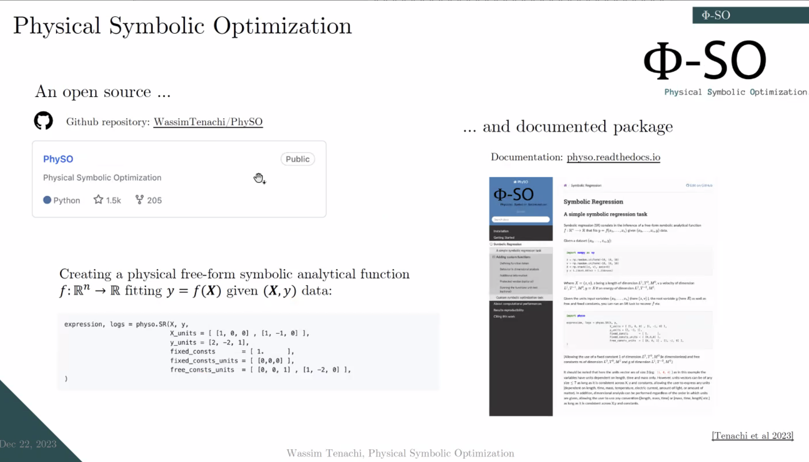

# Automatically Discovering Analytical Physical Laws from Data Using Deep Reinforcement Learning

## Abstract
Many areas of physics, such as astrophysics (my core scientific field), are entering an era of data abundance necessitating the employment of deep learning techniques.
However, as empirical laws transition into complex neural network representations, their integration into broader theories is getting increasingly challenging. This has steered my research towards symbolic regression, a promising field that can offer a complementary layer of interpretability to machine learning.
Symbolic regression is the study of algorithms that automate the search for free-form symbolic analytical functions fitting a dataset or meeting any other criteria, such as distilling the inner workings of a neural network.
It is distinct from numerical parameter optimization procedures in that it consists of a search in the space of functional forms themselves by optimizing the arrangement of mathematical symbols (e.g., x, t, *, /, +, -, log, exp, sin, cos, ...).

With new advances in deep learning there has been much renewed interest in such approaches, yet efforts have not been focused on physics, where data come with intrinsic constraints.
I will present Φ-SO, a Physical Symbolic Optimization framework for recovering analytical symbolic expressions from physics data using deep reinforcement learning techniques. Our system is built from the ground up to propose solutions where the physical units are consistent by construction, resulting in compact, physical, interpretable, and intelligible analytical models. This is useful not only in eliminating physically impossible solutions but also because it restricts enormously the freedom of the equation generator, thus vastly improving performances. Additionally, I will showcase its ability to leverage multiple datasets simultaneously, learning a singular analytical function that fits various datasets while accommodating potentially unique parameter values for each dataset, such as scale factors. Effectively leveraging prior knowledge that multiple datasets of interests should be obeying a common physical law. I will demonstrate its efficacy on a standard benchmark and briefly discuss future enhancements planned for the framework.

## Tree expression

<figure style="text-align: center;">
  
  <figcaption>

 

  </figcaption>
</figure>

<figure style="text-align: center;">
  
  <figcaption>

 

  </figcaption>
</figure>

<figure style="text-align: center;">
  
  <figcaption>

 

  </figcaption>
</figure>

## GitHub repository

<figure style="text-align: center;">
  
  <figcaption>

 

  </figcaption>
</figure>

$$
\sin \theta  = \frac{\exp(i\theta)-\exp(-i\theta)}{2i}
$$