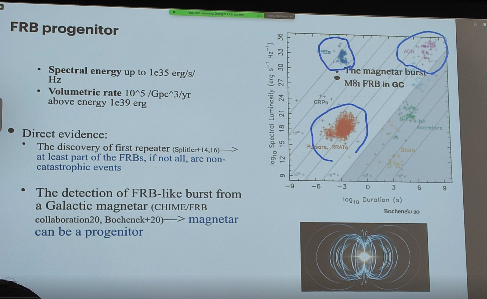
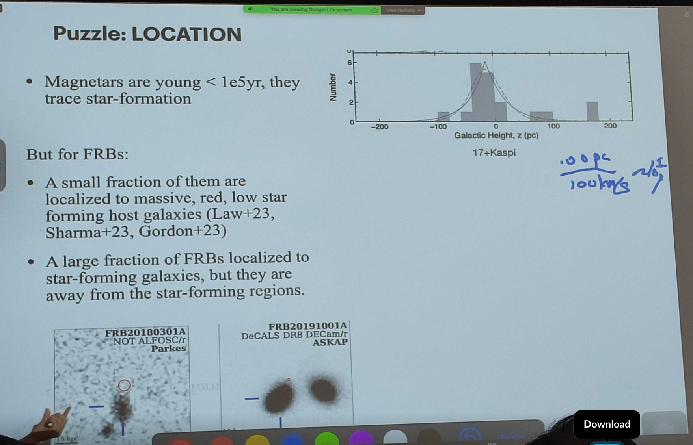
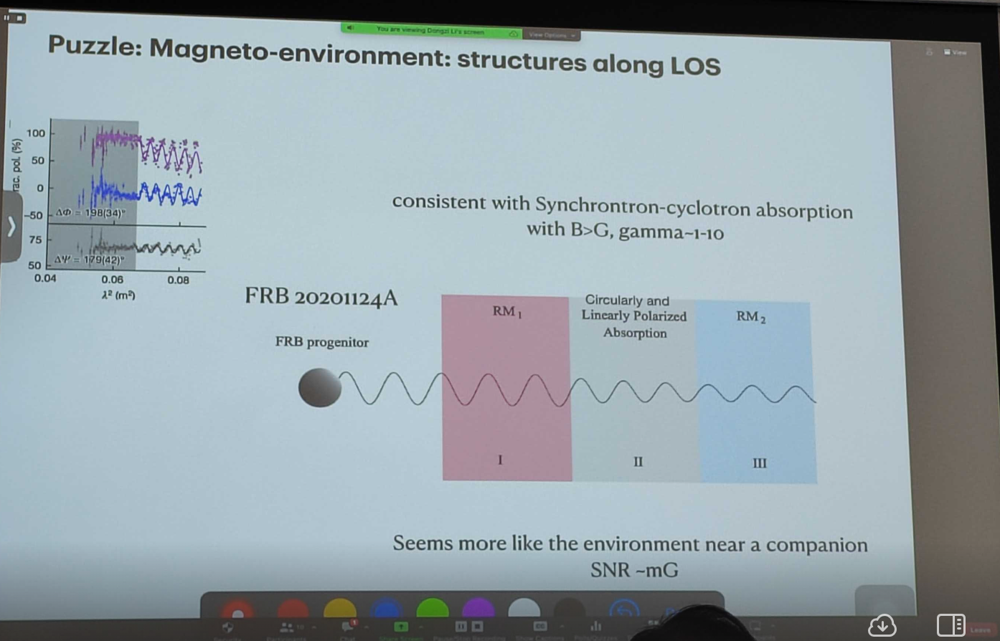

# The lively radio transient sky

## Speaker: Dr. Dongzi Li

### Background

- 1. FRB: bright, millisecond burst in radio
- 2. It can serve as a new cosmology probe

### FRB progenitor

To test the scenario of the FRB progenitor:

- 1. the energy rate: up to $10^{35}~\mathrm{erg}/\mathrm{s}/\mathrm{Hz}$
- 2. the volumetric rate: $10^{5}/\mathrm{Gpc}^{3}/\mathrm{yr}$.

Some scenarios:

- 1. Magnetar: they are young ($\lesssim 0.1~\mathrm{Myr}$) and trace star formation.
- 2. Merger: the major contribution cannot be the merger events as the volumetric rate of meger is too low than the FRB.

<figure style="text-align: center;">
  
  <figcaption>

  </figcaption>
</figure>

<figure style="text-align: center;">
  
  <figcaption>

  </figcaption>
</figure>

### Propagation effect

- 1. High frequency dependence
- 2. Disersion measure
- 3. Rotation measure

<figure style="text-align: center;">
  
  <figcaption>

 

  </figcaption>
</figure>

### How plasma lense improve the resolution

- 1. If the emission region is larger than the resolution, different part of the emission region will be magnified differently, which impoves the resolution.
- 2. If the emission region is smaller than the resolution, the magnification will be the same, which does not improve the resolution.

