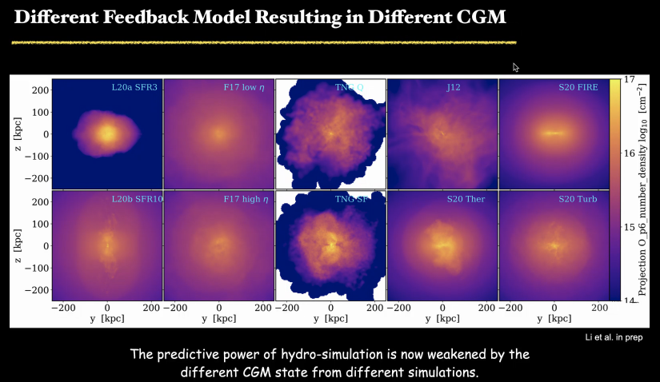
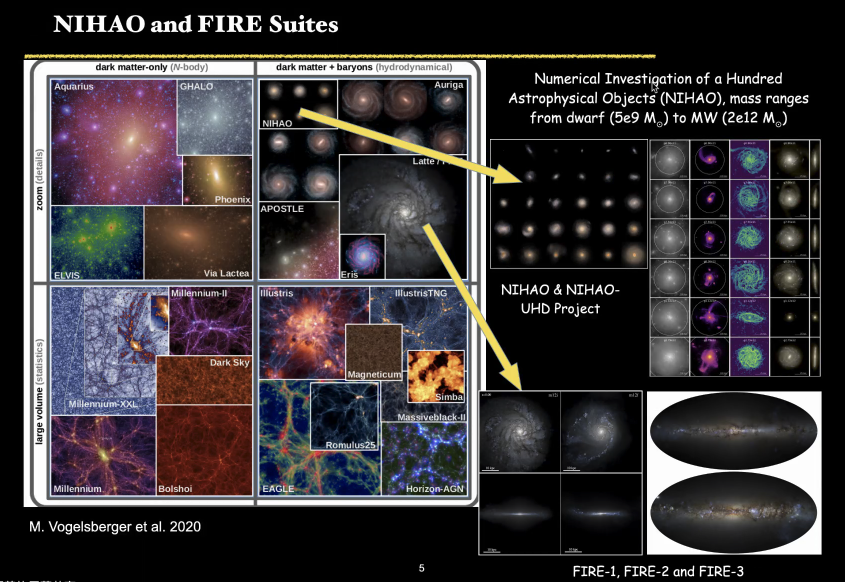
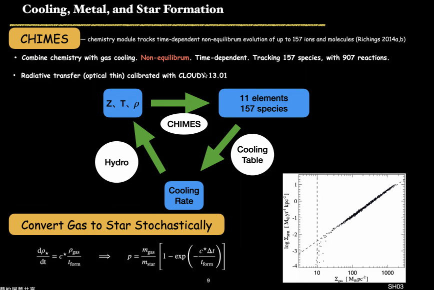
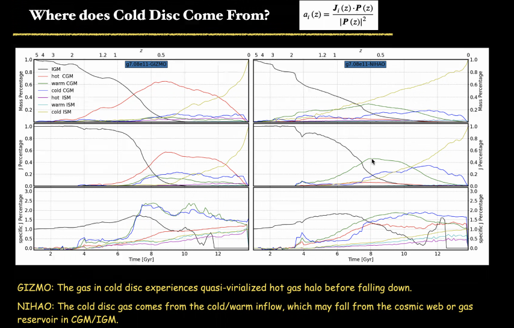
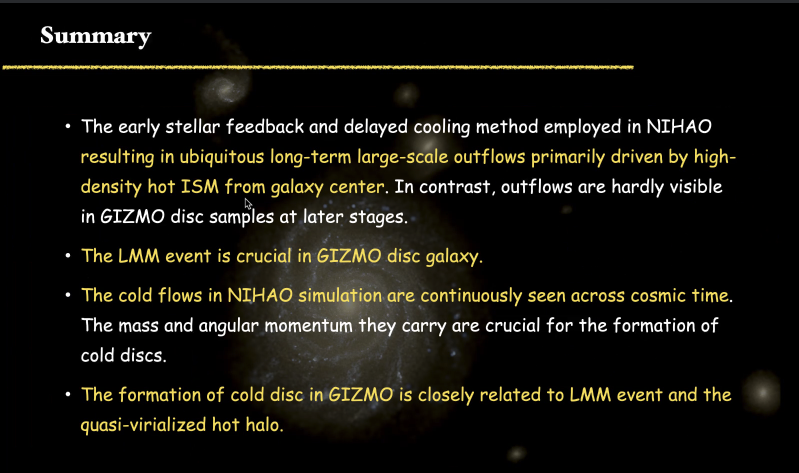

# NIHAO-GIZMO: A Comparison of Simulated Disc Galaxies from GASOLINE and GIZMO

## Speaker: Houzun Chen

## Different feedback model

<figure style="text-align: center;">
  
  <figcaption>

  </figcaption>
</figure>

Resolution is the key.

## Different kinds of simulations

<figure style="text-align: center;">
  
  <figcaption>

  </figcaption>
</figure>

## Cooling, metal, and star formation

<figure style="text-align: center;">
  
  <figcaption>

 
  </figcaption>
</figure>

## The origin of cold gas

<figure style="text-align: center;">
  
  <figcaption>

 
  </figcaption>
</figure>

## Summary

<figure style="text-align: center;">
  
  <figcaption>

 

  </figcaption>
</figure>

## Q&A

How to control IMF?

Supernovae rate $\Longrightarrow$ IMF.
The evolution of the IMF has not been implemented.