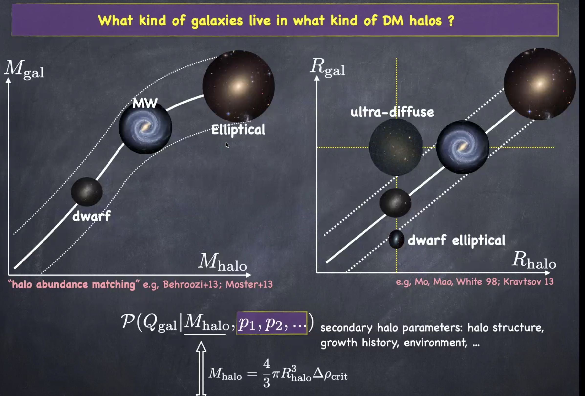

# Galaxy-halo connection and near-field cosmology with numerical and semi-analytic methods

<figure style="text-align: center;">
  
  <figcaption>

 

  </figcaption>
</figure>

The small-scale issues of $\mathrm{\Lambda}$CDM?

There are many missing small satellite galaxies.

<figure style="text-align: center;">
  
  <figcaption>

 

  </figcaption>
</figure>

## Deduce the properties of galaxies from the ones of DM halos

<figure style="text-align: center;">
  
  <figcaption>

 

  </figcaption>
</figure>

<figure style="text-align: center;">
  
  <figcaption>

  </figcaption>
</figure>

Compaction only happens at high-z.

Condition for compaction:

- Major merger

- Counter-rotating stream

- Disk instability: Toomre instability

There is no observed compaction in simulations with strong feedback.

<figure style="text-align: center;">
  
  <figcaption>

 

  </figcaption>
</figure>

<figure style="text-align: center;">
  
  <figcaption>

 

  </figcaption>
</figure>

## Take home message

<figure style="text-align: center;">
  
  <figcaption>

 

  </figcaption>
</figure>

