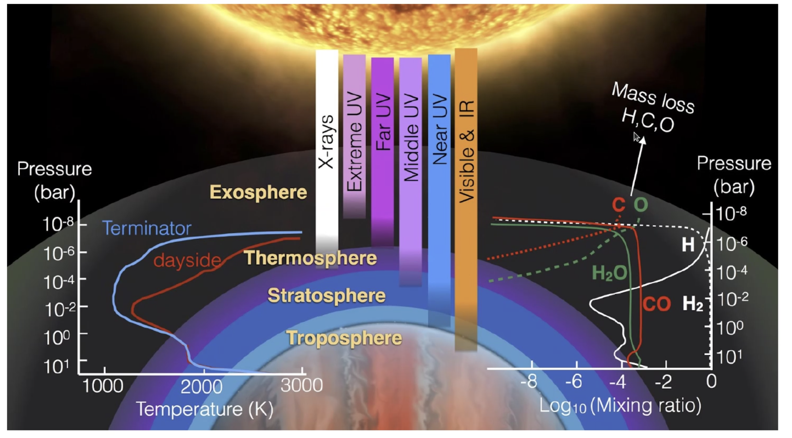
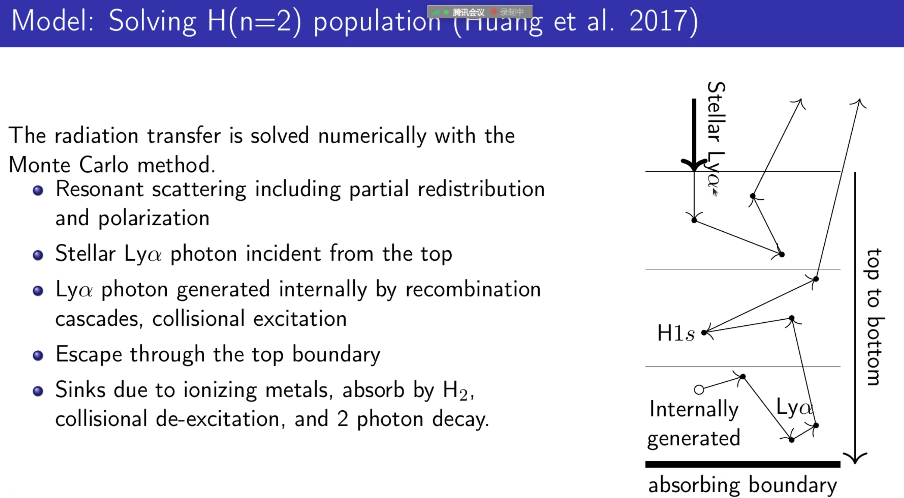
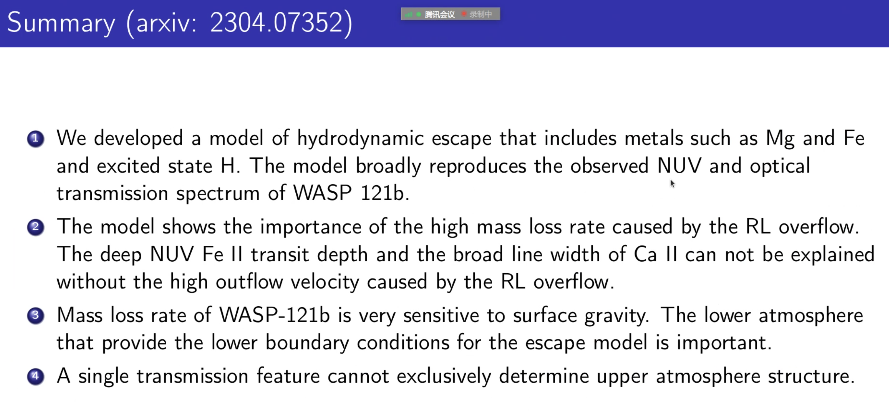

# A hydrodynamic study of the atmospheric escape of the hot Jupiter WASP-121b

## Speaker: Chenliang Huang

## Different bands

<figure style="text-align: center;">
  
  <figcaption>

 

  </figcaption>
</figure>

## Radiation transfer of Ly$\alpha$

<figure style="text-align: center;">
  
  <figcaption>

 

  </figcaption>
</figure>

## Summary

<figure style="text-align: center;">
  
  <figcaption>

 

  </figcaption>
</figure>