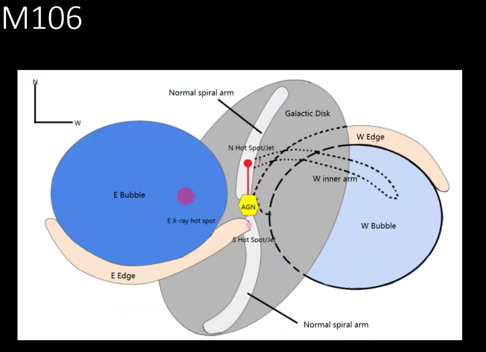
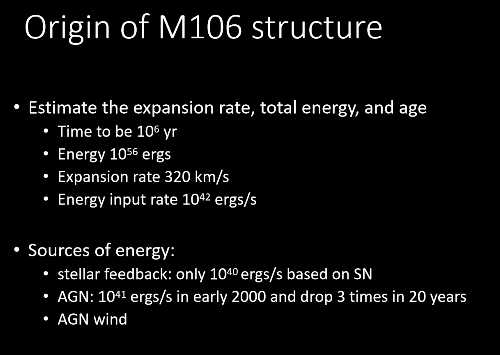
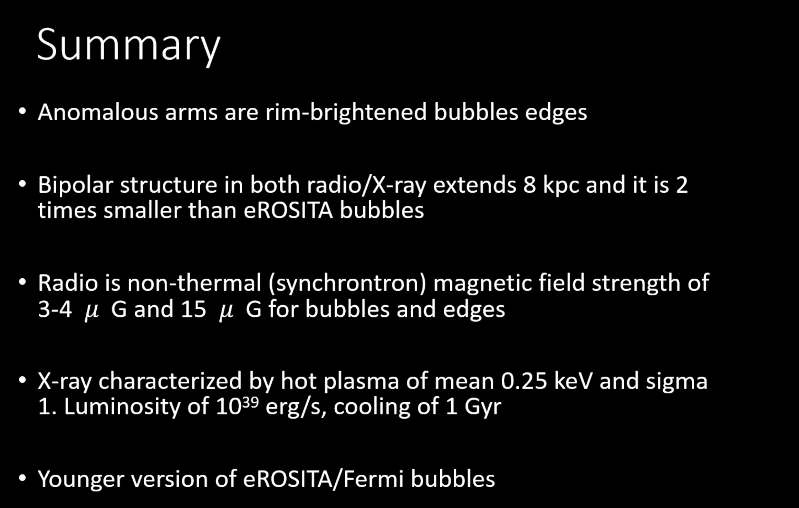

# Large-scale bipolar radio and X-ray-emitting bubble-like structure in M106

It is a Xtalk.

## M106

- Anomalous arm
- Low luminosity AGN $\sim 10^{40}$ erg/s
<figure style="text-align: center;">
  
  <figcaption>

 

  </figcaption>
</figure>

## It is AGN feedback not stellar feedback

<figure style="text-align: center;">
  
  <figcaption>

  </figcaption>
</figure>

## Summary

<figure style="text-align: center;">
  
  <figcaption>

 

  </figcaption>
</figure>