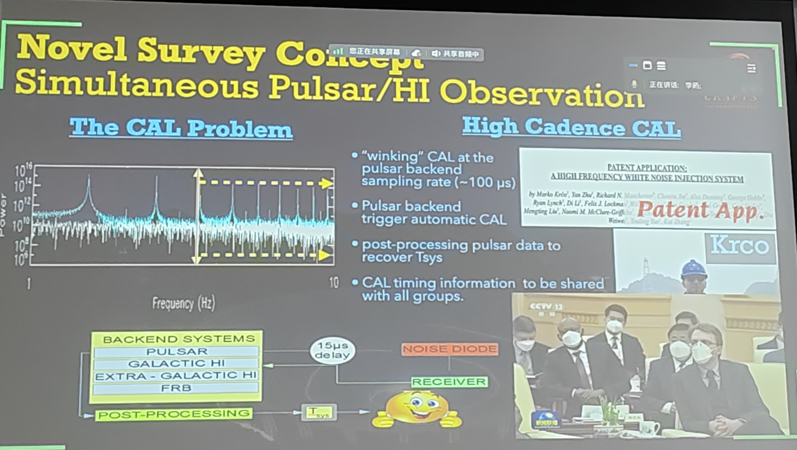
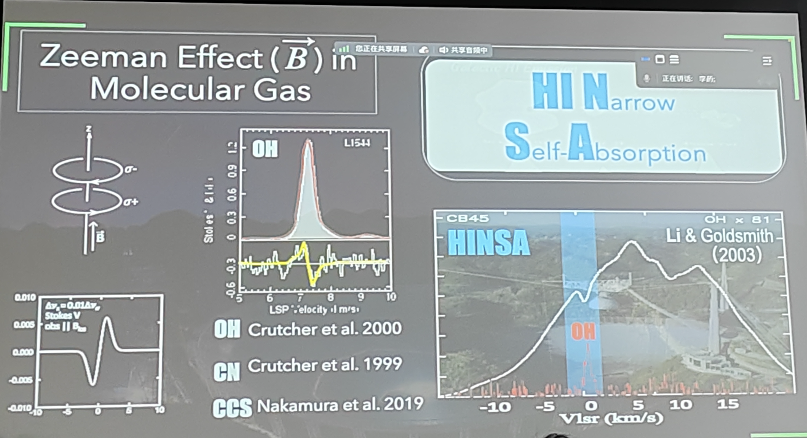

# Title: Revealing the Dynamic Universe

## Speaker: Dr. Di Li

## We always need calibration

There are two kinds of gains, that are antenna gain and electronic gain.
The antenna gain is very stable, while the electronic gain is sensitive to temperature.
Even a fluctuation of 1K can cause a 5% change in the electronic gain.
Consequently, we always need to eject a noise into the system to calibrate the electronic gain.

## Why there is no simultaneous HI and pulsar survey?

Since we always need to eject noise and do the calibration.
The frequency of the noise is usually about 1 Hz before FAST.
There will be some patterns in the spectrum, like a peak at 1 Hz and many peaks at the integer multiples of 1 Hz (1 Hz, 2 Hz, 3 Hz).
It is acceptable for the HI survey, but not for the pulsar survey.
As the period of the pulsar ranges from milliseconds to seconds, the noise will be a disaster for the pulsar survey.
Before FAST, the pulsar survey is usually done without the noise.
To simultaneously do the HI and pulsar survey, we need to eject the noise at a much higher frequency, which is possible for FAST.

<figure style="text-align: center;">
  
  <figcaption>

  </figcaption>
</figure>

## Zeeman effect

There are only the Zeeman effect of three kinds of molecular gas has been intensively studied, that are OH, CN, and CCS.

<figure style="text-align: center;">
  
  <figcaption>

  </figcaption>
</figure>