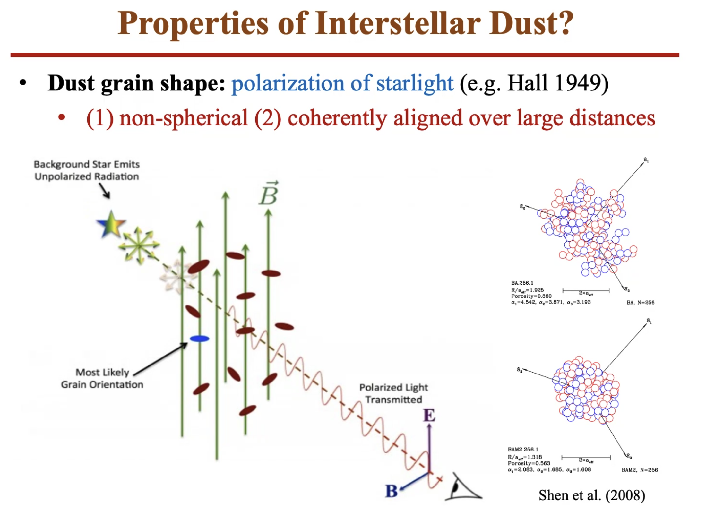
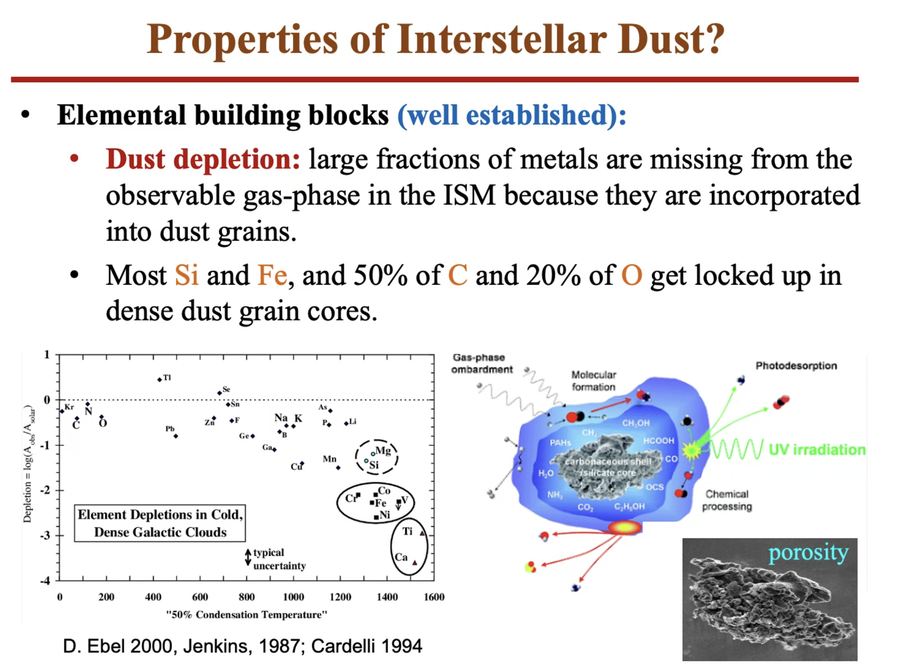
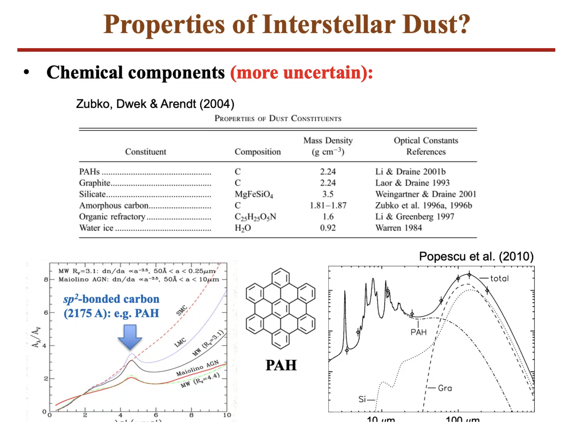
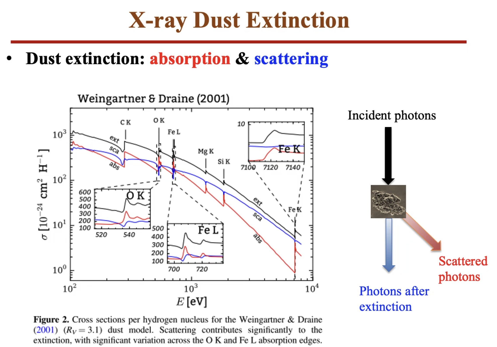
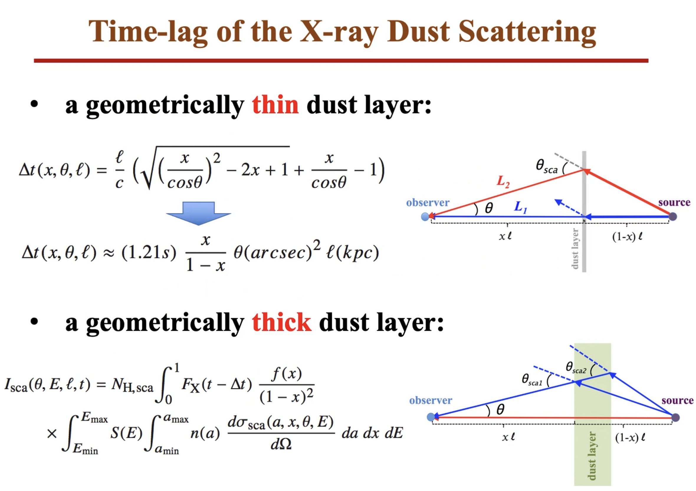
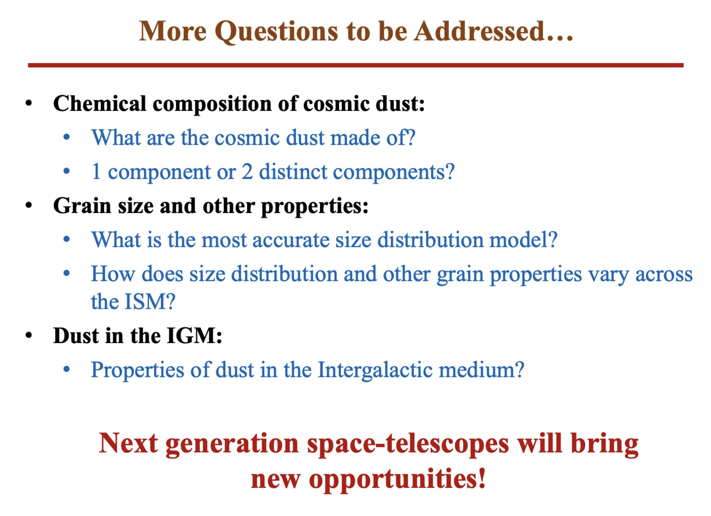
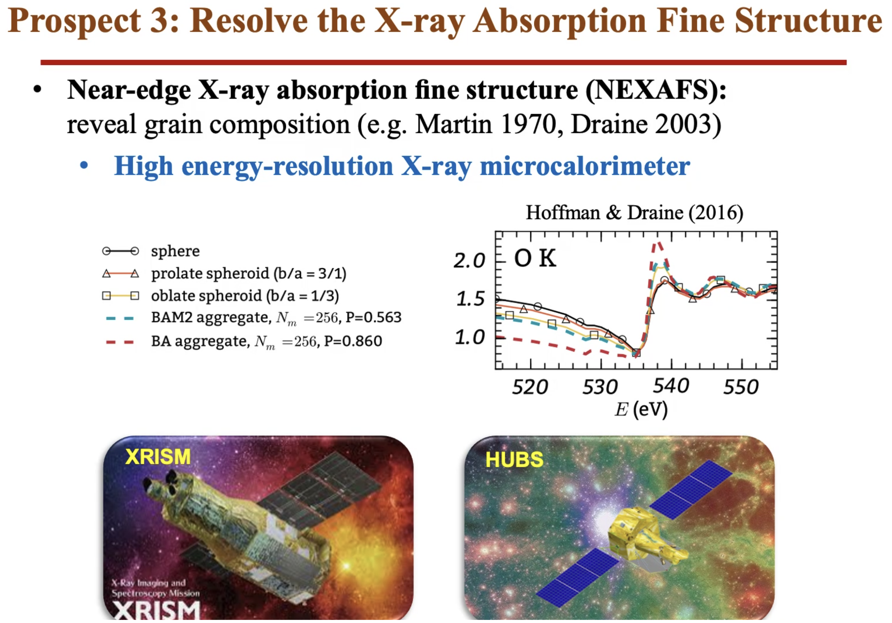
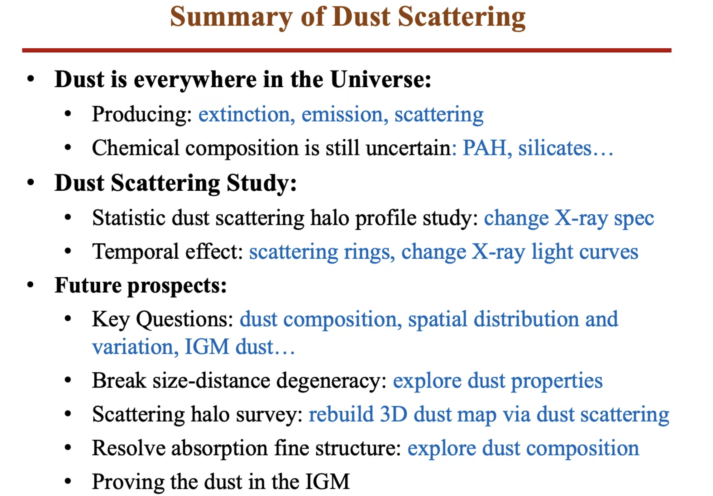

# Title: Interstellar X-ray Dust Scattering: Current Research and Future Prospects

## Speaker: Chichuan Jin

## Properties of dust

<figure style="text-align: center;">
  
  <figcaption>

  </figcaption>
</figure>

<figure style="text-align: center;">
  
  <figcaption>

  </figcaption>
</figure>

<figure style="text-align: center;">
  
  <figcaption>

  </figcaption>
</figure>

## X-ray dust extinction

<figure style="text-align: center;">
  
  <figcaption>

  </figcaption>
</figure>

## Temporal effect

<figure style="text-align: center;">
  
  <figcaption>

  </figcaption>
</figure>

## Future perspective

<figure style="text-align: center;">
  
  <figcaption>

  </figcaption>
</figure>

<figure style="text-align: center;">
  
  <figcaption>

  </figcaption>
</figure>

## Summary

<figure style="text-align: center;">
  
  <figcaption>

  </figcaption>
</figure>

## Q&A

- PAH can be produced effectively in the ISM by the late-type stars.
It is also a good tracer of star formation rate.
- Thick layers are more common in research.
- It is small-angle scattering. If the dust is behind the source, and it scatters X-ray photons to the observer, it is large-angle scattering. The large-angle scattering has a relatively small cross-section and is negligible.
- Lobster-eye telescope: large field of view, but low SNR.
- 
