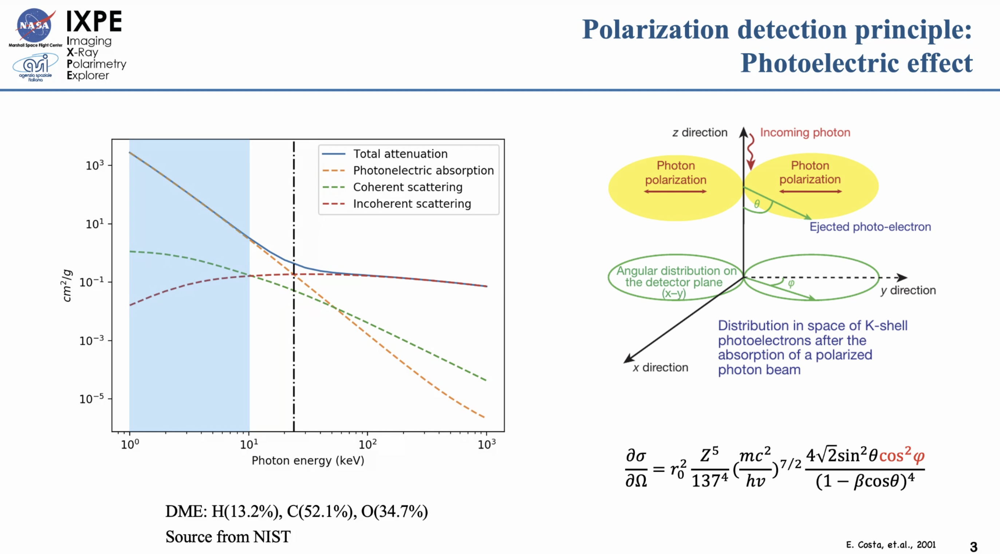
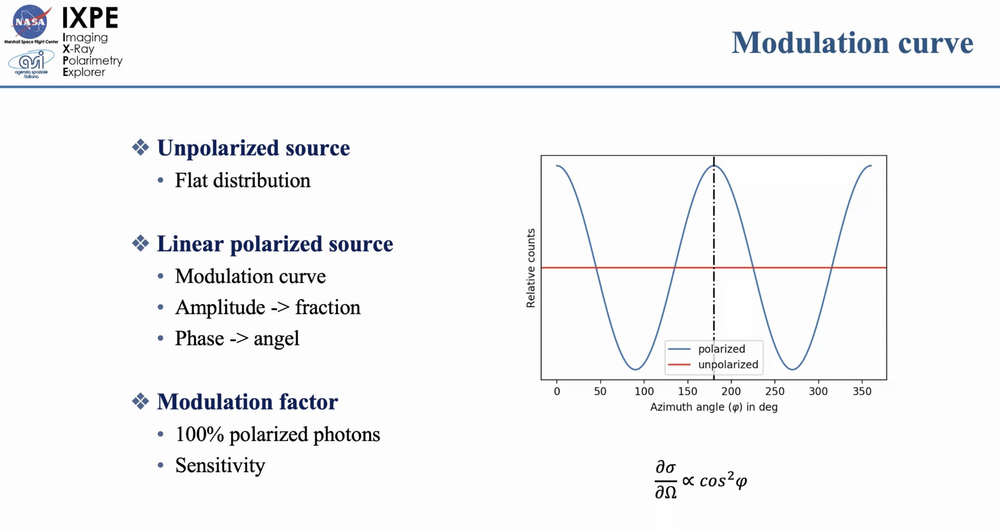
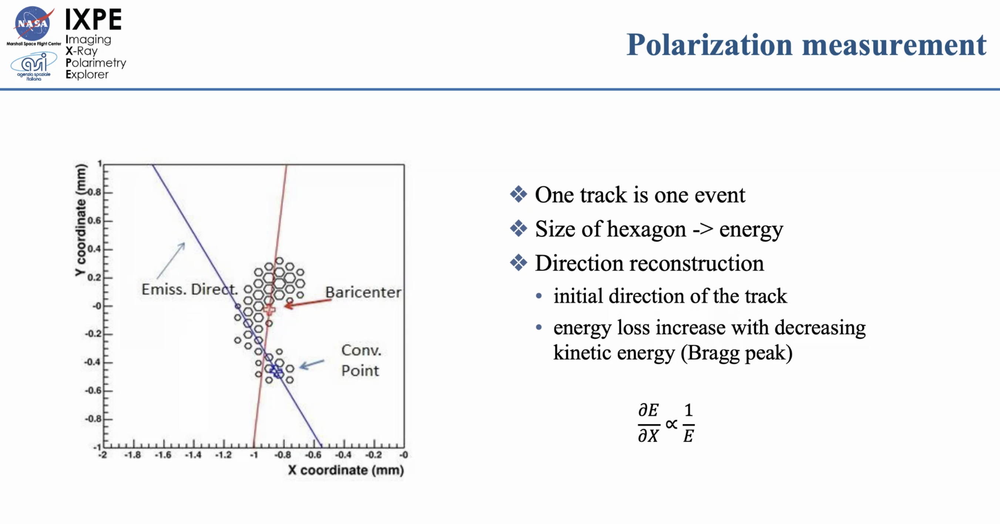
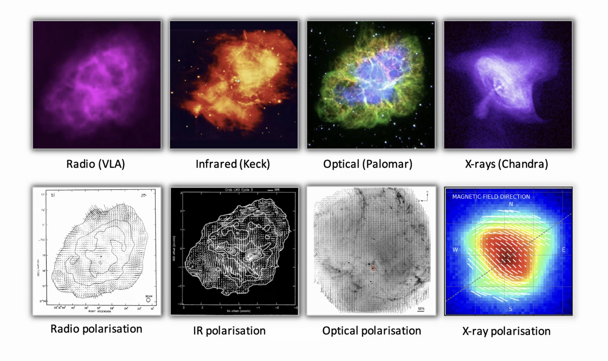
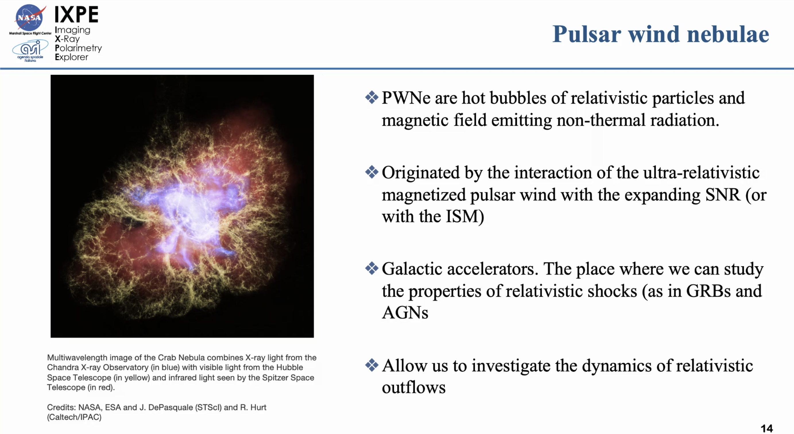
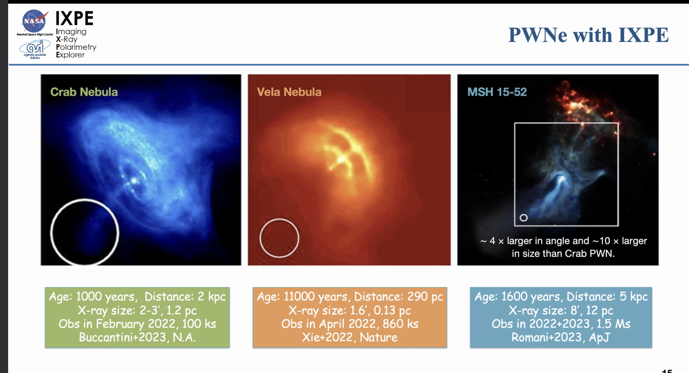
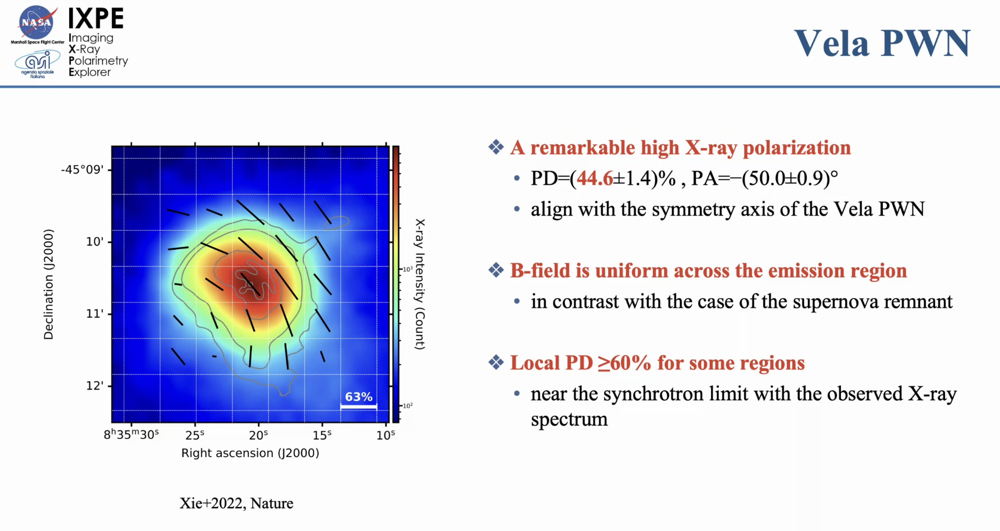
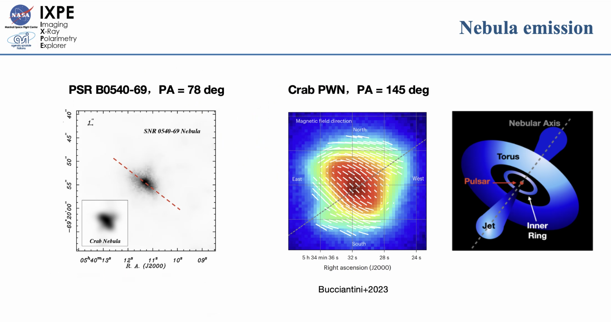

# Title: A polarized view of the pulsar wind nebula with IXPE

## Speaker: Fei Xie

## Basic introduction to the polarization

<figure style="text-align: center;">
  
  <figcaption>

  </figcaption>
</figure>

<figure style="text-align: center;">
  
  <figcaption>

  </figcaption>
</figure>

<figure style="text-align: center;">
  
  <figcaption>

The head: low density of electron <-- the higher energy of the photon, the less energy loss.
The tail: high density of electron <-- the lower energy of the photon, the more energy loss. 

  </figcaption>
</figure>

The position of the incoming photon is obtained by reconstruction of the photon.
IXPE is an Imaging X-ray Polarimetry Explorer.

<figure style="text-align: center;">
  
  <figcaption></figcaption>
</figure>

## Pulsar wind nebulae

<figure style="text-align: center;">
  
  <figcaption></figcaption>
</figure>

<figure style="text-align: center;">
  
  <figcaption>
  Cosmic hand
  </figcaption>
</figure>

The polarization angle could change very quickly.

<figure style="text-align: center;">
  
  <figcaption>

    Uniform B-field and there is no turbulence. 
    The polarization of X-ray and radio observations 
    are consistent from region to region.

  </figcaption>
</figure>

<figure style="text-align: center;">
  
  <figcaption>

  </figcaption>
</figure> 