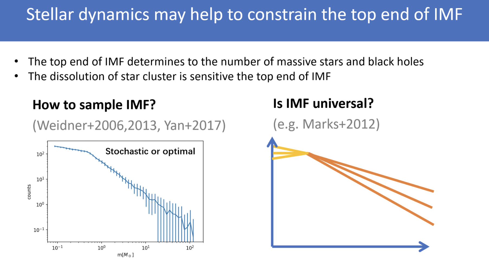
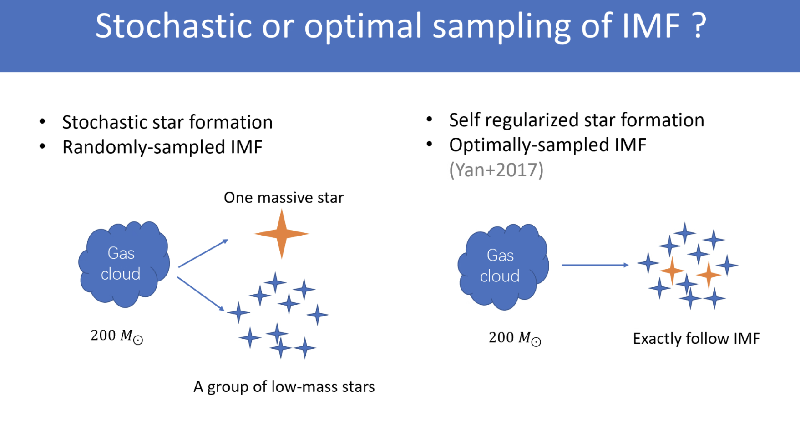
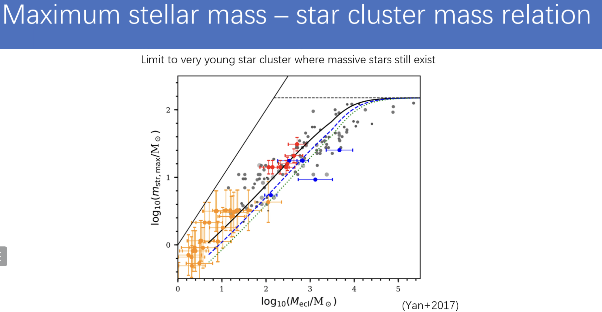
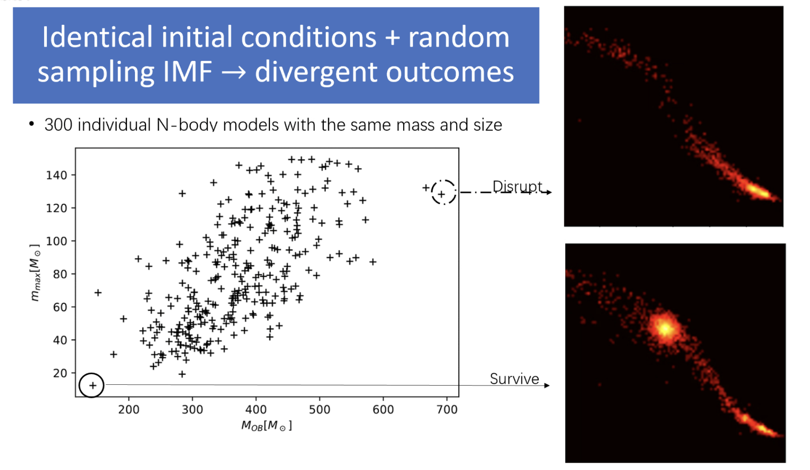
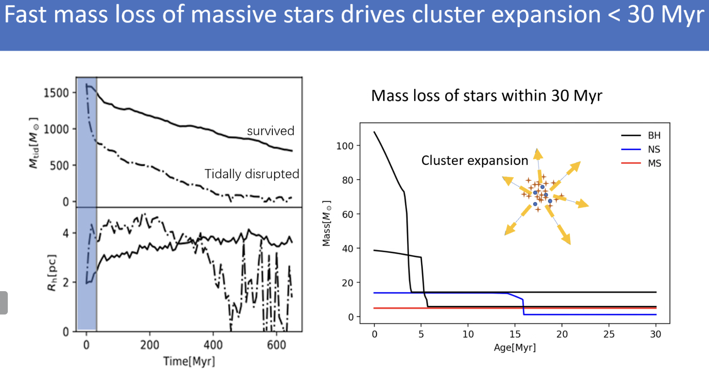
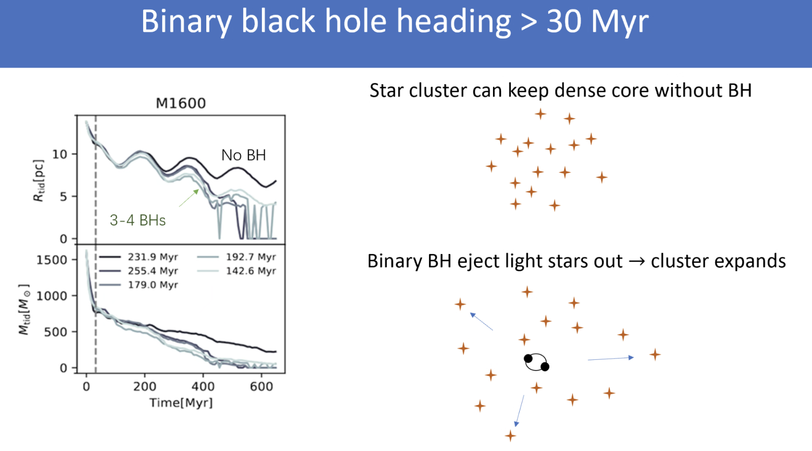
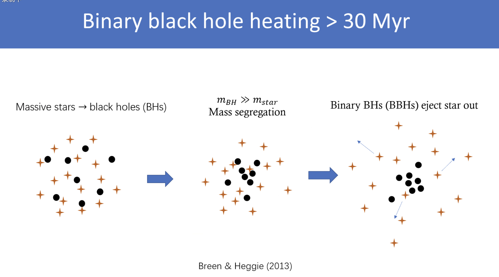
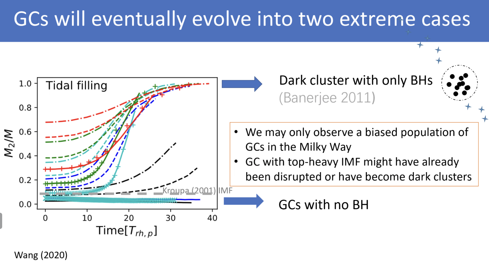
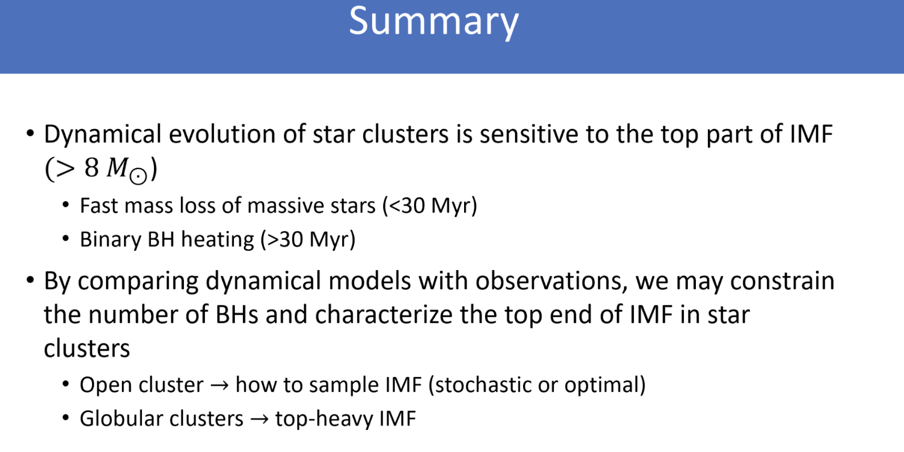

---
prev:
    text: "A polarized view of the pulsar wind nebula"
    link: "/Colloquium/2024/2024-03-28-A-polarized-view-of-the-pulsar-wind-nebula"
next: false
---
# Title: The impact of massive stars and black holes on the dynamical evolution of star clusters

## Speaker: Long Wang

<figure style="text-align: center;">
  
  <figcaption>

 Very large scatter of IMF at the mass regime $\gtrsim 2~M_{\odot}$

  </figcaption>
</figure>

## Stochastic or optical sampling?

<figure style="text-align: center;">
  
  <figcaption>

  </figcaption>
</figure>

<figure style="text-align: center;">
  
  <figcaption>

Stochastic sampling does not fit the observation well (black solid line).

  </figcaption>
</figure>

### Mass loss from OB stars
<figure style="text-align: center;">
  
  <figcaption>
The high total mass of OB stars: disrupt

The low total mass of OB stars: survive
  </figcaption>
</figure>

<figure style="text-align: center;">
  
  <figcaption>
  </figcaption>
</figure>

Stochastic sampling will lead to some extreme cases, which may be a star cluster with a very high total mass of OB stars or a very low total mass of OB stars.
A higher total mass of OB stars -> more mass loss within 30 Myr -> expansion of the star cluster -> more likely to be tidally disrupted.

### Effect of stars due to black holes

<figure style="text-align: center;">
  
  <figcaption>
  </figcaption>
</figure>

<figure style="text-align: center;">
  
  <figcaption>

  </figcaption>
</figure>

### Biases of the global cluster

<figure style="text-align: center;">
  
  <figcaption>
  </figcaption>
</figure>

### Summary
<figure style="text-align: center;">
  
  <figcaption>

 

  </figcaption>
</figure>