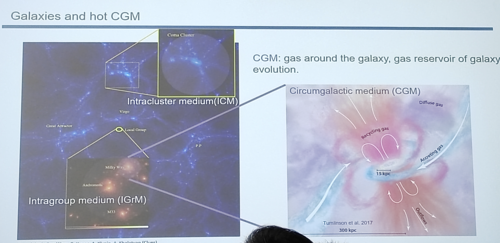
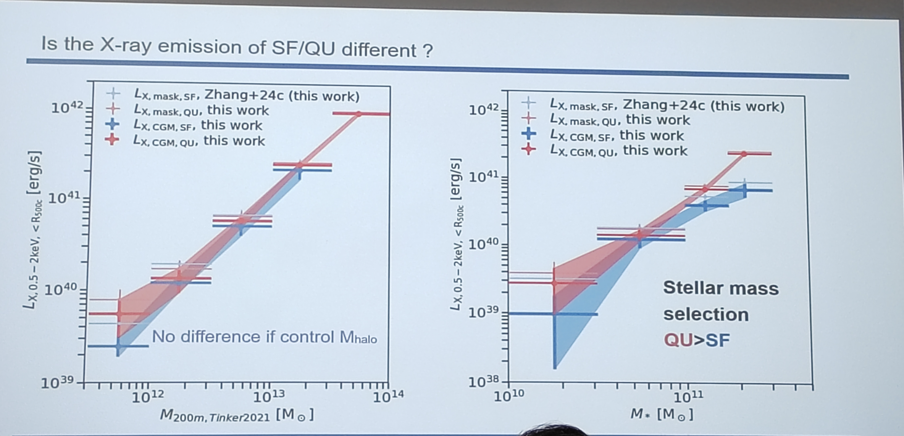
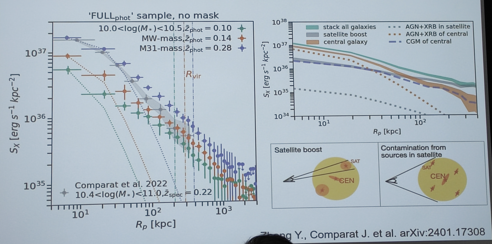
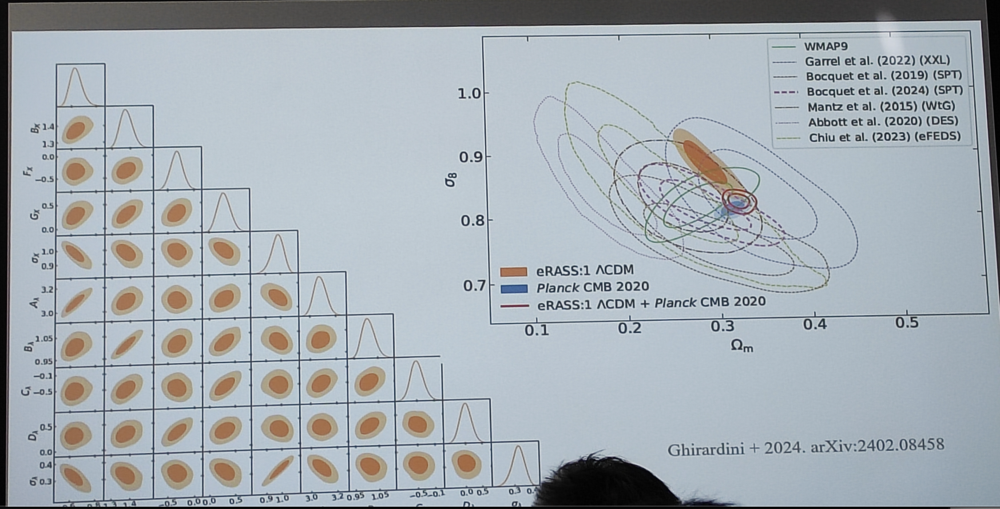
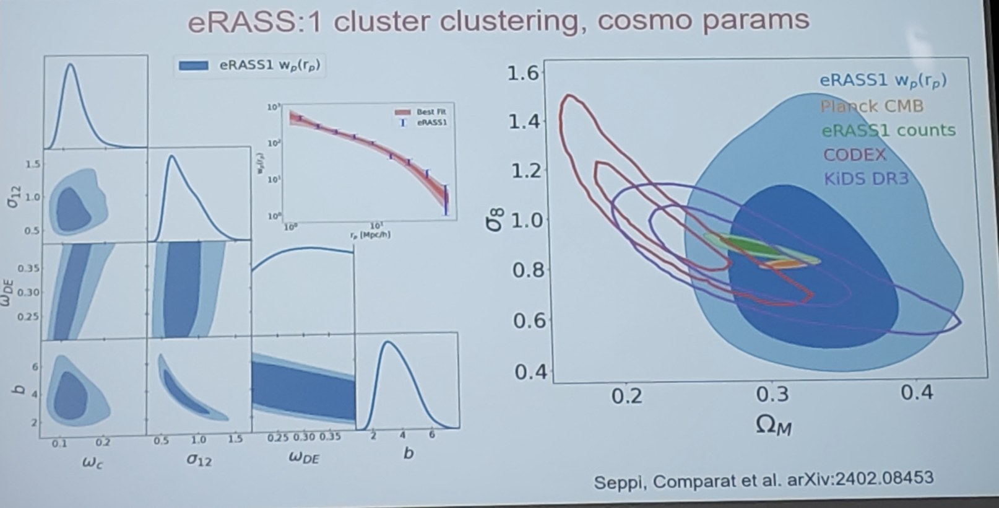

# Title: X-ray emissions from the large scale structure of the Universe

## CGM

<figure style="text-align: center;">
  
  <figcaption>
    Galaxies and hot CGM
  </figcaption>
</figure>

### eROSITA bubbles

Such a kind of bubbles are also found in Milky-Way like galaxies in TNG simulation.

<figure style="text-align: center;">
  
  <figcaption>
    Fig.1: eROSITA bubbles
  </figcaption>
</figure>

### Star-forming and quiscent galaxies

<figure style="text-align: center;">
  
  <figcaption>

    The y-axis is the X-ray luminosity from CGM.

  </figcaption>
</figure>

The right figure indicates that the main driver for the X-ray luminosity from CGM is the halo mass, i.e., it is the virialization of the halo that drives the X-ray luminosity, not the feedback from the galaxies (not the interplay between CGM and the galaxies).
Through virialization, the gas in the halo is heated up by the accretion shock to a temperature of $10^6$ K, which is the temperature of the hot CGM.

### Baryon fraction inference

<figure style="text-align: center;">
  
  <figcaption>

  </figcaption>
</figure>

### Stack galaxies and boost of satellite galaxies

<figure style="text-align: center;">
  
  <figcaption>

  </figcaption>
</figure>

### Abundance and temperature of the outer skirts of hot CGM

<figure style="text-align: center;">
  
  <figcaption>

 

  </figcaption>
</figure>

## Clusters and groups

### Constraints on cosmological parameters

<figure style="text-align: center;">
  
  <figcaption>

  </figcaption>
</figure>

<figure style="text-align: center;">
  
  <figcaption>

  </figcaption>
</figure>

## Conclusion

<figure style="text-align: center;">
  
  <figcaption>

  </figcaption>
</figure>