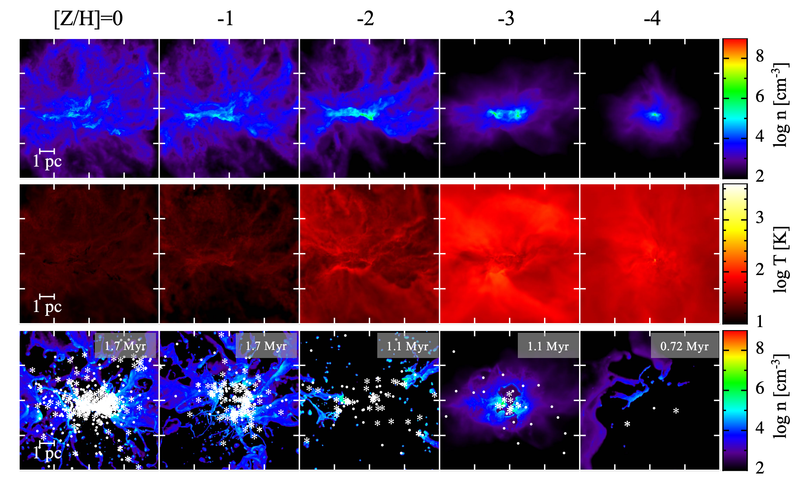
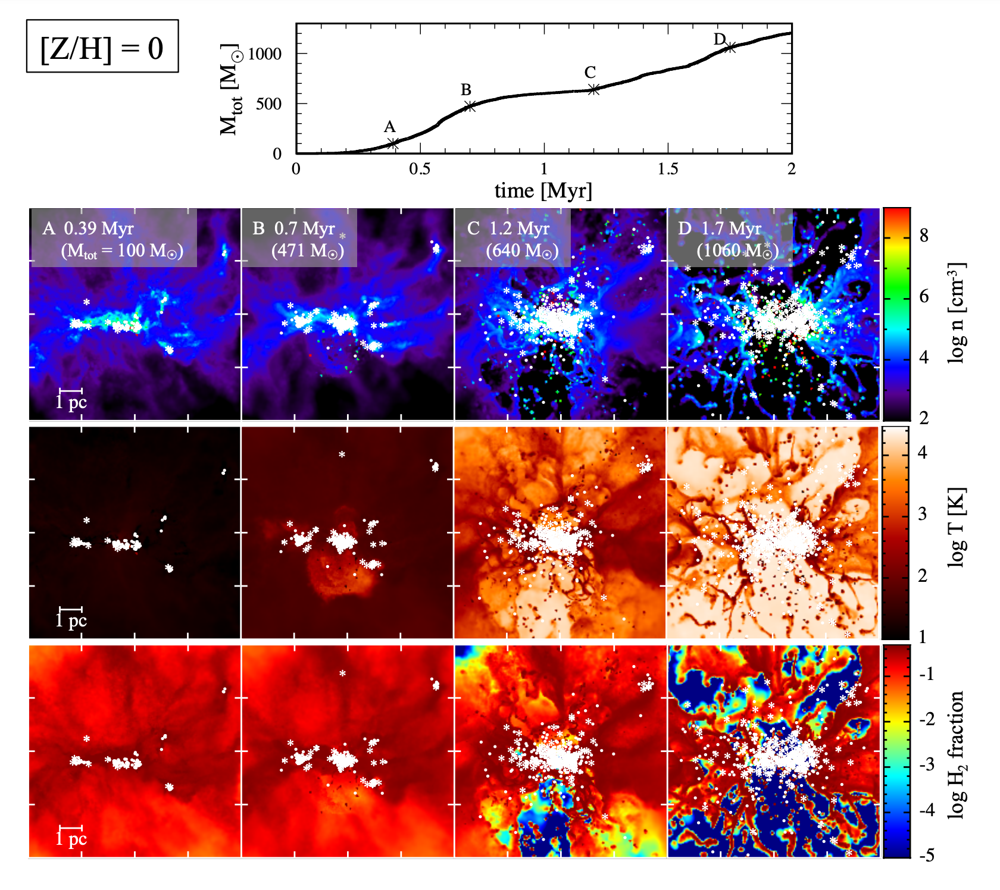
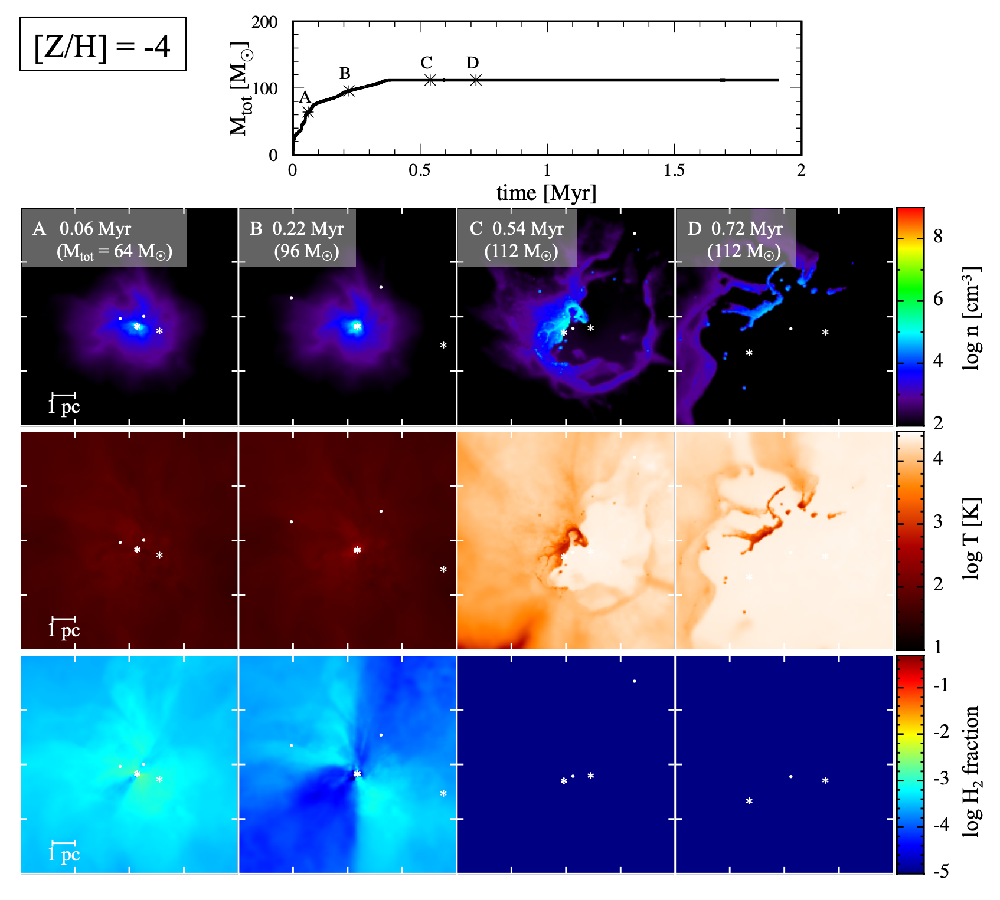
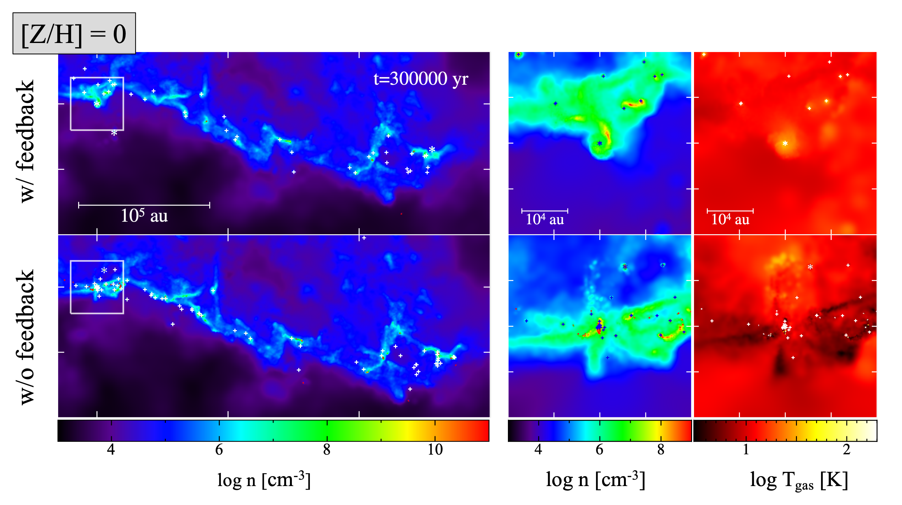
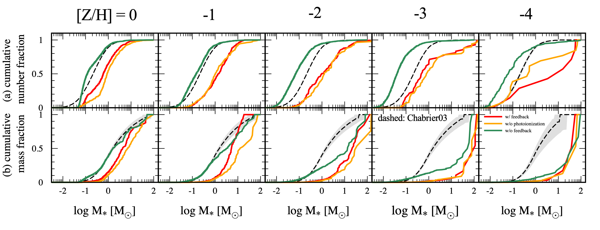
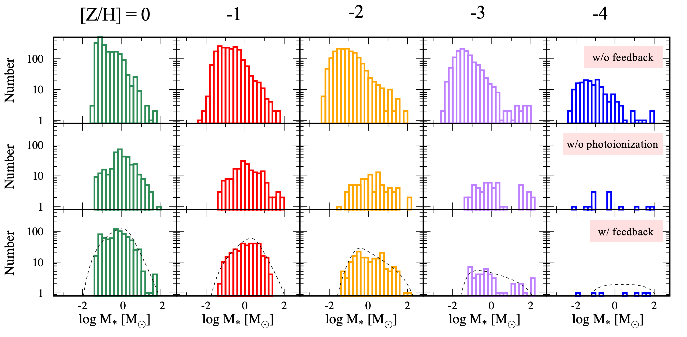

# Radiative feedback matters for the initial mass function of metal-poor stars

<strong>Title:</strong> <a href="https://arxiv.org/abs/2312.13339"> Impact of radiative feedback on the initial mass function of metal-poor stars</a>

 by Guan-Fu Liu | Jan 6, 2024 | Daily Paper Summaries |0 comments 

<strong>Authors:</strong>
Sunmyon Chon, Takashi Hosokawa, Kazuyuki Omukai, Raffaella Schneider

<strong>First Author’s Institution:</strong>
Max-Planck-Institut für Astrophysik, Karl-Schwarzschild-Str. 1, D-85741 Garching, Germany

<strong>Status:</strong> Submitted to MNRAS [open access]

Initial mass function ([IMF](https://en.wikipedia.org/wiki/Initial_mass_function)) is fundamental to our understanding of the formation and evolution of galaxies.
IMF is directly related to star formation, stellar evolution, chemical enrichment, feedback processes, and almost all observable properties of galaxies.
IMF describes the distribution of stellar masses during a single star-forming episode when the stars are at the zero-age main sequence ([ZAMS](https://astronomy.swin.edu.au/cosmos/z/Zero+Age+Main+Sequence)), i.e., when stars enter the main sequence and start hydrogen burning.
Mathematically, IMF is defined as the number of stars per unit mass interval,
$$
\xi(m) = \frac{dN}{dm},
$$
where $\xi(m)$ is the IMF, $m$ is the stellar mass, and $dN$ is the number of stars whose masses within $(m,m+dm)$.

The first form of the IMF was introduced by Salpeter in 1955, which is a power law with a slope of $-2.35$, that is
$$
\xi(m) \propto m^{-2.35},
$$
which is now known as the [Salpeter IMF](https://ui.adsabs.harvard.edu/abs/1955ApJ...121..161S).
There are also other kinds of IMF such as the [Chabrier IMF](https://ui.adsabs.harvard.edu/abs/2003PASP..115..763C/abstract) and the [Kroupa IMF](https://ui.adsabs.harvard.edu/abs/2001MNRAS.322..231K/abstract).
Although there are some differences between these IMFs, they are all **universal**, i.e., independent of the environment.
It should be noted that such universality is not intuitive, but the observations of the Milky Way and nearby galaxies have shown no convincing evidence for the variation of IMF.
Since the determination of IMF for the high-redshift universe is challenging, the authors of this paper conduct a series of long-term hydrodynamic simulations to provide more insights into the IMF in the early universe.

## A simple picture: Jeans instability

Before going into the details of the simulations, some basic concepts and mechanisms should be introduced.
[Jeans instability](https://en.wikipedia.org/wiki/Jeans_instability) is the most important general picture for the formation of stars.
Jeans mass is the minimum mass required for a cloud to collapse under its own gravitational force, which can be used to estimate the mass of the stars.
The Jeans mass is given by
$$
M_J = \left(\frac{5kT}{3G\mu m_H}\right)^{3/2}\frac{\pi}{6\sqrt{\rho}}\propto T^{3/2}\rho^{-1/2},
$$
where $k$ is the Boltzmann constant, $T$ is the temperature, $G$ is the gravitational constant, $\mu$ is the mean molecular weight, $m_H$ is the mass of hydrogen atom, and $\rho$ is the density of the cloud.
The higher the temperature and the lower the density, the larger the Jeans mass.
Although the Jeans instability is a simple scenario for the formation of stars, it is rather important for the reason that almost any kind of complicated mechanism plays a role in the formation of stars through changing the temperature and density of the gas, thus changing the Jeans mass.
Since the cooling is more ineffective for the metal-poor gas, the temperature is higher and the Jeans mass is larger, which is often the case in the early universe.

## Star formation at different metallicities

To investigate the role that metallicity plays in star formation, the author conducts a series of simulations with varying metallicities.
As is shown in Figure 1, the stars are more cluster-like at higher metallicities, but only a few stars are formed at the lowest metallicity.
The expansion of HII regions created by massive stars disrupts the gas cloud and suppresses the star formation at all metallicities, which underlines the importance of radiative feedback.
<figure style="text-align: left;">
  
  <figcaption>

  <strong>Figure 1: </strong> The projected density, and temperature distribution at the epoch of the first protostar formation for $\text{[Z/H]}= $ $0$, $−1$, $−2$, $−3$, and $−4$ are shown in the top and middle rows, respectively. The bottom panels show the density distribution when the HII region expands around the star cluster and the cloud starts to deplete. The stars with a mass larger (smaller) than $1~M_{\odot}$ are overplotted by white asterisks (dots) in the bottom row.
   <em>Adapted from Figure 1 in Chon et al. 2023.</em>

  </figcaption>
</figure>

### Star formation history at solar metallicity

More details about the star formation history at solar metallicity are shown in Figure 2.
The star formation history can be divided into four epochs, which goes as follows,

- 1. Epoch A: there is a fragmentation of a filamentary cloud, and hence protostars are formed in alignment. But no massive stars have been formed yet.
- 2. Epoch B: The protostars formed in epoch A have grown and the most massive one has reached $\sim 20~M_{\odot}$. The massive stars emit numerous ionizing photons, which heat the surrounding region to a temperature of several thousand K and create HII region. The accretion flow onto the massive stars is disrupted by the hot gas and the growth of the massive stars is suppressed.
- 3. Epoch C: The HII region expands in all directions, but the gas hidden behind the filament is shielded from the ionizing photons and remains neutral.
- 4. Epoch D: Almost all the domain is filled with the HII region, while there is still some dense and neutral gas deep inside the remaining filament. Compression of the cold and neutral gas by the HII region leads to the formation of new stars.

<figure style="text-align: left;">
  
  <figcaption>

 <strong>Figure 2: </strong> How the total stellar mass evolves with time, and the projected density, temperature, and the $\text{H}_{2}$ fraction for the solar metallicity are shown from the top to the bottom, respectively. The white asterisks and dots in the bottom row indicate the stars with a mass larger and smaller than $1~M_{\odot}$, respectively.
   <em>Adapted from Figure 2 in Chon et al. 2023.</em>

  </figcaption>
</figure>

### Star formation history at extremely low metallicity

For the extremely low metallicity ($\text{[Z/H]}=-4$), the star formation history is shown in Figure 3.

- 1. Epoch A: The star formation sequence is distinct from the solar metallicity case. Since the metallicity is extremely low, the cooling is inefficient and the temperature is high, which eliminates the fine structure created by initial turbulence.
The structure of the gas is more core-like and no filamentary structure is formed.
Therefore, stars are formed within such a small cloud core, some of which may be ejected due to the gravitational interaction with other stars.
- 2. Epoch B: Star formation is suppressed by stellar feedback and the HII region expands. In addition, the expansion of an $\text{H}_2$ photo-dissociation region (PDR) is also important for the suppression of star formation.
- 3. Epoch C: Since the massive stars can be ejected to an outer region, the HII region expands and suppresses the star formation at the outer region. Such an ejection of massive stars is more common for the extremely low metallicity case, as the stars tend to be more concentrated in the center initially.
- 4. Epoch D: The star-forming gas is completely depleted and the star formation is terminated.

<figure style="text-align: left;">
  
  <figcaption>

<strong>Figure 3: </strong> Same as Figure 2, but for the extremely low metallicity ($\text{[Z/H]}=-4$).
   <em>Adapted from Figure 4 in Chon et al. 2023.</em>

  </figcaption>
</figure>

Radiative feedback has an important impact on the star formation process and, thus on the initial mass function, at different metallicities.
There are two different mechanisms for radiative feedback, that is dust heating and photoionization, which are discussed in the following.

## Dust heating: fragmentation suppression

The heating of dust grains by stellar radiation hinders the fragmentation of the gas cloud at a small scale, reducing the number of low-mass stars with $M_{*}<1~M_{\odot}$.
Illustrated by Figure 4, dust heating leaves little effect on the pc-scale filamentary structure.
However, stellar irradiation heats the gas inside the filamentary structure to several thousand K, which suppresses the fragmentation of the gas cloud at a small scale.
Such a suppression of fragmentation at a small scale leads to a decrease in the number of low-mass stars.
Taking no stellar feedback into consideration, the number fraction of low-mass stars with masses smaller than $1~M_{\odot}$ is larger than 0.5, which is shown in green lines in Figure 5(a).
However, the number fraction of low-mass stars is reduced to $\sim 0.3$ when the stellar feedback is included, which is shown in red lines in Figure 5(a).
This kind of reduction is significant for all metallicities.

<figure style="text-align: left;">
  
  <figcaption>

<strong>Figure 4: </strong> The upper and lower panels illustrate the runs with stellar feedback and without feedback, respectively. The leftmost column show the distribution of the gas density at a large scale. The remaining two columns illustrate the zoom-in view of the gas density and temperature within the area marked by the white square on the left panels. Stars with masses higher (lower) than $1~M_{\odot}$ are overplotted by white asterisks (crosses).
   <em>Adapted from Figure 8 in Chon et al. 2023.</em>
 

  </figcaption>
</figure>

## Photoionization: hindrance of growth of massive stars

Photoionization is another important mechanism for radiative feedback, which has a substantial impact on the formation of massive stars, especially for the higher metallicities $\text{[Z/H]}\gtrsim -2$.
The mass fraction of massive stars with $M_{*}>10~M_{\odot}$ is much larger at the higher metallicities $\text{[Z/H]}\gtrsim -2$ when the photoionization is excluded, which is shown in yellow lines in Figure 5(b).
When the metallicities are higher, there are more massive stars and these massive stars tend to form in isolated small cores with smaller discs. Therefore the HII region can expand more easily and suppress the accretion onto the massive stars.

<figure style="text-align: left;">
  
  <figcaption>
 
 <strong>Figure 5: </strong> The cumulative number (mass) fraction of stars with masses below $M_{*}$ is shown in the upper (lower) panel. The red lines indicate the runs with stellar feedback, while the green lines show the cases without any stellar feedback. The yellow lines are the runs with stellar feedback except for the photoionization.
 The corresponding values for the Chabrier IMF are represented by the black dashed lines, with the shaded region indicating the $1\sigma$ uncertainty.
 <em> Adapted from Figure 13 in Chon et al. 2023.</em>

  </figcaption>
</figure>

## The overall shape of the IMF

Since the radiative feedback has a significant impact on the formation of stars, with the dust heating suppressing the formation of low-mass stars and the photoionization suppressing the formation of massive stars, the overall shape of the IMF is changed.
Figure 6 shows the stellar mass distributions at the end of simulations for different metallicities with $\text{[Z/H]} = 0$, $−1$, $−2$, $−3$, and $−4$ from left to right.
Comparing the upper and the bottom panels in Figure 6, it is evident that the radiative feedback has a more significant impact on the IMF at lower metallicities.
Including the photoionization, the number fraction of massive stars with $M_{*}>10~M_{\odot}$ is reduced, especially for the higher metallicities $\text{[Z/H]}\gtrsim -2$, which is shown in the middle and bottom rows in Figure 6.
The number of low-mass stars with $M_{*}<1~M_{\odot}$ is also reduced when taking dust heating into account, which is shown in the upper and middle rows in Figure 6.

<figure style="text-align: left;">
  
  <figcaption>

 <strong>Figure 6: </strong> The stellar mass distributions at the end of simulations for different metallicities with $\text{[Z/H]} = 0$, $−1$, $−2$, $−3$, and $−4$ from left to right.
 The cases without feedback, with feedback but no photoionization, and with feedback are shown in the top, middle, and bottom panels, respectively.
<em> Adapted from Figure 12 in Chon et al. 2023.</em>

  </figcaption>
</figure>

The authors conduct a series of long-term hydrodynamic simulations to investigate the impact of radiative feedback on the IMF at different metallicities. They find that radiative feedback matters in shaping the IMF at lower metallicities. The dust heating suppresses the formation of low-mass stars, while the photoionization suppresses the formation of massive stars.
Since the metallicities in more pristine environments are lower, the radiative feedback is more important in the early universe.
As the observation in the local universe suggests a universal IMF, this paper provides more insights into the possibility of the variation of the IMF.
