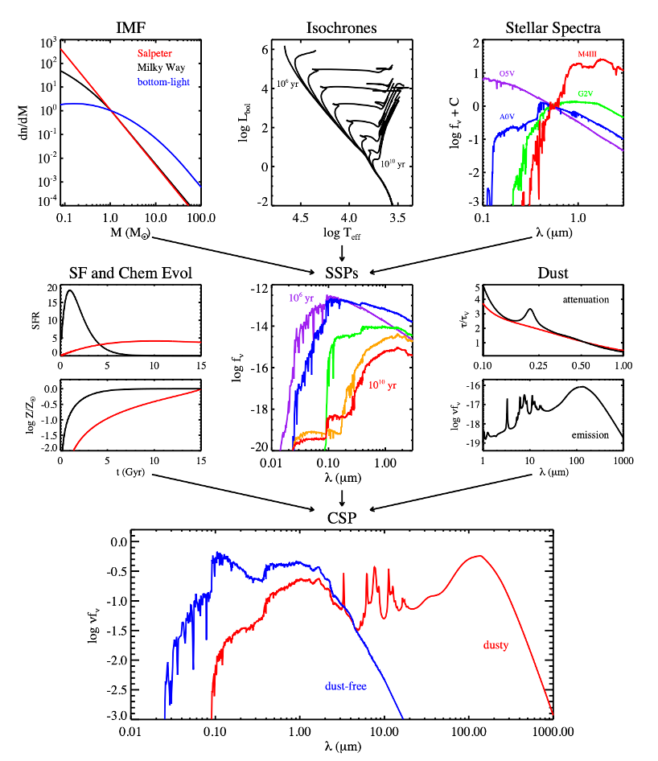

---
prev:
    text: "The Milky Way"
    link: "/Notes/Galactic-Physics/Milky-Way"
next:
    text: "Tracing Star Formation Rate"
    link: "/Notes/Galactic-Physics/Tracing-Star-Formation-Rate"
---
# Simple Stellar Populations (SSP)

## Definition

A simple stellar population (SSP) refers to a group of stars that are born at the same time, in the same volume of space, and from a gas cloud of homogeneous chemical composition.
SSPs are characterized by a single age and metallicity, and they serve as the basic building blocks for studying the formation and evolution of galaxies and their components.

## Why SSP?

The PCA of galaxy spectra reaveals that the spectra of galaxies are dominated by a few eigenspectra. 

<figure style="text-align: center;">
  
  <figcaption>
  </figcaption>
</figure>

