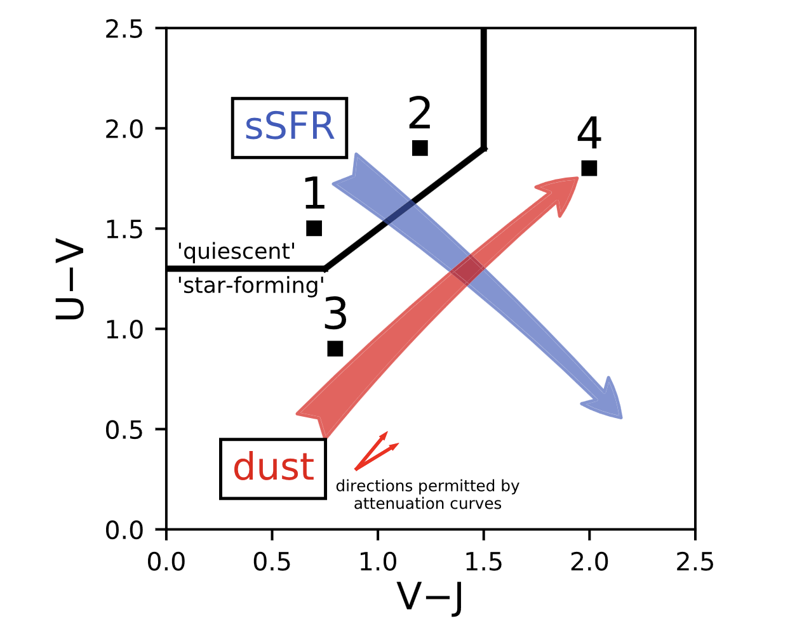
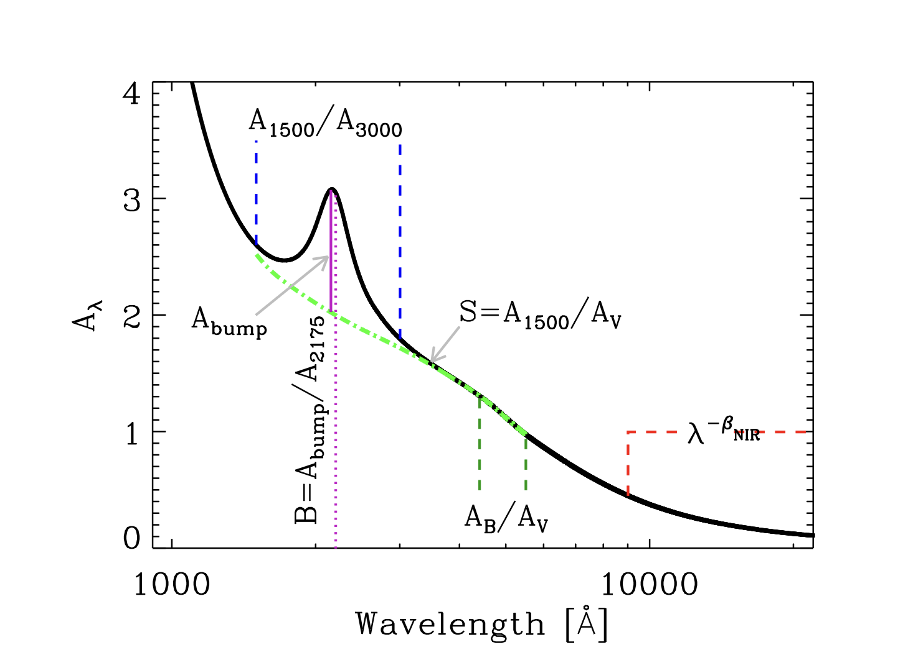

# Introduction

The galaxies observed were redder than normal can be interpreted as their older age or dust reddening.
The UVJ diagram is a tool to distinguish between these two possibilities and is effective at separating quiescent and star-forming galaxies.
The UVJ diagram is a color-color diagram that uses the rest-frame U-V and V-J colors

<figure style="text-align: center;">
  
  <figcaption>
 Figure 1 from <a href="https://iopscience.iop.org/article/10.3847/2041-8213/ab2f8c "> Beyond UVJ </a>

  </figcaption>
</figure>

## The principle of the UVJ diagram

- U band: Ultraviolet, trace the recent star formation, most sensitive to dust extinction
- V band: Visible, trace stellar mass, less sensitive to dust extinction than U band
- J band: Near-infrared, trace the older stellar population, least sensitive to dust extinction.
  
Given that the luminosity in the U band is mainly due to young and massive stars and the luminosity in the V band is mainly due to the total stellar mass, star-forming galaxies (with a larger sSFR) are expected to have a smaller U (more massive stars, larger $\dot{M}$) and a larger V (less stellar mass, smaller $M_{\star}$), thus a smaller U-V and a larger V-J.
You may conclude that a quiescent galaxy will have a larger U-V and a larger V-J (larger U, fewer massive stars; smaller J, more old stars).
However, a galaxy with a large U-V and a large V-J is more likely to be a star-forming but dusty galaxy, rather than a quiescent galaxy.
If there is a large amount of dust in the galaxy, the luminosity in the U band will suffer a larger extinction than the luminosity in the V band, thus the U-V will be larger than the intrinsic value, and the luminosity in the J band will suffer the least extinction, thus the V-J will be larger than the intrinsic value.
<figure style="text-align: center;">
  
  <figcaption>

 Schematic representation of an attenuation or extinction curve, 
 from <a href="https://arxiv.org/pdf/2001.03181.pdf "> The Dust Attenuation Law in Galaxies </a>

  </figcaption>
</figure>