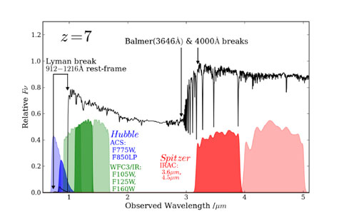
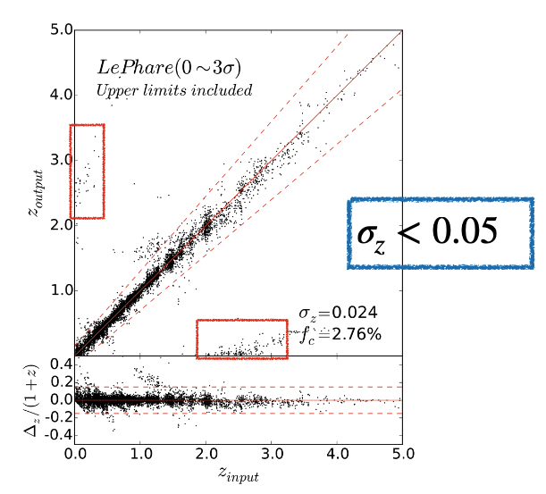

# Why some photo-z in CSST is under/over-estimated?

## How to get the photon-z

<figure style="text-align: center;">
  
  <figcaption> This figure is from this <a href="https://ned.ipac.caltech.edu/level5/Sept14/Dunlop/Dunlop3.html"> website </a>.
  </figcaption>
</figure>

<!-- {style="display: block; margin: 0 auto; width: 120%;" } -->
<!-- This figure is from this [website].(https://ned.ipac.caltech.edu/level5/Sept14/Dunlop/Dunlop3.html) -->

To get the redshift of a galaxy, the feature of its speecturm should be utilized.
The most common way is to use the Lyman break or Balmer break, which is the drop of flux at the wavelength of $912 ~ \mathrm{\mathring{A}}$ - $1216 ~ \mathrm{\mathring{A}}$ and $3646 ~ \mathrm{\mathring{A}}$  - $4000 ~ \mathrm{\mathring{A}}$ , respectively.
By measuring the flux of a galaxy in a series of narrow bands, the position of the break can be determined.
The redshift of the galaxy can be calculated by the following equation:
$$
z=\frac{\lambda_{\mathrm{obs}}}{\lambda_{\mathrm{rest}}}-1
$$
where $\lambda_{\mathrm{obs}}$ is the observed wavelength of the break and $\lambda_{\mathrm{rest}}$ is the rest wavelength of the break.
The position of the Balmer break in the figure above is about $3~\mu \mathrm{m}=3\times 10^{4} ~ \mathrm{\mathring{A}}$, and hence the redshift is about $7$.

## The break can be mistaken

By measuring the flux in a series of narrow bands, $\lambda_{\mathrm{obs}}$ of a break can be deterimined.
By confirming the break is the Lyman break or Balmer break, $\lambda_{\mathrm{rest}}$ can be determined.
However, the break can be mistaken.

<!-- {style="display: block; margin: 0 auto; width: 120%;" } -->

<figure style="text-align: center;">
  
  <figcaption>

  Photon-z versus Spec-z
  
  </figcaption>
</figure>

For an instance, for a galaxy at redshift $0.2$, there is a
Balmer break at $3646 \times 1.2 = 4375.2 ~ \mathrm{\mathring{A}}$.
$$
z_{\mathrm{photon}} \approx \frac{4375.2}{1000}-1 \approx 2.4
$$
The redshift is over-estimated by a factor of $12$.

<!-- <figure style="text-align: center;">
  
  <figcaption>Photon-z versus Spec-z </figcaption>
</figure> -->

## Other breaks

Yes, apart from the Lyman break, there are several other breaks or discontinuities observed in the astronomical spectrum. These breaks occur at specific wavelengths and are caused by various physical processes.

1. Balmer Break: The Balmer break is a discontinuity observed in the optical spectrum of stars. It occurs at a wavelength of approximately $3646 ~ \mathrm{\mathring{A}}$ (Angstroms) and is caused by the absorption of photons by hydrogen atoms in the star's outer atmosphere. This break is particularly prominent in hot, young stars.

2. Paschen Break: Similar to the Balmer break, the Paschen break is observed in the infrared spectrum of stars. It occurs at a longer wavelength of around $8200 ~ \mathrm{\mathring{A}}$ and is caused by the absorption of photons by hydrogen atoms in the star's outer atmosphere. The Paschen break is more prominent in cooler stars compared to the Balmer break.

3. Werner Break: The Werner break is a discontinuity observed in the ultraviolet spectrum of stars. It occurs at a wavelength of approximately $912 ~ \mathrm{\mathring{A}}$ and is caused by the absorption of photons by neutral hydrogen atoms in the interstellar medium. This break is significant in studying the properties of interstellar gas and the formation of stars.

4. $4000 ~ \mathrm{\mathring{A}}$ Break: The $4000 ~ \mathrm{\mathring{A}}$ break, also known as the Balmer/$4000 ~\mathrm{\mathring{A}}$ break, is a discontinuity observed in the optical spectrum of galaxies. It occurs at a wavelength of around $4000 ~ \mathrm{\mathring{A}}$ and is caused by the combined effect of the Balmer break and metal absorption lines. This break is used to study the age and stellar populations of galaxies.

These breaks in the astronomical spectrum provide valuable information about the physical properties of celestial objects, such as their temperature, composition, and age. By analyzing these breaks, astronomers can gain insights into the nature and evolution of stars, galaxies, and the universe as a whole.
