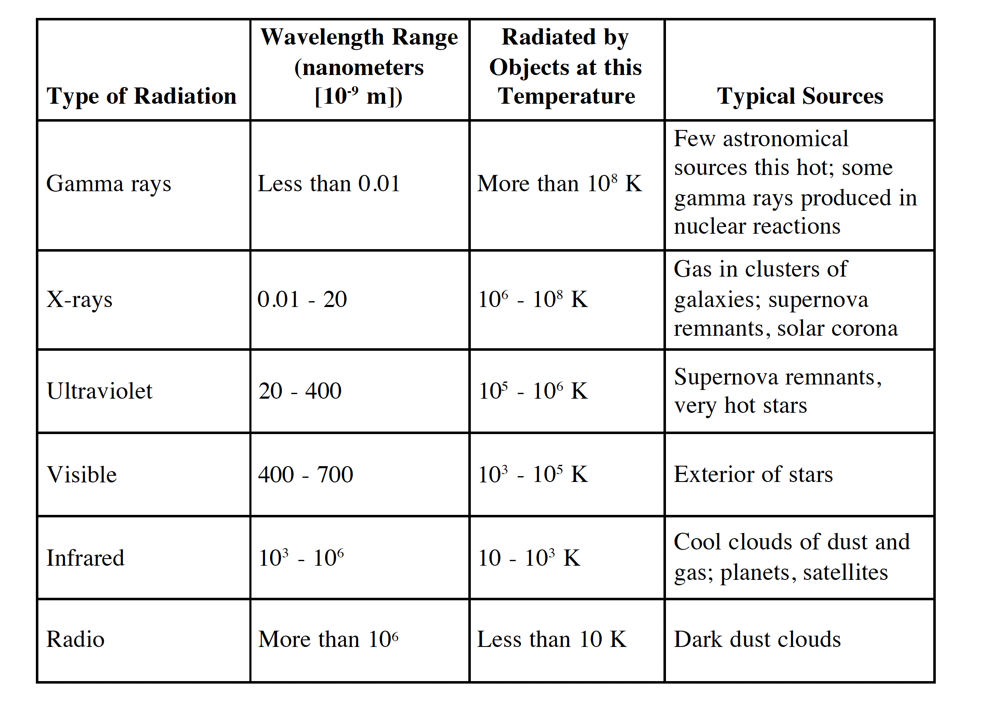
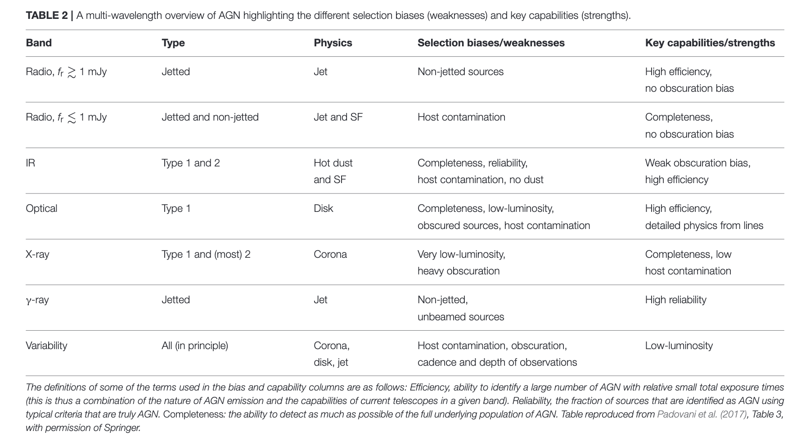

# Electromagnetic Spectrum

## Table containing basic information

<figure style="text-align: center;">
  
  <figcaption>Chapter 3 in <i> Basics of Radio Astronomy</i> by Diane Fisher Miller</figcaption>
</figure>

## Active Galactic Nuclei at All Wavelengths and from All Angles

<figure style="text-align: center;">
  
  <figcaption>
    From <a href="https://ui.adsabs.harvard.edu/abs/2017FrASS...4...35P/abstract"> Padovai (2017)</a>
  </figcaption>
</figure>