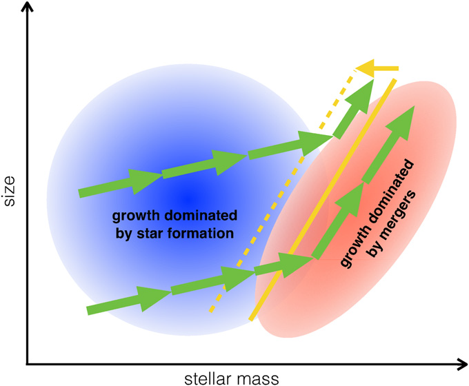
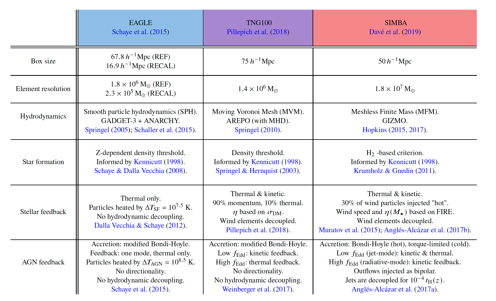
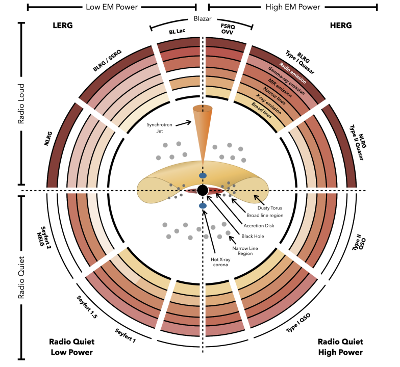
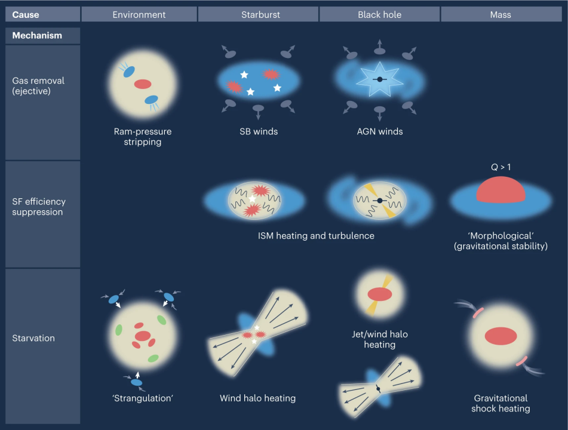
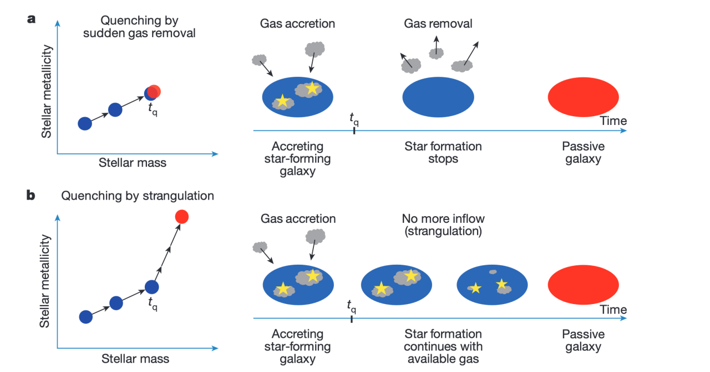
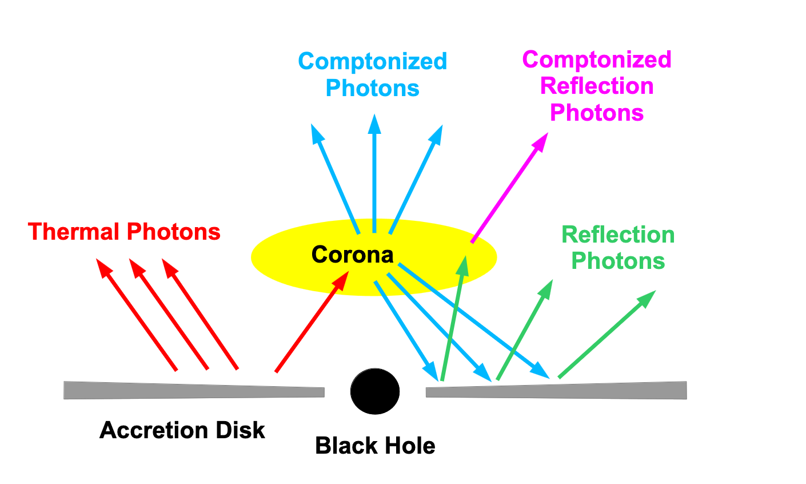
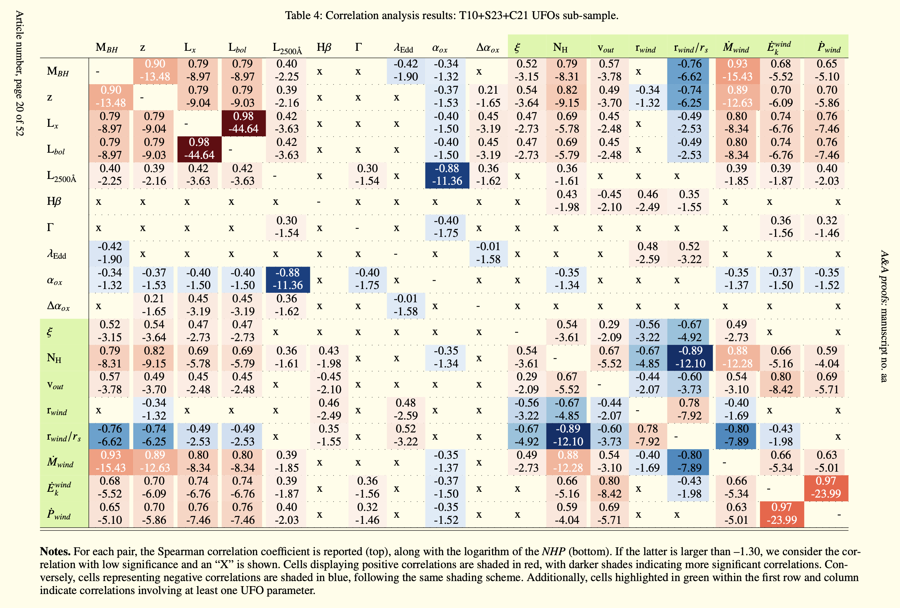

# Schematics of Astronomy

I created this page to collect some schematics of astronomy. I will add more in the future.

<figure style="text-align: center;">
  
  <figcaption>
 Figure 28 from <a href="https://iopscience.iop.org/article/10.1088/0004-637X/813/1/23"> van Dokkum et al. (2015) </a>
 
> Illustration of possible average tracks of galaxies in the size–mass plane from z ∼ 3 to z ∼ 0.

  </figcaption>
</figure>

<figure style="text-align: center;">
  
  <figcaption>
 Table 1 from <a href="https://arxiv.org/abs/2402.08408"> Wright et al. (2024) </a>
 
> Description of the simulations used for this study:EAGLE,TNG, and SIMBA.

  </figcaption>
</figure>

<figure style="text-align: center;">
  
  <figcaption>
 Figure 8 from <a href="https://arxiv.org/abs/2402.08408"> Wright et al. (2024) </a>

 > Schematic diagram summarising the different gas flow paradigms found in EAGLE, TNG and SIMBA, split into low mass haloes where stellar feedback dominates (left), and higher mass haloes where AGN feedback dominates (right)

  </figcaption>
</figure>

<figure style="text-align: center;">
  
  <figcaption>
 From <a href="https://zenodo.org/records/6381013">AGN Unification Diagram</a>
 
  </figcaption>
</figure>

## Quenching mechanisms of galaxies

<figure style="text-align: center;">
  
  <figcaption>
 Figure 1 from <a href="https://www.nature.com/articles/s41550-023-01911-3">Curtis-Lake et al. (2023)
</a>
 
 Causes and mechanisms of galaxy quenching

  </figcaption>
</figure>

<figure style="text-align: center;">
  
  <figcaption>
 Figure 1 from <a href="https://www.nature.com/articles/nature14439">Peng et al. (2015)
</a>
 
 > Illustration of two different quenching scenarios and their effect on stellar metallicities

  </figcaption>
</figure>

## Reflection Comptonization

<figure style="text-align: center;">
  
  <figcaption>
 Figure 1 from <a href="https://arxiv.org/abs/2404.06893">Li et al. (2024) </a>
 
Disk-corona system with reflection Comptonization.

  </figcaption>
</figure>

## Correlations of supermassive black hole winds in X-ray

<figure style="text-align: center;">
  
  <figcaption>
 Table 4: Correlation analysis results: T10+S23+C21 UFOs sub-sample from <a href="https://arxiv.org/abs/2403.09538"> Gianolli et al. (2024) </a>
  </figcaption>
</figure>