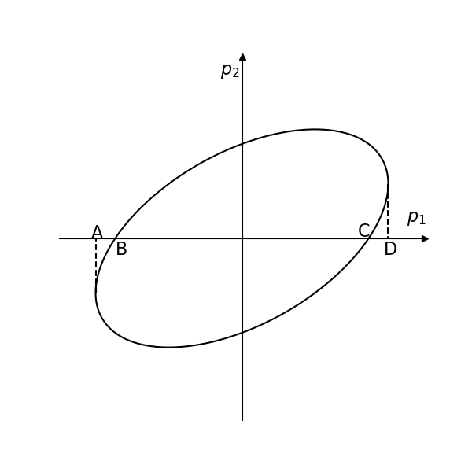

# Some essential notes on C-statistics

## Basic concepts

C-statistics is based on Poisson likelihood:
$$
    L(M)=\prod_i \frac{M_i^{D_i}}{D_{i} !} \exp \left(-M_i\right)
$$
where $L(M)$ is the likelihood for the model $M$, $D_{i}$ is the data in $i$th bin, $M_{i}$ denotes the model prediction in $i$th bin.
Taking its logarithm and multiplying by $-2$, we can get
$$
    -2\ln L(M) = 2\sum_{i} (M_{i}-D_{i}\ln M_{i}+\ln(D_{i}!)).
$$
Omitting the factorial term, we can get the Cash-statistics ([Cash 1979](https://ui.adsabs.harvard.edu/abs/1979ApJ...228..939C)):
$$
    \tilde{C} = 2\sum_{i} (M_{i}-D_{i}\ln M_{i}).
$$
Approximating the factorial term by [Stirling's formula](https://en.wikipedia.org/wiki/Stirling%27s_approximation), that is
$$
    \ln(D_{i}!) \approx D_{i}\ln D_{i} - D_{i},
$$
a modification of the original Cash-statistic, C-statistics, can be obtained as follows:
$$
    C = 2\sum_{i}(M_{i}-D_{i}\ln M_{i}+D_{i}\ln D_{i} - D_{i}),
$$
which is implemented in some popular fitting packages like XSPEC ([Arnaud 1996](https://ui.adsabs.harvard.edu/abs/1996ASPC..101...17A)), SHERPA ([Freeman et al.
2001](https://ui.adsabs.harvard.edu/abs/2001SPIE.4477...76F)), and SPEX ([Kaastra et al. 1996](https://ui.adsabs.harvard.edu/abs/1996uxsa.conf..411K)).
$\tilde{C}$ is the same as $C$, up to a constant $\sum_{i}(D_{i}\ln D_{i} - D_{i})$.
$C$ is non-negative, $C$ is equal to $0$ if and only if all the $M_{i}$ are equal to $D_{i}$.
Since the count rate is usually low for X-ray observation, it is better to use C-statistics fitting than $\chi^{2}$ fitting, i.e., getting the best-fit parameters by minimizing $C$ instead of $\chi^{2}$.

## $1\sigma$ confidence intervals for parameters

Assuming that there are $k$ parameters in the model, that is $p_{1}$, $p_{2}$, ..., $p_{k}$, a set of $\{p_{i}\}$ ($i$ ranges from $1$ to $k$) that results in a minimum value of $C$ is the best-fit parameter set, i.e., the best-fit model.
However, merely getting the best-fit parameter set is not enough, we also need to evaluate the $1\sigma$ confidence intervals for the parameters.

### A simple schematic

For simplicity, we may as well take a model with just two parameters $p_{1}$ and $p_{2}$ as an example.
$\{p_{1,\rm best},p_{2, \rm best}\}$ is the best-fit parameter set, which generates the minimum $C$, i.e., $C_{\rm min}$.
Considering the 2D parameter space $(p_{1},p_{2})$, $C$ will be larger than $C_{\rm min}$ in the neighborhood of $(p_{1,\rm best},p_{2, \rm best})$.
$C\leq C_{\rm min}+1$ defines a close region in the 2D parameter space, which is called the $1\sigma$ confidence region.
$C=C_{\rm min}+1$ defines the corresponding boundary of the $1 \sigma$ confidence region.
The figure below can serve as a schematic of the $1\sigma$ confidence region in the 2D parameter space $(p_{1},p_{2})$, which assumes that $p_{1,\rm best}=0$ and $p_{2,\rm best}=0$, or equivalently, the origin of the 2D parameter space is set to be the best-fit parameter set.

The line segment **AD** represents the $1\sigma$ confidence interval for $p_{1}$.
The line segment **BC** is **not** the $1\sigma$ confidence interval for $p_{1}$.
If we fix the parameter $p_{2}=p_{2,\rm best}=0$ and calculate the error of $p_{1}$ in SPEX, we will get the $1\sigma$ confidence interval for $p_{1}$, which is the line segment **BC**.
However, it is not reasonable, because there will always be some correlation between parameters.
You can also find that the $1\sigma$ confidence interval for $p_{1}$ obtained by setting the rest parameters to the best-fit value will always be smaller than the $1\sigma$ confidence interval for $p_{1}$ obtained by freeing all the parameters (BC<AD).

<figure style="text-align: center;">
  
  <figcaption>

The $1\sigma$ confidence region in the 2D parameter space $(p_{1},p_{2})$ is represented by the oblique ellipse.
Points A and D denote the minimum and maximum value of $p_{1}$ of the oblique ellipse, respectively.
Points B and C are two points of intersection between the oblique ellipse and the horizontal line $p_{2}=p_{2,\rm best}=0$.

  </figcaption>
</figure>

### The algorithm of finding the $1\sigma$ confidence interval

As shown in the Figure, you may think that we need to get the boundary, namely, the oblique ellipse first and then get the $1\sigma$ confidence interval for each parameter by projecting the oblique ellipse to each parameter axis (by
getting the minimum and maximum value of each parameter).
However, calculating the boundary of the oblique ellipse is not efficient.
To calculate the $1\sigma$ confidence interval for the parameter $p_{1}$, the algorithm implementd in SPEX goes as follows,
- 1. Get the best-fit parameter set
- 2. Fix the parameter $p_{1}$ to a value that is close to the $p_{1,\rm best}$ but free all the rest parameters.
- 3. Obtain the minimum $C$
- 4. If the minimum $C$ is larger than $C_{\rm min}+1$, choose a new $p_{1}$ that is closer to $p_{1,\rm best}$, if the minimum $C$ is smaller than $C_{\rm min}+1$, choose a new $p_{1}$ that is farther from $p_{1,\rm best}$. Go to step 2.
- 5. Return the two points $p_{1}$ that can result in the minimum $C$ being equal to $C_{\rm min}+1$ by setting the rest parameters to be free. Actually, it is not exactly $C_{\rm min}+1$, there is some tolerance, the algorithm in SPEX will stop at some value that is close to $C_{\rm min}+1$, like $C_{\rm min}+1.01$.

### Why the $1\sigma$ region is defined as $C_{\rm min}+1$?

Why it is $C_{\rm min}+1$ not some value like $C_{\rm min}+1.2$ or $C_{\rm min}+1.3$?
It should date back to the $\chi^{2}$ test.
$$
\Delta \chi^{2} = \chi^{2}(N) - \chi^{2}_{\rm min}(N-1)
$$
is distributed like a $\chi^{2}$ variable with one degree of freedom, where N is the number of data points and $\chi^{2}(N-1)_{\rm min}$ is the $\chi^{2}$ the usual minimum fit statistic [Bonamente (2019)](https://arxiv.org/abs/1912.05444).
Namely, $\Delta \chi^{2}$ is distributed as $\chi^{2}(1)$.
According to the $\chi^{2}(1)$ distribution, $\Delta \chi^{2}\leq 1$ will lead to a probability of 68%, which is the so-called $1\sigma$ confidence level.
For C-statistics,
$$
\Delta C = C - C_{\rm min}
$$
is **approximately** distributed like a $\chi^{2}(1)$ distribution.
Therefore, we also use $C_{\rm min}+1$ to define the $1\sigma$ confidence region.
