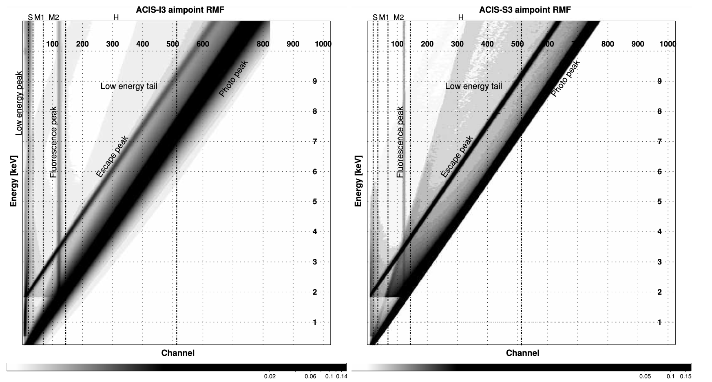

# How to use RMF?

## Some symbols

| Symbol                     | Shape         | Units              |
| -------------------------- | ------------- | ------------------ |
| Number of Energy Bins $m$  | $1$, a scalar | 1                  |
| Model $M$                  | $1 \times m$  | photons/s/cm$^{2}$ |
| Effective Area $S$         | $1 \times m$  | cm$^{2}$           |
| Photon Luminosity $L$      | $1 \times m$  | photons/s          |
| Number of Channels $n$     | $1$, a scalar | 1                  |
| Redistribution Matrix File | $m\times n$   | 1                  |
| Predicted Count Rate $C$   | $1 \times n$  | counts/s           |
| Raw Data $D$               | $1 \times n$  | counts/s           |

The predicted count rate $C$

In reality, the number of channels is fixed, and the number of energy bins is adjustable.
## A simple example:

### $m$ and $n$

Supposing m=3, n=4, the energy bins are:

[0,0.5] keV, [0.5, 1.0] keV, [1.0, 1.5] keV.
the channels are 1, 2, 3, 4.

### Model $M$:

$$
\begin{array}{ccc}
(200 & 100 & 50)
\end{array}
$$

The unit of $M$ is photons/s/cm$^{2}$.

The physical meaning of "20" is there are 20 photons per second per square centimeter in the energy range [0,0.5] keV.

Note that "the number of photons" is different from "counts": "the number of photons" is inferred from the model, and "counts" is the count of each channel.

### Effective Area $S$

$$
\begin{array}{ccc}
(4 & 2 & 1)
\end{array}
$$

The unit of $S$ is cm$^{2}$.

The physical meaning of "4" is the effective area in the energy bin [0.0.5] keV is 4 cm$^{2}$.

### Redistribution Matrix File

Supposing the redistribution matrix is

$$\mathrm{RMF}\equiv\left(\begin{array}{cccc}
0.7 & 0.1 & 0.1 & 0.1 \\
0.2 & 0.6 & 0.1 & 0.1 \\
0.1 & 0.1 & 0.7 & 0.1
\end{array}\right)$$

There are 3 (m=3) rows and 4 (n=4) columns.

The first row 
$$
\begin{array}{cccc}
(0.7 & 0.1 & 0.1 & 0.1)
\end{array}
$$
means that a single photon within the energy bin [0,0.5] keV will have the probability of 0.7, 0.1, 0.1, and 0.1 that cause the count in channel 1, 2, 3, and 4 to increase by 1, respectively. 

Namely, if there are many photons, say 1000 photons, within the energy bin [0,0.5] keV, the count of the channel 1, 2, 3, and 4 will be 700, 100, 100, 100, respectively

The second row
$$
\begin{array}{cccc}
(0.2 & 0.6 & 0.1 & 0.1)
\end{array}
$$
means that a single photon within the energy bin [0.5,1.0] keV will have the probability of 0.2, 0.6, 0.1, and 0.1 that cause the count in channel 1, 2, 3, and 4 to increase by 1, respectively.

The third row
$$
\begin{array}{cccc}
(0.1 & 0.1 & 0.7 & 0.1)
\end{array}
$$
means that a single photon within the energy bin [0.5,1.0] keV will have the probability of 0.1, 0.1, 0.7, and 0.1 that cause the count in channel 1, 2, 3, and 4 to increase by 1, respectively. 

If the count in channel 2 is increased by 1, there is much more likely to be an incoming photon within the energy bin [0,0.5] keV (probability=0.75) but still can be an incoming photon within the energy bin [0,0.5] keV (probability=0.125) or [1.0,1.5] keV (probability=0.125).

## How can we get the spectra?

We can **NOT** deduce the number of photons in different energy bins from the count of different channels.
Since the raw data is the number of counts in different channels, how can we get the number of photons in different energy bins and plot the spectra?
The answer is that we just simply attribute the number of counts in different energy bins to the channel that has the highest probability of causing the count in that channel to increase by 1.
Namely, if there are 100 counts in channel 2, we attribute all of them to the energy bin [0.5,1.0] keV.
We can plot such a spectrum (counts/s/kev versus energy) but we do not fit such a spectrum actually.

## How can we fit the model?

### Do the [Hadamard product](https://en.wikipedia.org/wiki/Hadamard_product_(matrices)) of $M$ and $S$.

The Hadamard product of $M$ and $S$ is defined as
$$
(M \odot S)_{i j}=(M)_{i j}(S)_{i j}.
$$

It is nothing but the **element-wise** product of $M$ and $S$.
In the above example, the Hadamard product of $M$ and $S$ is
$$
\begin{array}{ccc}
L\equiv(M \odot S)=(800 & 200 & 50),
\end{array}
$$
where $L$ is the photon luminosity with the unit of photons/s.
The physical meaning of "800" is there are 800 photons per second can be detected in the energy range [0, 0.5] keV.
We need to **redistribute** "800" to different channels, that is why we call the redistribution matrix.
The predicted count rate $C$ is
$$
C\equiv L \cdot \mathrm{RMF}=
\begin{array}{ccc}
(800 & 200 & 50)
\end{array}
\left(\begin{array}{cccc}
0.7 & 0.1 & 0.1 & 0.1 \\
0.2 & 0.6 & 0.1 & 0.1 \\
0.1 & 0.1 & 0.7 & 0.1
\end{array}\right)
=\begin{array}{cccc}
(605 & 205 & 135 & 105)
\end{array}.
$$
The unit of $C$ is counts/s.
The physical meaning of "605" is there are 605 counts per second in channel 1.
Namely, in the given model $M$, the effective area $S$, and the redistribution matrix $\mathrm{RMF}$, the count rate in channels 2, 3, and 4 are 205, 135, and 105 counts/s, respectively.
Since we have the number of counts in different channels, that is the raw data $D$ is something like
$$
\begin{array}{cccc}
(600 & 210 & 130 & 110)
\end{array},
$$
the unit of which is counts/s.
What we are trying to do is to find the best-fit model $M$ that can make $C$ get as close as possible to the raw data $D$ (Varying $M$ to make $C\rightarrow D$).

<figure style="text-align: center;">
  
  <figcaption>
 An actual RMF, Figure 3 from <a href="https://ui.adsabs.harvard.edu/abs/2009ApJ...690..128G/abstract"> Grimm et al. (2009)</a>
  </figcaption>
</figure>