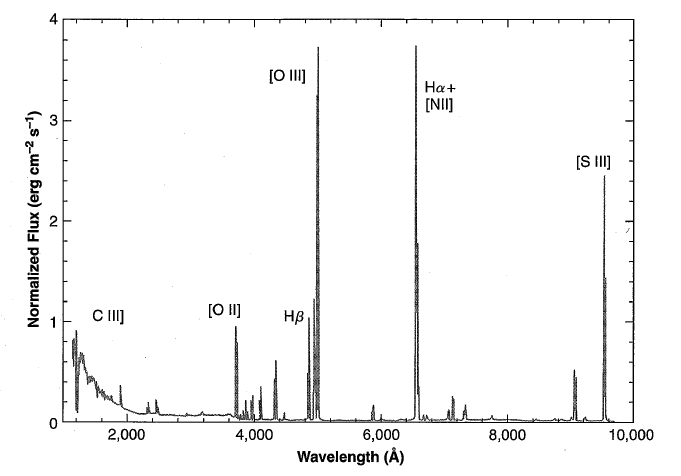

# Chapter 1 General Introduction

## 1. Different ionized gaes

- H II regions: to probe the evolution of the elements and the star formation history of galaxies
  - There are O- or early B-type stars (young, hot, luminous stars) with effective temperature of $3\times 10^{4} ~\mathrm{K}-5\times 10^{4}~\mathrm{K}$.
  - H is ionized, part of the He is ionized.
  - Typical density: $10^{1-4} \mathrm{cm}^{-3}$
  - Velocity of gas $\approx 10~\mathrm{km/s}$, close to the isothermal sound speed.
  - Strong H I recombination lines, [N II] and [O II] collionally excited lines.
  - Concentrated to the spiral arms for the Milky Way.
- Planetary nebulae: the outer remaining envelopes of dying stars
  - There are dying stars with effective temperature of $\sim 5\times 10^{4}~\mathrm{K}$.
  - More ionized than H II region
  - Typical density: $10^{2-4} \mathrm{cm}^{-3}$
- Supernova remnants: to observe material from the burned-out deep interiors of supernovae
- Gas around active galactic nuclei: to study the central engines of galaxies

## 2. Spectra

<figure style="text-align: center;">
  
  <figcaption>
    Figure 1.1 in this book
  </figcaption>
</figure>

- Emission lines: dominated by forbidden lines like [O III] $\lambda\lambda 4959, 5007$, [NII] $\lambda\lambda 6548, 6583$, and [S II] $\lambda\lambda 9069, 9523$; by permitted lines like H$\alpha$ and H$\beta$. More details are available in Figure 1.1.
- Weak continuous spectra: consist of atomic and reflection components.
  -  Atomic continuum: chiefly by free-bound transitions, mainly in the Paschen continuum of H I at $\lambda>3646\mathrm{\mathring{A}}$, and the Balmer continuum at $912~\mathrm{\mathring{A}}<\lambda < 3646~\mathrm{\mathring{A}}$.
  -  Reflection continua: starlight scattered by dust.
- Continous spectrum is strong in the radio-frequency region.

## 3. Physical conditions

- The energy source: ultraviolet radiation from stars. The effective surface temperature of hot stars can be as high as $\gtrsim 3\times 10^{4}~\mathrm{K}$.
- The main energy-input mechaism: the photoionization of H.
- The liberated photoelectrons collide with ions and hence excite the low energy levels of the ions.
- Although the probabilities of the radiative decay of the excited levels is small, the collisional de-excitation is even more inefficient as a consequence of low density ($
n_e \leq 10^4 \mathrm{~cm}^{-3}$). Therefore, almost every excitation leads to emission of a photon.
- There is an equilibrium between the photoionization and recombination processes, which is called the ionization equilibrium.
- The recombination of a ion will form a excited atoms, such as H$^{+}$ give rise to excited atoms of H and leads to the emission of H I (the origin of the H I Balmer- and Paschen-line spectra).
- Inelastic collisions of free electrons and ions converts kinetic energy into excitation energy, which is called the collisional excitation. The inverse process is called the collisional de-excitation. There are two ways to lose the excitation energy for a excited ions: (1) radiative decay; (2) collisional de-excitation.
- There are almost no lines for the ions that are fully ionized in the hot gas. Although a single nucleus can be excited, but the energy is too high, which is $\gtrsim 1000 ~\mathrm{keV}$. [NuDat 3.0](https://www.nndc.bnl.gov/nudat3/) gives the energy levels for the nuclei. [NuDat 3.0 for $^{56}$Fe](https://www.nndc.bnl.gov/nudat3/getdataset.jsp?nucleus=56Fe&unc=NDS) shows the energy levels for $^{56}$Fe. The energy of the first excited level for $^{56}$Fe is $0.847~\mathrm{MeV}$, which is too high to be excited in the hot gas. The hydrogen nucleus is even more stable.
