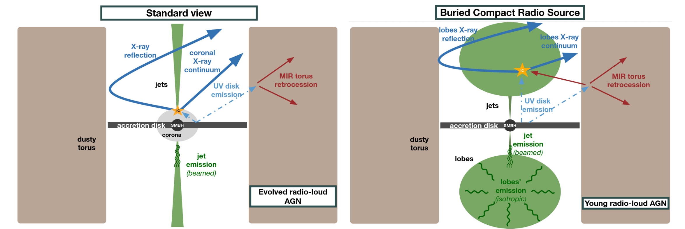
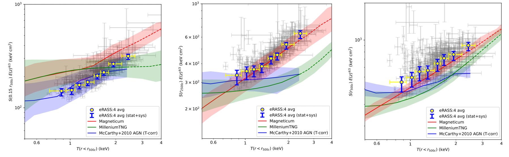

# arXiv reading on January 31, 2024

## 1. [On the Origin of the X-ray Emission in Heavily Obscured Compact Radio Sources](https://arxiv.org/abs/2312.13418)

### 1.1 Basic concepts

- 1. > Hard X-ray emission of active galactic nuclei (AGNs) is typically associated with the presence of a corona, a hot plasma in the accretion disk vicinity, where optical/UV disk photons gain energy via the process of Comptonization.
- 2. > The X-ray continuum is often accompanied by fluorescent iron lines, which are now established as ubiquitous features in the X-ray spectra of both obscured and unobscured AGNs.

### 1.2 Schematic view of evolved and young radio-loud AGNs

<figure style="text-align: left;">
  
  <figcaption>

*Left panel*: Schematic view of an evolved radio-loud AGN, depicting the UV disk emission comptonized within ultra-compact disk hard X-ray emitting region, and subsequently reflected by a dusty torus to form the reflection X-ray component.
*Right panel*: Schematic view of a young radio source, where the X-ray continuum emission is produced within compact radio
lobes, formed by newly-born relativistic jets propagating through the circumnuclear environment.

  </figcaption>
</figure>

## 2. [The SRG/eROSITA All-Sky Survey: Constraints on AGN Feedback in Galaxy Groups](https://www.arxiv.org/abs/2401.17276)

### 2.1 eROSITA data helps in constraining AGN feedback models

<figure style="text-align: left;">
  
  <figcaption>

Comparisons of entropy measurements from eROSITA and three hydrodynamic simulations. Left shows values in the cores of the groups, center at the mid-regions of groups, and right at the outskirts of groups. The grey data represents values for each observational bin of galaxy groups, while the blue and yellow points represent the averaged values at a given temperature.
Adapted from Figure 16 in Bahar et al. 2024.

  </figcaption>
</figure>

MillenniumTNG has the weakest feedback prescription overall and favors stronger AGN feedback.
The Magneticum simulation has the best prescription.